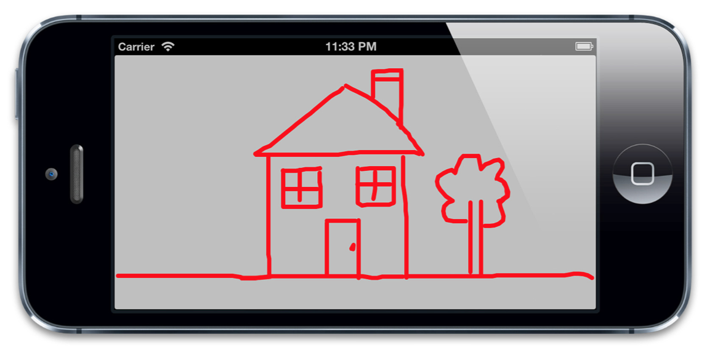
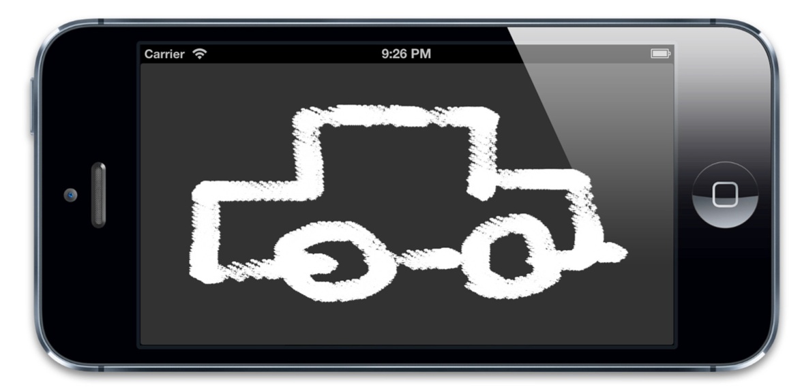
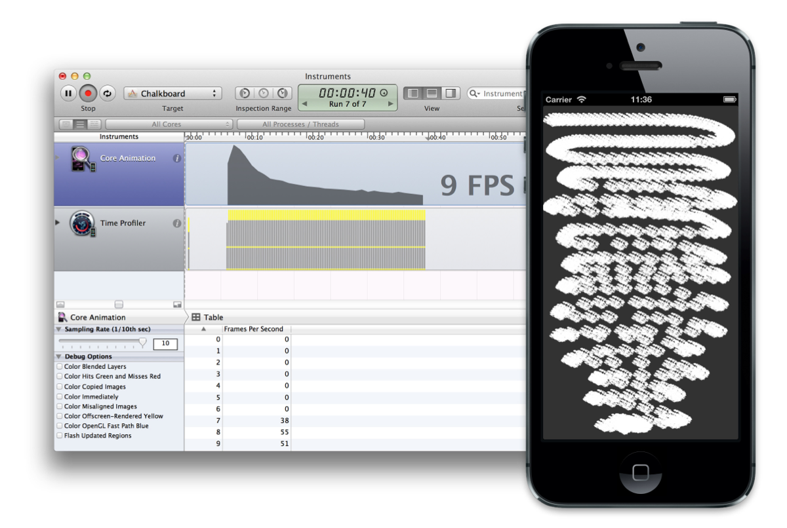
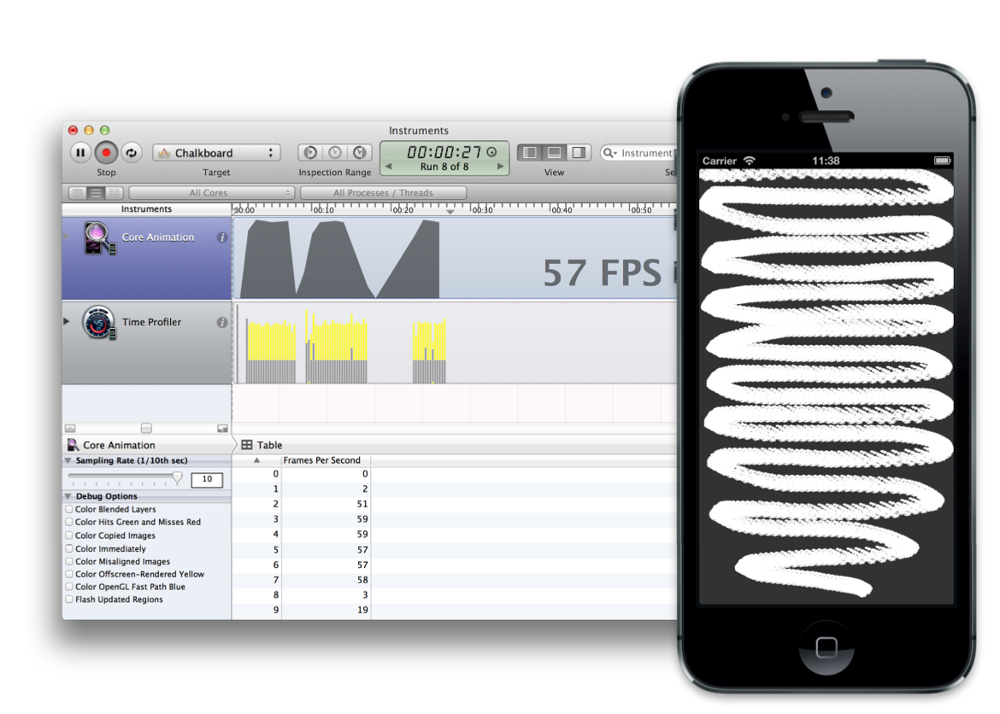

#高效绘图

> 不必要的效率考虑往往是性能问题的万恶之源。
> ——William Allan Wulf

在第12章『速度的曲率』我们学习如何用Instruments来诊断Core Animation性能问题。在构建一个iOS app的时候会遇到很多潜在的性能陷阱，但是在本章我们将着眼于有关*绘制*的性能问题。

##软件绘图

术语*绘图*通常在Core Animation的上下文中指代软件绘图（意即：不由GPU协助的绘图）。在iOS中，软件绘图通常是由Core Graphics框架完成来完成。但是，在一些必要的情况下，相比Core Animation和OpenGL，Core Graphics要慢了不少。

软件绘图不仅效率低，还会消耗可观的内存。`CALayer`只需要一些与自己相关的内存：只有它的寄宿图会消耗一定的内存空间。即使直接赋给`contents`属性一张图片，也不需要增加额外的照片存储大小。如果相同的一张图片被多个图层作为`contents`属性，那么他们将会共用同一块内存，而不是复制内存块。

但是一旦你实现了`CALayerDelegate`协议中的`-drawLayer:inContext:`方法或者`UIView`中的`-drawRect:`方法（其实就是前者的包装方法），图层就创建了一个绘制上下文，这个上下文需要的大小的内存可从这个算式得出：图层宽\*图层高\*4字节，宽高的单位均为像素。对于一个在Retina iPad上的全屏图层来说，这个内存量就是 2048\*1526\*4字节，相当于12MB内存，图层每次重绘的时候都需要重新抹掉内存然后重新分配。

软件绘图的代价昂贵，除非绝对必要，你应该避免重绘你的视图。提高绘制性能的秘诀就在于尽量避免去绘制。

##矢量图形

我们用Core Graphics来绘图的一个通常原因就是只是用图片或是图层效果不能轻易地绘制出矢量图形。矢量绘图包含一下这些：

* 任意多边形（不仅仅是一个矩形）
* 斜线或曲线
* 文本
* 渐变

举个例子，清单13.1 展示了一个基本的画线应用。这个应用将用户的触摸手势转换成一个`UIBezierPath`上的点，然后绘制成视图。我们在一个`UIView`子类`DrawingView`中实现了所有的绘制逻辑，这个情况下我们没有用上view controller。但是如果你喜欢你可以在view controller中实现触摸事件处理。图13.1是代码运行结果。

清单13.1 用Core Graphics实现一个简单的绘图应用

```objective-c
#import "DrawingView.h"

@interface DrawingView ()

@property (nonatomic, strong) UIBezierPath *path;

@end

@implementation DrawingView

- (void)awakeFromNib
{
    //create a mutable path
    self.path = [[UIBezierPath alloc] init];
    self.path.lineJoinStyle = kCGLineJoinRound;
    self.path.lineCapStyle = kCGLineCapRound;
    
    self.path.lineWidth = 5;
}

- (void)touchesBegan:(NSSet *)touches withEvent:(UIEvent *)event
{
    //get the starting point
    CGPoint point = [[touches anyObject] locationInView:self];

    //move the path drawing cursor to the starting point
    [self.path moveToPoint:point];
}

- (void)touchesMoved:(NSSet *)touches withEvent:(UIEvent *)event
{
    //get the current point
    CGPoint point = [[touches anyObject] locationInView:self];

    //add a new line segment to our path
    [self.path addLineToPoint:point];

    //redraw the view
    [self setNeedsDisplay];
}

- (void)drawRect:(CGRect)rect
{
    //draw path
    [[UIColor clearColor] setFill];
    [[UIColor redColor] setStroke];
    [self.path stroke];
}
@end
```



图13.1 用Core Graphics做一个简单的『素描』

这样实现的问题在于，我们画得越多，程序就会越慢。因为每次移动手指的时候都会重绘整个贝塞尔路径（`UIBezierPath`），随着路径越来越复杂，每次重绘的工作就会增加，直接导致了帧数的下降。看来我们需要一个更好的方法了。

Core Animation为这些图形类型的绘制提供了专门的类，并给他们提供硬件支持（第六章『专有图层』有详细提到）。`CAShapeLayer`可以绘制多边形，直线和曲线。`CATextLayer`可以绘制文本。`CAGradientLayer`用来绘制渐变。这些总体上都比Core Graphics更快，同时他们也避免了创造一个寄宿图。

如果稍微将之前的代码变动一下，用`CAShapeLayer`替代Core Graphics，性能就会得到提高（见清单13.2）.虽然随着路径复杂性的增加，绘制性能依然会下降，但是只有当非常非常浮躁的绘制时才会感到明显的帧率差异。

清单13.2 用`CAShapeLayer`重新实现绘图应用

```objective-c
#import "DrawingView.h"
#import <QuartzCore/QuartzCore.h>

@interface DrawingView ()

@property (nonatomic, strong) UIBezierPath *path;

@end

@implementation DrawingView

+ (Class)layerClass
{
    //this makes our view create a CAShapeLayer
    //instead of a CALayer for its backing layer
    return [CAShapeLayer class];
}

- (void)awakeFromNib
{
    //create a mutable path
    self.path = [[UIBezierPath alloc] init];

    //configure the layer
    CAShapeLayer *shapeLayer = (CAShapeLayer *)self.layer;
    shapeLayer.strokeColor = [UIColor redColor].CGColor;
    shapeLayer.fillColor = [UIColor clearColor].CGColor;
    shapeLayer.lineJoin = kCALineJoinRound;
    shapeLayer.lineCap = kCALineCapRound;
    shapeLayer.lineWidth = 5;
}

- (void)touchesBegan:(NSSet *)touches withEvent:(UIEvent *)event
{
    //get the starting point
    CGPoint point = [[touches anyObject] locationInView:self];

    //move the path drawing cursor to the starting point
    [self.path moveToPoint:point];
}

- (void)touchesMoved:(NSSet *)touches withEvent:(UIEvent *)event
{
    //get the current point
    CGPoint point = [[touches anyObject] locationInView:self];

    //add a new line segment to our path
    [self.path addLineToPoint:point];

    //update the layer with a copy of the path
    ((CAShapeLayer *)self.layer).path = self.path.CGPath;
}
@end
```

##脏矩形

有时候用`CAShapeLayer`或者其他矢量图形图层替代Core Graphics并不是那么切实可行。比如我们的绘图应用：我们用线条完美地完成了矢量绘制。但是设想一下如果我们能进一步提高应用的性能，让它就像一个黑板一样工作，然后用『粉笔』来绘制线条。模拟粉笔最简单的方法就是用一个『线刷』图片然后将它粘贴到用户手指碰触的地方，但是这个方法用`CAShapeLayer`没办法实现。

我们可以给每个『线刷』创建一个独立的图层，但是实现起来有很大的问题。屏幕上允许同时出现图层上线数量大约是几百，那样我们很快就会超出的。这种情况下我们没什么办法，就用Core Graphics吧（除非你想用OpenGL做一些更复杂的事情）。

我们的『黑板』应用的最初实现见清单13.3，我们更改了之前版本的`DrawingView`，用一个画刷位置的数组代替`UIBezierPath`。图13.2是运行结果

清单13.3 简单的类似黑板的应用

```objective-c
#import "DrawingView.h"
#import <QuartzCore/QuartzCore.h>
#define BRUSH_SIZE 32

@interface DrawingView ()

@property (nonatomic, strong) NSMutableArray *strokes;

@end

@implementation DrawingView

- (void)awakeFromNib
{
    //create array
    self.strokes = [NSMutableArray array];
}

- (void)touchesBegan:(NSSet *)touches withEvent:(UIEvent *)event
{
    //get the starting point
    CGPoint point = [[touches anyObject] locationInView:self];

    //add brush stroke
    [self addBrushStrokeAtPoint:point];
}

- (void)touchesMoved:(NSSet *)touches withEvent:(UIEvent *)event
{
    //get the touch point
    CGPoint point = [[touches anyObject] locationInView:self];

    //add brush stroke
    [self addBrushStrokeAtPoint:point];
}

- (void)addBrushStrokeAtPoint:(CGPoint)point
{
    //add brush stroke to array
    [self.strokes addObject:[NSValue valueWithCGPoint:point]];

    //needs redraw
    [self setNeedsDisplay];
}

- (void)drawRect:(CGRect)rect
{
    //redraw strokes
    for (NSValue *value in self.strokes) {
        //get point
        CGPoint point = [value CGPointValue];

        //get brush rect
        CGRect brushRect = CGRectMake(point.x - BRUSH_SIZE/2, point.y - BRUSH_SIZE/2, BRUSH_SIZE, BRUSH_SIZE);

        //draw brush stroke    
        [[UIImage imageNamed:@"Chalk.png"] drawInRect:brushRect];
    }
}
@end
```



图13.2 用程序绘制一个简单的『素描』

这个实现在模拟器上表现还不错，但是在真实设备上就没那么好了。问题在于每次手指移动的时候我们就会重绘之前的线刷，即使场景的大部分并没有改变。我们绘制地越多，就会越慢。随着时间的增加每次重绘需要更多的时间，帧数也会下降（见图13.3），如何提高性能呢？



图13.3 帧率和线条质量会随时间下降。

为了减少不必要的绘制，Mac OS和iOS设备将会把屏幕区分为需要重绘的区域和不需要重绘的区域。那些需要重绘的部分被称作『脏区域』。在实际应用中，鉴于非矩形区域边界裁剪和混合的复杂性，通常会区分出包含指定视图的矩形位置，而这个位置就是『脏矩形』。

当一个视图被改动过了，TA可能需要重绘。但是很多情况下，只是这个视图的一部分被改变了，所以重绘整个寄宿图就太浪费了。但是Core Animation通常并不了解你的自定义绘图代码，它也不能自己计算出脏区域的位置。然而，你的确可以提供这些信息。

当你检测到指定视图或图层的指定部分需要被重绘，你直接调用`-setNeedsDisplayInRect:`来标记它，然后将影响到的矩形作为参数传入。这样就会在一次视图刷新时调用视图的`-drawRect:`（或图层代理的`-drawLayer:inContext:`方法）。

传入`-drawLayer:inContext:`的`CGContext`参数会自动被裁切以适应对应的矩形。为了确定矩形的尺寸大小，你可以用`CGContextGetClipBoundingBox()`方法来从上下文获得大小。调用`-drawRect()`会更简单，因为`CGRect`会作为参数直接传入。

你应该将你的绘制工作限制在这个矩形中。任何在此区域之外的绘制都将被自动无视，但是这样CPU花在计算和抛弃上的时间就浪费了，实在是太不值得了。

相比依赖于Core Graphics为你重绘，裁剪出自己的绘制区域可能会让你避免不必要的操作。那就是说，如果你的裁剪逻辑相当复杂，那还是让Core Graphics来代劳吧，记住：当你能高效完成的时候才这样做。

清单13.4 展示了一个`-addBrushStrokeAtPoint:`方法的升级版，它只重绘当前线刷的附近区域。另外也会刷新之前线刷的附近区域，我们也可以用`CGRectIntersectsRect()`来避免重绘任何旧的线刷以不至于覆盖已更新过的区域。这样做会显著地提高绘制效率（见图13.4）

清单13.4 用`-setNeedsDisplayInRect:`来减少不必要的绘制
```objective-c
- (void)addBrushStrokeAtPoint:(CGPoint)point
{
    //add brush stroke to array
    [self.strokes addObject:[NSValue valueWithCGPoint:point]];

    //set dirty rect
    [self setNeedsDisplayInRect:[self brushRectForPoint:point]];
}

- (CGRect)brushRectForPoint:(CGPoint)point
{
    return CGRectMake(point.x - BRUSH_SIZE/2, point.y - BRUSH_SIZE/2, BRUSH_SIZE, BRUSH_SIZE);
}

- (void)drawRect:(CGRect)rect
{
    //redraw strokes
    for (NSValue *value in self.strokes) {
        //get point
        CGPoint point = [value CGPointValue];
        
        //get brush rect
        CGRect brushRect = [self brushRectForPoint:point];
        
        //only draw brush stroke if it intersects dirty rect
        if (CGRectIntersectsRect(rect, brushRect)) {
            //draw brush stroke
            [[UIImage imageNamed:@"Chalk.png"] drawInRect:brushRect];
        }
    }
}
```



图13.4 更好的帧率和顺滑线条

##异步绘制

UIKit的单线程天性意味着寄宿图通常要在主线程上更新，这意味着绘制会打断用户交互，甚至让整个app看起来处于无响应状态。我们对此无能为力，但是如果能避免用户等待绘制完成就好多了。

针对这个问题，有一些方法可以用到：一些情况下，我们可以推测性地提前在另外一个线程上绘制内容，然后将由此绘出的图片直接设置为图层的内容。这实现起来可能不是很方便，但是在特定情况下是可行的。Core Animation提供了一些选择：`CATiledLayer`和`drawsAsynchronously`属性。

###CATiledLayer

我们在第六章简单探索了一下`CATiledLayer`。除了将图层再次分割成独立更新的小块（类似于脏矩形自动更新的概念），`CATiledLayer`还有一个有趣的特性：在多个线程中为每个小块同时调用`-drawLayer:inContext:`方法。这就避免了阻塞用户交互而且能够利用多核心新片来更快地绘制。只有一个小块的`CATiledLayer`是实现异步更新图片视图的简单方法。

###drawsAsynchronously

iOS 6中，苹果为`CALayer`引入了这个令人好奇的属性，`drawsAsynchronously`属性对传入`-drawLayer:inContext:`的CGContext进行改动，允许CGContext延缓绘制命令的执行以至于不阻塞用户交互。

它与`CATiledLayer`使用的异步绘制并不相同。它自己的`-drawLayer:inContext:`方法只会在主线程调用，但是CGContext并不等待每个绘制命令的结束。相反地，它会将命令加入队列，当方法返回时，在后台线程逐个执行真正的绘制。

根据苹果的说法。这个特性在需要频繁重绘的视图上效果最好（比如我们的绘图应用，或者诸如`UITableViewCell`之类的），对那些只绘制一次或很少重绘的图层内容来说没什么太大的帮助。

##总结

本章我们主要围绕用Core Graphics软件绘制讨论了一些性能挑战，然后探索了一些改进方法：比如提高绘制性能或者减少需要绘制的数量。

第14章，『图像IO』，我们将讨论图片的载入性能。
