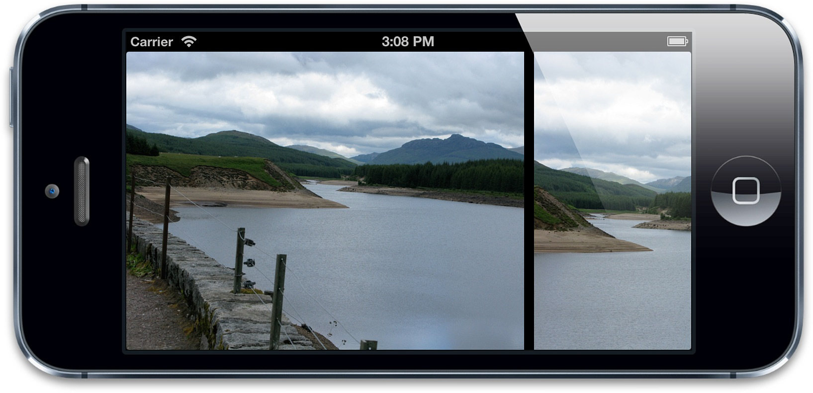
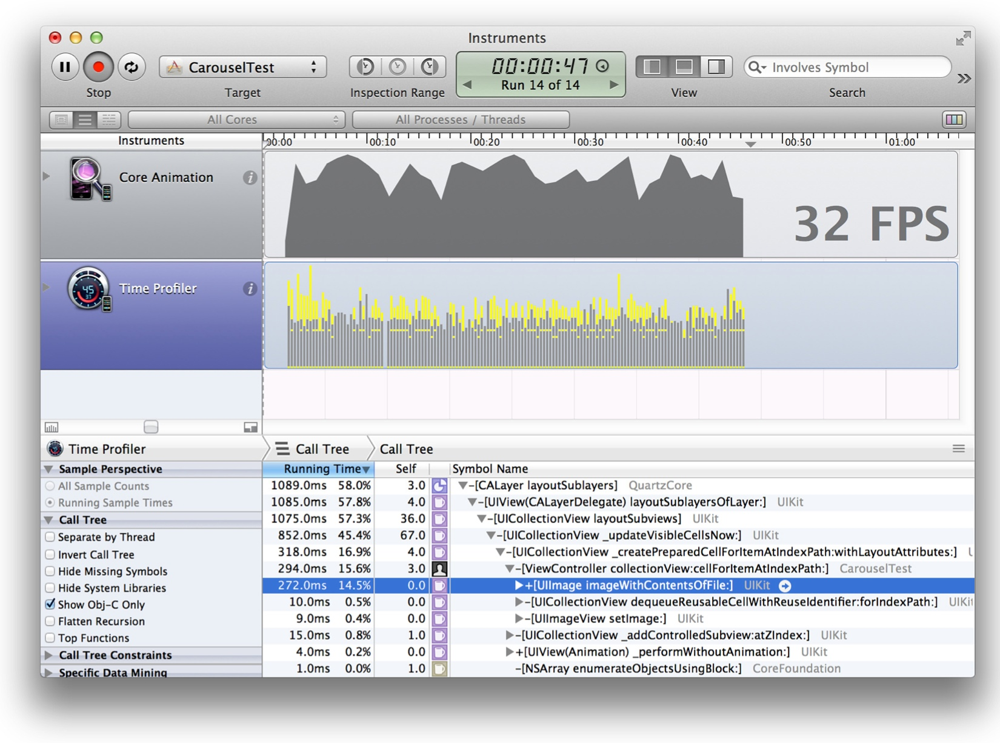

#图像IO

*潜伏期值得思考* - 凯文 帕萨特

在第13章“高效绘图”中，我们研究了和Core Graphics绘图相关的性能问题，以及如何修复。和绘图性能相关紧密相关的是图像性能。在这一章中，我们将研究如何优化从闪存驱动器或者网络中加载和显示图片。

##加载和潜伏

绘图实际消耗的时间通常并不是影响性能的因素。图片消耗很大一部分内存，而且不太可能把需要显示的图片都保留在内存中，所以需要在应用运行的时候周期性地加载和卸载图片。

图片文件加载的速度被CPU和IO（输入/输出）同时影响。iOS设备中的闪存已经比传统硬盘快很多了，但仍然比RAM慢将近200倍左右，这就需要很小心地管理加载，来避免延迟。

只要有可能，试着在程序生命周期不易察觉的时候来加载图片，例如启动，或者在屏幕切换的过程中。按下按钮和按钮响应事件之间最大的延迟大概是200ms，这比动画每一帧切换的16ms小得多。你可以在程序首次启动的时候加载图片，但是如果20秒内无法启动程序的话，iOS检测计时器就会终止你的应用（而且如果启动大于2，3秒的话用户就会抱怨了）。

有些时候，提前加载所有的东西并不明智。比如说包含上千张图片的图片传送带：用户希望能够能够平滑快速翻动图片，所以就不可能提前预加载所有图片；那样会消耗太多的时间和内存。

有时候图片也需要从远程网络连接中下载，这将会比从磁盘加载要消耗更多的时间，甚至可能由于连接问题而加载失败（在几秒钟尝试之后）。你不能够在主线程中加载网络造成等待，所以需要后台线程。

###线程加载

在第12章“性能调优”我们的联系人列表例子中，图片都非常小，所以可以在主线程同步加载。但是对于大图来说，这样做就不太合适了，因为加载会消耗很长时间，造成滑动的不流畅。滑动动画会在主线程的run loop中更新，所以会有更多运行在渲染服务进程中CPU相关的性能问题。

清单14.1显示了一个通过`UICollectionView`实现的基础的图片传送器。图片在主线程中`-collectionView:cellForItemAtIndexPath:`方法中同步加载（见图14.1）。

清单14.1 使用`UICollectionView`实现的图片传送器

```objective-c

#import "ViewController.h"

@interface ViewController() <UICollectionViewDataSource>

@property (nonatomic, copy) NSArray *imagePaths;
@property (nonatomic, weak) IBOutlet UICollectionView *collectionView;

@end

@implementation ViewController

- (void)viewDidLoad
{
    //set up data
    self.imagePaths =
    [[NSBundle mainBundle] pathsForResourcesOfType:@"png" inDirectory:@"Vacation Photos"];
    //register cell class
    [self.collectionView registerClass:[UICollectionViewCell class] forCellWithReuseIdentifier:@"Cell"];
}

- (NSInteger)collectionView:(UICollectionView *)collectionView numberOfItemsInSection:(NSInteger)section
{
    return [self.imagePaths count];
}

- (UICollectionViewCell *)collectionView:(UICollectionView *)collectionView
                  cellForItemAtIndexPath:(NSIndexPath *)indexPath
{
    //dequeue cell
    UICollectionViewCell *cell = [collectionView dequeueReusableCellWithReuseIdentifier:@"Cell" forIndexPath:indexPath];
    
    //add image view
    const NSInteger imageTag = 99;
    UIImageView *imageView = (UIImageView *)[cell viewWithTag:imageTag];
    if (!imageView) {
        imageView = [[UIImageView alloc] initWithFrame: cell.contentView.bounds];
        imageView.tag = imageTag;
        [cell.contentView addSubview:imageView];
    }
    //set image
    NSString *imagePath = self.imagePaths[indexPath.row];
    imageView.image = [UIImage imageWithContentsOfFile:imagePath];
    return cell;
}
@end

```


图14.1 运行中的图片传送器

传送器中的图片尺寸为800x600像素的PNG，对iPhone5来说，1/60秒要加载大概700KB左右的图片。当传送器滚动的时候，图片也在实时加载，于是（预期中的）卡动就发生了。时间分析工具（图14.2）显示了很多时间都消耗在了`UIImage`的`+imageWithContentsOfFile:`方法中了。很明显，图片加载造成了瓶颈。


图14.2 时间分析工具展示了CPU瓶颈

这里提升性能唯一的方式就是在另一个线程中加载图片。这并不能够降低实际的加载时间（可能情况会更糟，因为系统可能要消耗CPU时间来处理加载的图片数据），但是主线程能够有时间做一些别的事情，比如响应用户输入，以及滑动动画。

为了在后台线程加载图片，我们可以使用GCD或者`NSOperationQueue`创建自定义线程，或者使用`CATiledLayer`。为了从远程网络加载图片，我们可以使用异步的`NSURLConnection`，但是对本地存储的图片，并不十分有效。

