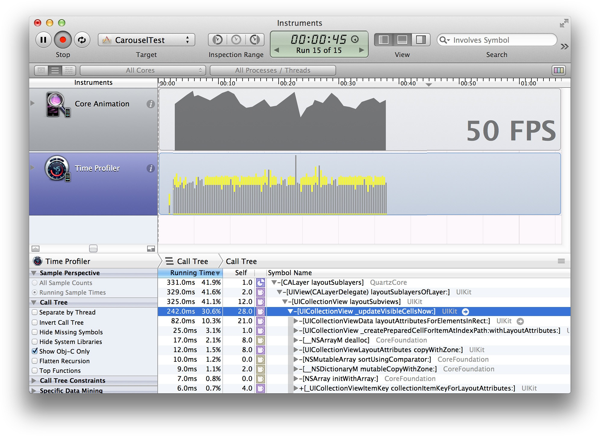
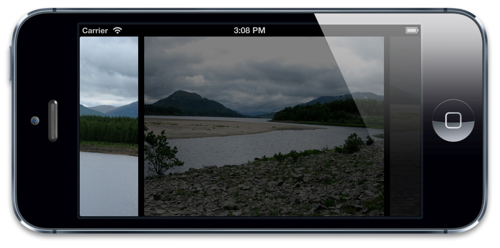

#图像IO

*潜伏期值得思考* - 凯文 帕萨特

在第13章“高效绘图”中，我们研究了和Core Graphics绘图相关的性能问题，以及如何修复。和绘图性能相关紧密相关的是图像性能。在这一章中，我们将研究如何优化从闪存驱动器或者网络中加载和显示图片。

##加载和潜伏

绘图实际消耗的时间通常并不是影响性能的因素。图片消耗很大一部分内存，而且不太可能把需要显示的图片都保留在内存中，所以需要在应用运行的时候周期性地加载和卸载图片。

图片文件加载的速度被CPU和IO（输入/输出）同时影响。iOS设备中的闪存已经比传统硬盘快很多了，但仍然比RAM慢将近200倍左右，这就需要很小心地管理加载，来避免延迟。

只要有可能，试着在程序生命周期不易察觉的时候来加载图片，例如启动，或者在屏幕切换的过程中。按下按钮和按钮响应事件之间最大的延迟大概是200ms，这比动画每一帧切换的16ms小得多。你可以在程序首次启动的时候加载图片，但是如果20秒内无法启动程序的话，iOS检测计时器就会终止你的应用（而且如果启动大于2，3秒的话用户就会抱怨了）。

有些时候，提前加载所有的东西并不明智。比如说包含上千张图片的图片传送带：用户希望能够能够平滑快速翻动图片，所以就不可能提前预加载所有图片；那样会消耗太多的时间和内存。

有时候图片也需要从远程网络连接中下载，这将会比从磁盘加载要消耗更多的时间，甚至可能由于连接问题而加载失败（在几秒钟尝试之后）。你不能够在主线程中加载网络造成等待，所以需要后台线程。

###线程加载

在第12章“性能调优”我们的联系人列表例子中，图片都非常小，所以可以在主线程同步加载。但是对于大图来说，这样做就不太合适了，因为加载会消耗很长时间，造成滑动的不流畅。滑动动画会在主线程的run loop中更新，所以会有更多运行在渲染服务进程中CPU相关的性能问题。

清单14.1显示了一个通过`UICollectionView`实现的基础的图片传送器。图片在主线程中`-collectionView:cellForItemAtIndexPath:`方法中同步加载（见图14.1）。

清单14.1 使用`UICollectionView`实现的图片传送器

```objective-c

#import "ViewController.h"

@interface ViewController() <UICollectionViewDataSource>

@property (nonatomic, copy) NSArray *imagePaths;
@property (nonatomic, weak) IBOutlet UICollectionView *collectionView;

@end

@implementation ViewController

- (void)viewDidLoad
{
    //set up data
    self.imagePaths =
    [[NSBundle mainBundle] pathsForResourcesOfType:@"png" inDirectory:@"Vacation Photos"];
    //register cell class
    [self.collectionView registerClass:[UICollectionViewCell class] forCellWithReuseIdentifier:@"Cell"];
}

- (NSInteger)collectionView:(UICollectionView *)collectionView numberOfItemsInSection:(NSInteger)section
{
    return [self.imagePaths count];
}

- (UICollectionViewCell *)collectionView:(UICollectionView *)collectionView
                  cellForItemAtIndexPath:(NSIndexPath *)indexPath
{
    //dequeue cell
    UICollectionViewCell *cell = [collectionView dequeueReusableCellWithReuseIdentifier:@"Cell" forIndexPath:indexPath];
    
    //add image view
    const NSInteger imageTag = 99;
    UIImageView *imageView = (UIImageView *)[cell viewWithTag:imageTag];
    if (!imageView) {
        imageView = [[UIImageView alloc] initWithFrame: cell.contentView.bounds];
        imageView.tag = imageTag;
        [cell.contentView addSubview:imageView];
    }
    //set image
    NSString *imagePath = self.imagePaths[indexPath.row];
    imageView.image = [UIImage imageWithContentsOfFile:imagePath];
    return cell;
}
@end

```


图14.1 运行中的图片传送器

传送器中的图片尺寸为800x600像素的PNG，对iPhone5来说，1/60秒要加载大概700KB左右的图片。当传送器滚动的时候，图片也在实时加载，于是（预期中的）卡动就发生了。时间分析工具（图14.2）显示了很多时间都消耗在了`UIImage`的`+imageWithContentsOfFile:`方法中了。很明显，图片加载造成了瓶颈。


图14.2 时间分析工具展示了CPU瓶颈

这里提升性能唯一的方式就是在另一个线程中加载图片。这并不能够降低实际的加载时间（可能情况会更糟，因为系统可能要消耗CPU时间来处理加载的图片数据），但是主线程能够有时间做一些别的事情，比如响应用户输入，以及滑动动画。

为了在后台线程加载图片，我们可以使用GCD或者`NSOperationQueue`创建自定义线程，或者使用`CATiledLayer`。为了从远程网络加载图片，我们可以使用异步的`NSURLConnection`，但是对本地存储的图片，并不十分有效。

###GCD和`NSOperationQueue`

GCD（Grand Central Dispatch）和`NSOperationQueue`很类似，都给我们提供了队列闭包块来在线程中按一定顺序来执行。`NSOperationQueue`有一个Objecive-C接口（而不是使用GCD的全局C函数），同样在操作优先级和依赖关系上提供了很好的粒度控制，但是需要更多地设置代码。

清单14.2显示了在低优先级的后台队列而不是主线程使用GCD加载图片的`-collectionView:cellForItemAtIndexPath:`方法，然后当需要加载图片到视图的时候切换到主线程，因为在后台线程访问视图会有安全隐患。

由于视图在`UICollectionView`会被循环利用，我们加载图片的时候不能确定是否被不同的索引重新复用。为了避免图片加载到错误的视图中，我们在加载前把单元格打上索引的标签，然后在设置图片的时候检测标签是否发生了改变。

清单14.2 使用GCD加载传送图片

```objective-c
- (UICollectionViewCell *)collectionView:(UICollectionView *)collectionView
                    cellForItemAtIndexPath:(NSIndexPath *)indexPath
{
    //dequeue cell
    UICollectionViewCell *cell = [collectionView dequeueReusableCellWithReuseIdentifier:@"Cell"
                                                                           forIndexPath:indexPath];
    //add image view
    const NSInteger imageTag = 99;
    UIImageView *imageView = (UIImageView *)[cell viewWithTag:imageTag];
    if (!imageView) {
        imageView = [[UIImageView alloc] initWithFrame: cell.contentView.bounds];
        imageView.tag = imageTag;
        [cell.contentView addSubview:imageView];
    }
    //tag cell with index and clear current image
    cell.tag = indexPath.row;
    imageView.image = nil;
    //switch to background thread
    dispatch_async(dispatch_get_global_queue(DISPATCH_QUEUE_PRIORITY_LOW, 0), ^{
        //load image
        NSInteger index = indexPath.row;
        NSString *imagePath = self.imagePaths[index];
        UIImage *image = [UIImage imageWithContentsOfFile:imagePath];
        //set image on main thread, but only if index still matches up
        dispatch_async(dispatch_get_main_queue(), ^{
            if (index == cell.tag) {
                imageView.image = image; }
        });
    });
    return cell;
}
```

当运行更新后的版本，性能比之前不用线程的版本好多了，但仍然并不完美（图14.3）。

我们可以看到`+imageWithContentsOfFile:`方法并不在CPU时间轨迹的最顶部，所以我们的确修复了延迟加载的问题。问题在于我们假设传送器的性能瓶颈在于图片文件的加载，但实际上并不是这样。加载图片数据到内存中只是问题的第一部分。


图14.3 使用后台线程加载图片来提升性能

###延迟解压

一旦图片文件被加载就必须要进行解码，解码过程是一个相当复杂的任务，需要消耗非常长的时间。解码后的图片将同样使用相当大的内存。

用于加载的CPU时间相对于解码来说根据图片格式而不同。对于PNG图片来说，加载会比JPEG更长，因为文件可能更大，但是解码会相对较快，而且Xcode会把PNG图片进行解码优化之后引入工程。JPEG图片更小，加载更快，但是解压的步骤要消耗更长的时间，因为JPEG解压算法比基于zip的PNG算法更加复杂。

当加载图片的时候，iOS通常会延迟解压图片的时间，直到加载到内存之后。这就会在准备绘制图片的时候影响性能，因为需要在绘制之前进行解压（通常是消耗时间的问题所在）。

最简单的方法就是使用`UIImage`的`+imageNamed:`方法避免延时加载。不像`+imageWithContentsOfFile:`（和其他别的`UIImage`加载方法），这个方法会在加载图片之后立刻进行解压（就和本章之前我们谈到的好处一样）。问题在于`+imageNamed:`只对从应用资源束中的图片有效，所以对用户生成的图片内容或者是下载的图片就没法使用了。

另一种立刻加载图片的方法就是把它设置成图层内容，或者是`UIImageView`的`image`属性。不幸的是，这又需要在主线程执行，所以不会对性能有所提升。

第三种方式就是绕过`UIKit`，像下面这样使用ImageIO框架：

```objective-c
NSInteger index = indexPath.row;
NSURL *imageURL = [NSURL fileURLWithPath:self.imagePaths[index]];
NSDictionary *options = @{(__bridge id)kCGImageSourceShouldCache: @YES}; 
CGImageSourceRef source = CGImageSourceCreateWithURL((__bridge CFURLRef)imageURL, NULL);
CGImageRef imageRef = CGImageSourceCreateImageAtIndex(source, 0,(__bridge CFDictionaryRef)options);
UIImage *image = [UIImage imageWithCGImage:imageRef]; 
CGImageRelease(imageRef);
CFRelease(source);
```

这样就可以使用`kCGImageSourceShouldCache`来创建图片，强制图片立刻解压，然后在图片的生命周期保留解压后的版本。

最后一种方式就是使用UIKit加载图片，但是立刻会知道`CGContext`中去。图片必须要在绘制之前解压，所以就强制了解压的及时性。这样的好处在于绘制图片可以再后台线程（例如加载本身）执行，而不会阻塞UI。

有两种方式可以为强制解压提前渲染图片：

* 将图片的一个像素绘制成一个像素大小的`CGContext`。这样仍然会解压整张图片，但是绘制本身并没有消耗任何时间。这样的好处在于加载的图片并不会在特定的设备上为绘制做优化，所以可以在任何时间点绘制出来。同样iOS也就可以丢弃解压后的图片来节省内存了。

* 将整张图片绘制到`CGContext`中，丢弃原始的图片，并且用一个从上下文内容中新的图片来代替。这样比绘制单一像素那样需要更加复杂的计算，但是因此产生的图片将会为绘制做优化，而且由于原始压缩图片被抛弃了，iOS就不能够随时丢弃任何解压后的图片来节省内存了。

需要注意的是苹果特别推荐了不要使用这些诡计来绕过标准图片解压逻辑（所以也是他们选择用默认处理方式的原因），但是如果你使用很多大图来构建应用，那如果想提升性能，就只能和系统博弈了。

如果不使用`+imageNamed:`，那么把整张图片绘制到`CGContext`可能是最佳的方式了。尽管你可能认为多余的绘制相较别的解压技术而言性能不是很高，但是新创建的图片（在特定的设备上做过优化）可能比原始图片绘制的更快。

同样，如果想显示图片到比原始尺寸小的容器中，那么一次性在后台线程重新绘制到正确的尺寸会比每次显示的时候都做缩放会更有效（尽管在这个例子中我们加载的图片呈现正确的尺寸，所以不需要多余的优化）。

如果修改了`-collectionView:cellForItemAtIndexPath:`方法来重绘图片（清单14.3），你会发现滑动更加平滑。

清单14.3 强制图片解压显示

```objective-c
- (UICollectionViewCell *)collectionView:(UICollectionView *)collectionView
                  cellForItemAtIndexPath:(NSIndexPath *)indexPath
{
    //dequeue cell
    UICollectionViewCell *cell = [collectionView dequeueReusableCellWithReuseIdentifier:@"Cell" forIndexPath:indexPath];
    ...
    //switch to background thread
    dispatch_async(dispatch_get_global_queue(DISPATCH_QUEUE_PRIORITY_LOW, 0), ^{
        //load image
        NSInteger index = indexPath.row;
        NSString *imagePath = self.imagePaths[index];
        UIImage *image = [UIImage imageWithContentsOfFile:imagePath];
        //redraw image using device context
        UIGraphicsBeginImageContextWithOptions(imageView.bounds.size, YES, 0);
        [image drawInRect:imageView.bounds];
        image = UIGraphicsGetImageFromCurrentImageContext();
        UIGraphicsEndImageContext();
        //set image on main thread, but only if index still matches up
        dispatch_async(dispatch_get_main_queue(), ^{
            if (index == imageView.tag) {
                imageView.image = image;
            }
        });
    });
    return cell;
}
```

###`CATiledLayer`

如第6章“专用图层”中的例子所示，`CATiledLayer`可以用来异步加载和显示大型图片，而不阻塞用户输入。但是我们同样可以使用`CATiledLayer`在`UICollectionView`中为每个表格创建分离的`CATiledLayer`实例加载传动器图片，每个表格仅使用一个图层。

这样使用`CATiledLayer`有几个潜在的弊端：

* `CATiledLayer`的队列和缓存算法没有暴露出来，所以我们只能祈祷它能匹配我们的需求

* `CATiledLayer`需要我们每次重绘图片到`CGContext`中，即使它已经解压缩，而且和我们单元格尺寸一样（因此可以直接用作图层内容，而不需要重绘）。

我们来看看这些弊端有没有造成不同：清单14.4显示了使用`CATiledLayer`对图片传送器的重新实现。

清单14.4 使用`CATiledLayer`的图片传送器

```objective-c
#import "ViewController.h"
#import <QuartzCore/QuartzCore.h>

@interface ViewController() <UICollectionViewDataSource>

@property (nonatomic, copy) NSArray *imagePaths;
@property (nonatomic, weak) IBOutlet UICollectionView *collectionView;

@end

@implementation ViewController

- (void)viewDidLoad
{
    //set up data
    self.imagePaths = [[NSBundle mainBundle] pathsForResourcesOfType:@"jpg" inDirectory:@"Vacation Photos"];
    [self.collectionView registerClass:[UICollectionViewCell class] forCellWithReuseIdentifier:@"Cell"];
}

- (NSInteger)collectionView:(UICollectionView *)collectionView numberOfItemsInSection:(NSInteger)section
{
    return [self.imagePaths count];
}

- (UICollectionViewCell *)collectionView:(UICollectionView *)collectionView cellForItemAtIndexPath:(NSIndexPath *)indexPath
{
    //dequeue cell
    UICollectionViewCell *cell = [collectionView dequeueReusableCellWithReuseIdentifier:@"Cell" forIndexPath:indexPath];
    //add the tiled layer
    CATiledLayer *tileLayer = [cell.contentView.layer.sublayers lastObject];
    if (!tileLayer) {
        tileLayer = [CATiledLayer layer];
        tileLayer.frame = cell.bounds;
        tileLayer.contentsScale = [UIScreen mainScreen].scale;
        tileLayer.tileSize = CGSizeMake(cell.bounds.size.width * [UIScreen mainScreen].scale, cell.bounds.size.height * [UIScreen mainScreen].scale);
        tileLayer.delegate = self;
        [tileLayer setValue:@(indexPath.row) forKey:@"index"];
        [cell.contentView.layer addSublayer:tileLayer];
    }
    //tag the layer with the correct index and reload
    tileLayer.contents = nil;
    [tileLayer setValue:@(indexPath.row) forKey:@"index"];
    [tileLayer setNeedsDisplay];
    return cell;
}

- (void)drawLayer:(CATiledLayer *)layer inContext:(CGContextRef)ctx
{
    //get image index
    NSInteger index = [[layer valueForKey:@"index"] integerValue];
    //load tile image
    NSString *imagePath = self.imagePaths[index];
    UIImage *tileImage = [UIImage imageWithContentsOfFile:imagePath];
    //calculate image rect
    CGFloat aspectRatio = tileImage.size.height / tileImage.size.width;
    CGRect imageRect = CGRectZero;
    imageRect.size.width = layer.bounds.size.width;
    imageRect.size.height = layer.bounds.size.height * aspectRatio;
    imageRect.origin.y = (layer.bounds.size.height - imageRect.size.height)/2;
    //draw tile
    UIGraphicsPushContext(ctx);
    [tileImage drawInRect:imageRect];
    UIGraphicsPopContext();
}

@end
```

需要解释几点：

* `CATiledLayer`的`tileSize`属性单位是像素，而不是点，所以为了保证瓦片和表格尺寸一致，需要乘以屏幕比例因子。

* 在`-drawLayer:inContext:`方法中，我们需要知道图层属于哪一个`indexPath`以加载正确的图片。这里我们利用了`CALayer`的KVC来存储和检索任意的值，将图层和索引打标签。

结果`CATiledLayer`工作的很好，性能问题解决了，而且和用GCD实现的代码量差不多。仅有一个问题在于图片加载到屏幕上后有一个明显的淡入（图14.4）。



图14.4 加载图片之后的淡入

我们可以调整`CATiledLayer`的`fadeDuration`属性来调整淡入的速度，或者直接将整个渐变移除，但是这并没有根本性地去除问题：在图片加载到准备绘制的时候总会有一个延迟，这将会导致滑动时候新图片的跳入。这并不是`CATiledLayer`的问题，使用GCD的版本也有这个问题。

即使使用上述我们讨论的所有加载图片和缓存的技术，有时候仍然会发现实时加载大图还是有问题。就和13章中提到的那样，iPad上一整个视网膜屏图片分辨率达到了2048x1536，而且会消耗12MB的RAM（未压缩）。第三代iPad的硬件并不能支持1/60秒的帧率加载，解压和显示这种图片。即使用后台线程加载来避免动画卡顿，仍然解决不了问题。

我们可以在加载的同时显示一个占位图片，但这并没有根本解决问题，我们可以做到更好。

###分辨率交换

视网膜分辨率（根据苹果市场定义）代表了人的肉眼在正常视角距离能够分辨的最小像素尺寸。但是这只能应用于静态像素。当观察一个移动图片时，你的眼睛就会对细节不敏感，于是一个低分辨率的图片和视网膜质量的图片没什么区别了。

如果需要快速加载和显示移动大图，简单的办法就是欺骗人眼，在移动传送器的时候显示一个小图（或者低分辨率），然后当停止的时候再换成大图。这意味着我们需要对每张图片存储两份不同分辨率的副本，但是幸运的是，由于需要同时支持Retina和非Retina设备，本来这就是普遍要做到的。

如果从远程源或者用户的相册加载没有可用的低分辨率版本图片，那就可以动态将大图绘制到较小的`CGContext`，然后存储到某处以备复用。

为了做到图片交换，我们需要利用`UIScrollView`的一些实现`UIScrollViewDelegate`协议的委托方法（和其他类似于`UITableView`和`UICollectionView`基于滚动视图的控件一样）：

    - (void)scrollViewDidEndDragging:(UIScrollView *)scrollView willDecelerate:(BOOL)decelerate;
    - (void)scrollViewDidEndDecelerating:(UIScrollView *)scrollView;	
你可以使用这几个方法来检测传送器是否停止滚动，然后加载高分辨率的图片。只要高分辨率图片和低分辨率图片尺寸颜色保持一致，你会很难察觉到替换的过程（保证在同一台机器使用相同的图像程序或者脚本生成这些图片）。









