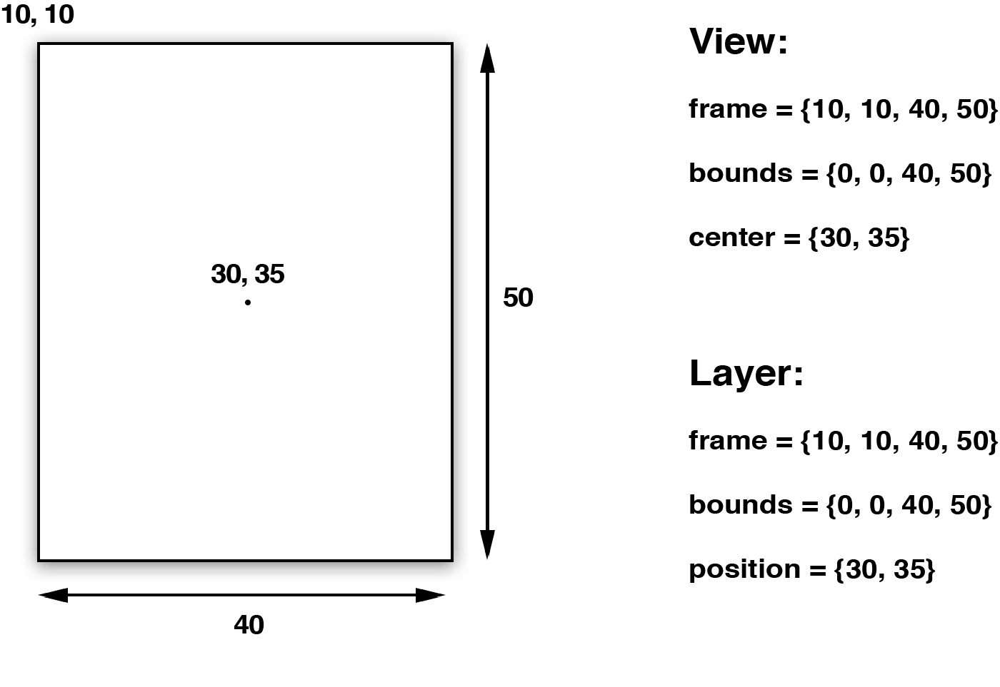

#图层几何学
>*不熟悉几何学的人就不要来这里了* --柏拉图学院入口的签名

在第二章里面，我们介绍了layer背后的图片，和一些控制图层坐标和旋转的属性。在这一章中，我们将要看一看图层内部是如何根据父图层和兄弟图层来控制位置和尺寸的。另外我们也会涉及如何管理图层的几何结构，以及它是如何被自动调整和自动布局影响的。

##布局
UIView有三个比较重要的布局属性：frame，bounds和center，CALayer对应地叫做frame，bounds和position。为了能清楚区分，图层用了“position”，视图用了“center”，但是他们都代表同样的值。

frame代表了图层的外部坐标（也就是在父图层上占据的空间），bounds是内部坐标（{0, 0}通常是图层的左上角），center和position都代表了相对于父图层anchorPoint所在的位置。anchorPoint的属性将会在后续介绍到，现在把它想成图层的中心点就好了。图3.1显示了这些属性是如何相互依赖的。

图3.1 UIView和CALayer的坐标系

对于视图或者图层来说，frame并不是一个非常清晰的属性，它其实是一个虚拟属性，是根据bounds，position和transform计算而来，所以当其中任何一个值发生改变，frame都会变化。相反，改变frame的值同样会影响到他们当中的值

记住当对图层做变换的时候，比如旋转或者缩放，frame实际上代表了覆盖在图层旋转之后的整个轴对齐的矩形区域，也就是说frame的宽高可能和bounds的宽高不再一致了（图3.2）

图3.2 旋转一个视图或者图层之后的frame属性

##锚点
之前提到过，视图的center属性和图层的position属性都指定了相对于父图层anchorPoint的位置。图层的anchorPoint通过position来控制它的frame的位置，你可以认为anchorPoint是用来移动图层的*句柄*。

默认来说，anchorPoint位于图层的中点，所以图层的将会以这个点为中心放置。anchorPoint属性并没有被UIView接口暴露出来，这也是view的position属性被叫做center的原因。但是layer的anchorPoint可以被移动，比如你可以把它置于图层frame的左上角，于是图层的内容将会向右下角的position方向移动（图3.3），而不是居中了。

图3.3 在frame层面上改变anchorPoint的效果

和第二章提到的contentsRect和contentsCenter属性类似，anchorPoint用*单位坐标*来描述，也就是图层的相对坐标，图层左上角是{0, 0}，右下角是{1, 1}，因此默认坐标是{0.5, 0.5}。anchorPoint可以通过指定x和y值小于0或者大于1，使它放置在图层范围之外。