#寄宿图
>图片胜过千言万语，界面抵得上千图片  ——Ben Shneiderman

我们在第一章『图层树』中介绍了CALayer类并创建了一个简单的有蓝色背景的图层。背景颜色还好啦，但是如果它仅仅是展现了一个单调的颜色未免也太无聊了。事实上CALayer类能够包含一张你喜欢的图片，这一章节我们将来探索CALayer的寄宿图（即图层中包含的图）。

##contents属性
CALayer 有一个属性叫做`contents`，这个属性的类型被定义为id，意味着它可以是任何类型的对象。在这种情况下，你可以给`contents`属性赋任何值，你的app仍然能够编译通过。但是，在实践中，如果你给`contents`赋的不是CGImage，那么你得到的图层将是空白的。

`contents`这个奇怪的表现是由Mac OS的历史原因造成的。它之所以被定义为id类型，是因为在Mac OS系统上，这个属性对CGImage和NSImage类型的值都起作用。如果你试图在iOS平台上将UIImage的值赋给它，只能得到一个空白的图层。一些初识Core Animation的iOS开发者可能会对这个感到困惑。

头疼的不仅仅是我们刚才提到的这个问题。事实上，你真正要赋值的类型应该是CGImageRef，它是一个指向CGImage结构的指针。UIImage有一个CGImage属性，它返回一个"CGImageRef",如果你想把这个值直接赋值给CALayer的`contents`，那你将会得到一个编译错误。因为CGImageRef并不是一个真正的Cocoa对象，而是一个Core Foundation类型。

尽管Core Foundation类型跟Cocoa对象在运行时貌似很像（被称作toll-free bridging），它们并不是类型兼容的，不过你可以通过bridged关键字转换。如果要给图层的寄宿图赋值，你可以按照以下这个方法：

``` objective-c
layer.contents = (__bridge id)image.CGImage;
```

如果你没有使用ARC（自动引用计数），你就不需要__bridge这部分。但是，你干嘛不用ARC？！

让我们来继续修改我们在第一章新建的工程，以便能够展示一张图片而不仅仅是一个背景色。我们已经用代码的方式建立一个图层，那我们就不需要额外的图层了。那么我们就直接把layerView的宿主图层的`contents`属性设置成图片。

清单2.1 更新后的代码。

``` objective-c
@implementation ViewController

- (void)viewDidLoad
{
  [super viewDidLoad]; //load an image
  UIImage *image = [UIImage imageNamed:@"Snowman.png"];

  //add it directly to our view's layer
  self.layerView.layer.contents = (__bridge id)image.CGImage;
}
@end
```

图表2.1 在UIView的宿主图层中显示一张图片


我们用这些简单的代码做了一件很有趣的事情：我们利用CALayer在一个普通的UIView中显示了一张图片。这不是一个UIImageView，它不是我们通常用来展示图片的方法。通过直接操作图层，我们使用了一些新的函数，使得UIView更加有趣了。

**contentGravity**

你可能已经注意到了我们的雪人看起来有点。。。胖 ＝＝！ 我们加载的图片并不刚好是一个方的，为了适应这个视图，它有一点点被拉伸了。在使用UIImageView的时候遇到过同样的问题，解决方法就是把`contentMode`属性设置成更合适的值，像这样：

```objective-c
view.contentMode = UIViewContentModeScaleAspectFit;
```
这个方法基本和我们遇到的情况的解决方法已经接近了（你可以试一下 :) ），不过UIView大多数视觉相关的属性比如`contentMode`，对这些属性的操作其实是对对应图层的操作。

CALayer与`contentMode`对应的属性叫做`contentsGravity`，但是它是一个NSString类型，而不是像对应的UIKit部分，那里面的值是枚举。`contentsGravity`可选的常量值有以下一些：

* kCAGravityCenter
* kCAGravityTop
* kCAGravityBottom
* kCAGravityLeft
* kCAGravityRight
* kCAGravityTopLeft
* kCAGravityTopRight
* kCAGravityBottomLeft
* kCAGravityBottomRight
* kCAGravityResize
* kCAGravityResizeAspect
* kCAGravityResizeAspectFill

和`cotentMode`一样，`contentsGravity`的目的是为了决定内容在图层的边界中怎么对齐，我们将使用kCAGravityResizeAspect，它的效果等同于UIViewContentModeScaleAspectFit， 同时它还能在图层中等比例拉伸以适应图层的边界。

```objective-c
self.layerView.layer.contentsGravity = kCAGravityResizeAspect;
```

图2.2 可以看到结果

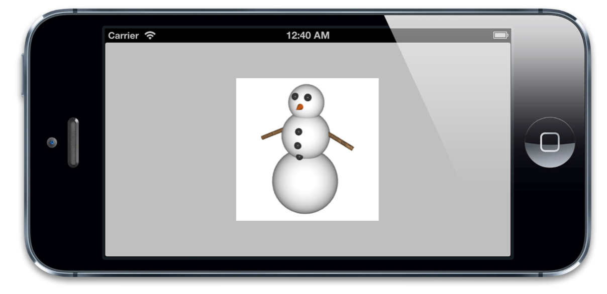

图2.2 正确地设置`contentsGravity`的值

##contentsScale

`contentsScale`属性定义了寄宿图的像素尺寸和视图大小的比例，默认情况下它是一个值为1.0的浮点数。

`contentsScale`的目的并不是那么明显。它并不是总会对屏幕上的寄宿图有影响。如果你尝试对我们的例子设置不同的值，你就会发现根本没任何影响。因为`contents`由于设置了`contentsGravity`属性，所以它已经被拉伸以适应图层的边界。

如果你只是单纯地想放大图层的`contents`图片，你可以通过使用图层的`transform`和`affineTransform`属性来达到这个目的（见第五章『Transforms』，里面对此有解释），这(指放大)也不是`contentsScale`的目的所在.

`contentsScale`属性其实属于支持高分辨率（又称Hi-DPI或Retina）屏幕机制的一部分。它用来判断在绘制图层的时候应该为寄宿图创建的空间大小，和需要显示的图片的拉伸度（假设并没有设置`contentsGravity`属性）。UIView有一个类似功能但是非常少用到的`contentScaleFactor`属性。

如果`contentsScale`设置为1.0，将会以每个点1个像素绘制图片，如果设置为2.0，则会以每个点2个像素绘制图片，这就是我们熟知的Retina屏幕。（如果你对像素和点的概念不是很清楚的话，这个章节的后面部分将会对此做出解释）。

这并不会对我们在使用kCAGravityResizeAspect时产生任何影响，因为它就是拉伸图片以适应图层而已，根本不会考虑到分辨率问题。但是如果我们把`contentsGravity`设置为kCAGravityCenter（这个值并不会拉伸图片），那将会有很明显的变化（如图2.3）

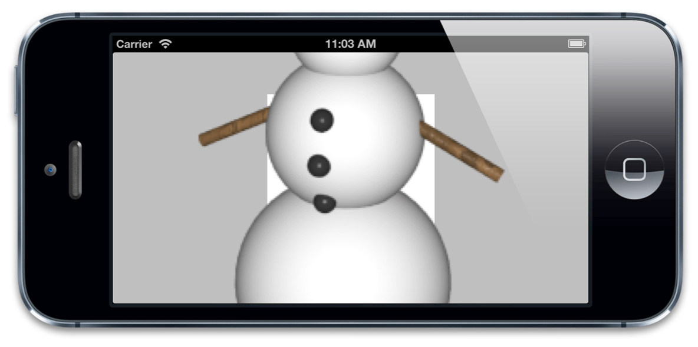

图2.3 用错误的`contentsScale`属性显示Retina图片

如你所见，我们的雪人不仅有点大还有点像素的颗粒感。那是因为和UIImage不同，CGImage没有拉伸的概念。当我们使用UIImage类去读取我们的雪人图片的时候，它读取了高质量的Retina版本的图片。但是当我们用CGImage来设置我们的图层的内容时，拉伸这个因素在转换的时候就丢失了。不过我们可以通过手动设置`contentsScale`来修复这个问题（如2.2清单），图2.4是结果

```objective-c
@implementation ViewController

- (void)viewDidLoad
{
  [super viewDidLoad]; //load an image
  UIImage *image = [UIImage imageNamed:@"Snowman.png"]; //add it directly to our view's layer
  self.layerView.layer.contents = (__bridge id)image.CGImage; //center the image
  self.layerView.layer.contentsGravity = kCAGravityCenter;

  //set the contentsScale to match image
  self.layerView.layer.contentsScale = image.scale;
}

@end
```

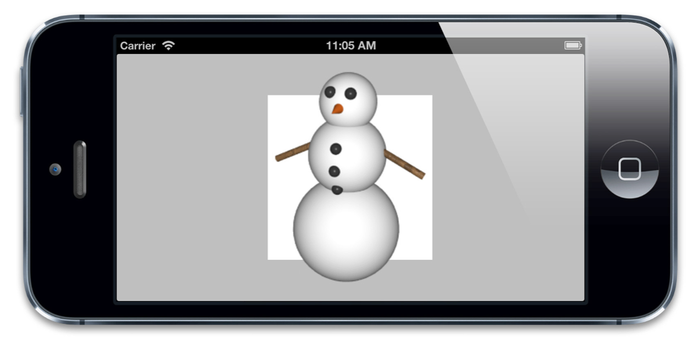

图2.4 同样的Retina图片设置了正确的`contentsScale`之后

当用代码的方式来处理寄宿图的时候，一定要记住要手动的设置图层的`contentsScale`属性，否则，你的图片在Retina设备上就显示得不正确啦。代码如下：

```objective-c
layer.contentsScale = [UIScreen mainScreen].scale;
```

##maskToBounds

现在我们的雪人总算是显示了正确的大小，不过你也许已经发现了另外一些事情：它超出了视图的边界。默认情况下，UIView仍然会绘制超过边界的内容或是子视图，在CALayer下也是这样的。

UIView有一个叫做`clipsToBounds`的属性可以用来决定是否显示超出边界的内容，CALayer对应的属性叫做`masksToBounds`，把它设置为YES，雪人就在边界里啦～（如图2.5）

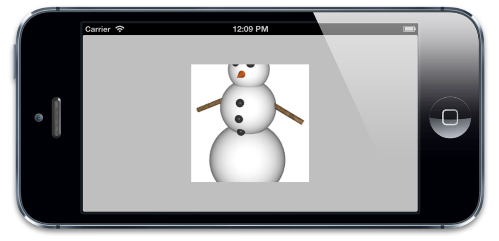

图2.5 使用`masksToBounds`来修建图层内容

##contentsRect

CALayer的`contentsRect`属性允许我们在图层边框里显示寄宿图的一个子域。这涉及到图片是如何显示和拉伸的，所以要比`contentsGravity`灵活多了

和`bounds`，`frame`不同，`contentsRect`不是按点来计算的，它使用了*单位坐标*，单位坐标指定在0到1之间，是一个相对值（像素和点就是绝对值）。所以它们是相对与寄宿图的尺寸的。iOS使用了以下的坐标系统：

* 点 —— 在iOS和Mac OS中最常见的坐标体系。点就像是虚拟的像素，也被称作逻辑像素。在标准设备上，一个点就是一个像素，但是在Retina设备上，一个点等于2*2个像素。iOS用点作为屏幕的坐标测算体系就是为了在Retina设备和普通设备上能有一致的视觉效果。
* 像素 —— 物理像素坐标并不会用来屏幕布局，但是仍然与图片有相对关系。UIImage是一个屏幕分辨率解决方案，所以指定点来度量大小。但是一些底层的图片表示如CGImage就会使用像素，所以你要清楚在Retina设备和普通设备上，它们表现出来了不同的大小。
* 单位 —— 对于与图片大小或是图层边界相关的显示，单位坐标是一个方便的度量方式， 当大小改变的时候，也不需要再次调整。单位坐标在OpenGL这种纹理坐标系统中用得很多，Core Animation中也用到了单位坐标。

默认的`contentsRect`是{0, 0, 1, 1}，这意味着整个寄宿图默认都是可见的，如果我们指定一个小一点的矩形，图片就会被裁剪（如图2.6）

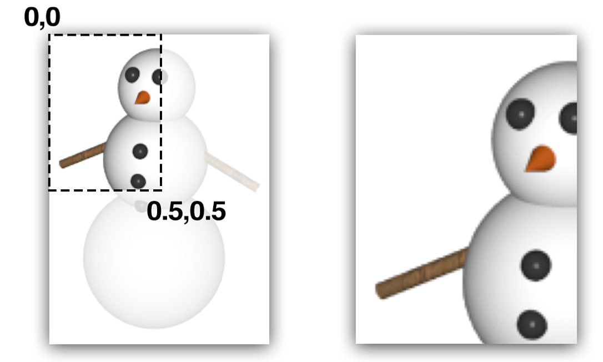

图2.6 一个自定义的`contentsRect`（左）和之前显示的内容（右）

事实上给`contentsRect`设置一个负数的原点或是大于{1, 1}的尺寸也是可以的。这种情况下，最外面的像素会被拉伸以填充剩下的区域。

`contentsRect`在app中最有趣的地方在于一个叫做*image sprites*（图片拼合）的用法。如果你有游戏编程的经验，那么你一定对图片拼合的概念很熟悉，图片能够在屏幕上独立地变更位置。抛开游戏编程不谈，这个技术常用来指代载入拼合的图片，跟移动图片一点关系也没有。

典型地，图片拼合后可以打包整合到一张大图上一次性载入。相比多次载入不同的图片，这样做能够带来很多方面的好处：内存使用，载入时间，渲染性能等等

2D游戏引擎入Cocos2D使用了拼合技术，它使用OpenGL来显示图片。不过我们可以使用拼合在一个普通的UIKit应用中，对！就是使用`contentsRect`

首先，我们需要一个拼合后的图表 —— 一个包含小一些的拼合图的大图片。如图2.7所示：

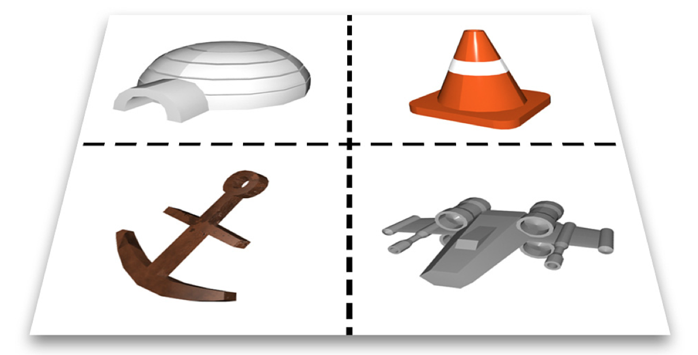

接下来，我们要在app中载入并显示这些拼合图。规则很简单：像平常一样载入我们的大图，然后把它赋值给四个独立的图层的`contents`，然后设置每个图层的`contentsRect`来去掉我们不想显示的部分。

我们的工程中需要一些额外的视图。（为了避免太多代码。我们将使用Interface Builder来访问它们的位置，如果你愿意还是可以用代码的方式来实现的）。清单2.3有需要的代码，图2.8展示了结果

```objective-c

@interface ViewController ()
@property (nonatomic, weak) IBOutlet UIView *coneView;
@property (nonatomic, weak) IBOutlet UIView *shipView;
@property (nonatomic, weak) IBOutlet UIView *iglooView;
@property (nonatomic, weak) IBOutlet UIView *anchorView;
@end

@implementation ViewController

- (void)addSpriteImage:(UIImage *)image withContentRect:(CGRect)rect toLayer:(CALayer *)layer //set image
{
  layer.contents = (__bridge id)image.CGImage;

  //scale contents to fit
  layer.contentsGravity = kCAGravityResizeAspect;

  //set contentsRect
  layer.contentsRect = rect;
}

- (void)viewDidLoad 
{
  [super viewDidLoad]; //load sprite sheet
  UIImage *image = [UIImage imageNamed:@"Sprites.png"];
  //set igloo sprite
  [self addSpriteImage:image withContentRect:CGRectMake(0, 0, 0.5, 0.5) toLayer:self.iglooView.layer];
  //set cone sprite
  [self addSpriteImage:image withContentRect:CGRectMake(0.5, 0, 0.5, 0.5) toLayer:self.coneView.layer];
  //set anchor sprite
  [self addSpriteImage:image withContentRect:CGRectMake(0, 0.5, 0.5, 0.5) toLayer:self.anchorView.layer];
  //set spaceship sprite
  [self addSpriteImage:image withContentRect:CGRectMake(0.5, 0.5, 0.5, 0.5) toLayer:self.shipView.layer];
}
@end
```
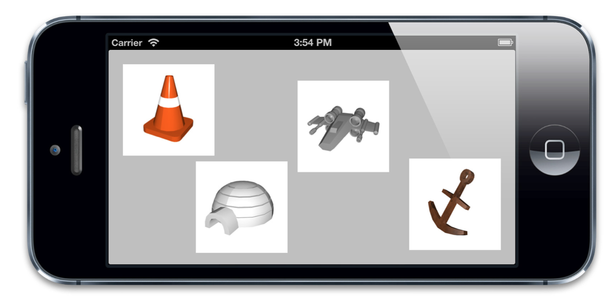

拼合不仅给app提供了一个整洁的载入方式，还有效地提高了载入性能（单张大图比多张小图载入得更快），但是如果有手动安排的话，它们还是有一些不方便的，如果你需要在一个已经创建好的拼合图上做一些尺寸上的修改或者其他变动，无疑是比较麻烦的。

Mac上有一些商业软件可以为你自动拼合图片，这些工具自动生成一个包含拼合后的坐标的XML或者plist文件，拼合图片的使用大大简化。这个文件可以和图片一同载入，并给每个拼合的图层设置`contentsRect`，这样开发者就不用手动写代码来摆放位置了。

这些文件通常在OpenGL游戏中使用，不过呢，你要是有兴趣在一些常见的app中使用拼合技术，那么一个叫做LayerSprites的开源库（[https://github.com/nicklockwood/LayerSprites](https://github.com/nicklockwood/LayerSprites))，它能够读取Cocos2D格式中的拼合图并在普通的Core Animation层中显示出来。

##contentsCenter

本章我们介绍的最后一个和内容有关的属性是`contentsCenter`，看名字你可能会以为它可能跟图片的位置有关，不过这名字着实误导了你。`contentsCenter`其实是一个CGRect，它定义了一个固定的边框和一个在图层上可拉伸的区域。 改变`contentsCenter`的值并不会影响到寄宿图的显示，除非这个图层的大小改变了，你才看得到效果。

默认情况下，`contentsCenter`是{0, 0, 1, 1}，这意味着如果大小（由`conttensGravity`决定）改变了,那么寄宿图将会均匀地拉伸开。但是如果我们增加原点的值并减小尺寸。我们会在图片的周围创造一个边框。图2.9展示了`contentsCenter`设置为{0.25, 0.25, 0.5, 0.5}的效果。

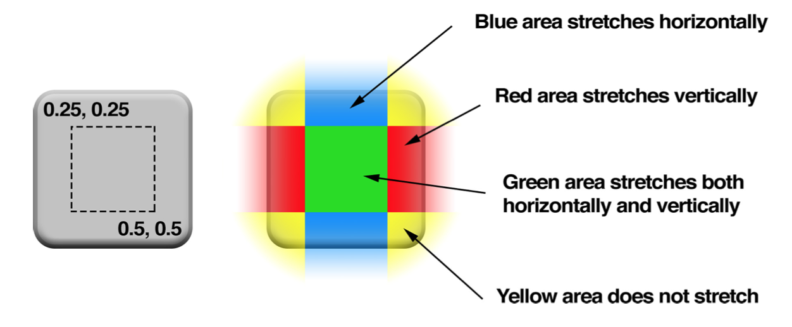

图2.9 `contentsCenter`的例子

这意味着我们可以随意重设尺寸，边框仍然会是连续的。它工作起来的效果和UIImage里的-resizableImageWithCapInsets: 方法效果非常类似，只是它可以运用到任何寄宿图，甚至包括在Core Graphics运行时绘制的图形（本章稍后会讲到）。

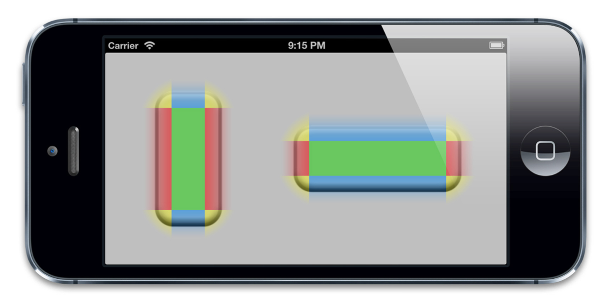

图2.10 同一图片使用不同的`contentsCenter`

清单2.4 演示了如何编写这些可拉伸视图。不过，contentsCenter的另一个很酷的特性就是，它可以在Interface Builder里面配置，根本不用写代码。如图2.11

清单2.4 用`contentsCenter`设置可拉伸视图

```objective-c
@interface ViewController ()

@property (nonatomic, weak) IBOutlet UIView *button1;
@property (nonatomic, weak) IBOutlet UIView *button2;

@end

@implementation ViewController

- (void)addStretchableImage:(UIImage *)image withContentCenter:(CGRect)rect toLayer:(CALayer *)layer
{  
  //set image
  layer.contents = (__bridge id)image.CGImage;

  //set contentsCenter
  layer.contentsCenter = rect;
}

- (void)viewDidLoad
{
  [super viewDidLoad]; //load button image
  UIImage *image = [UIImage imageNamed:@"Button.png"];

  //set button 1
  [self addStretchableImage:image withContentCenter:CGRectMake(0.25, 0.25, 0.5, 0.5) toLayer:self.button1.layer];

  //set button 2
  [self addStretchableImage:image withContentCenter:CGRectMake(0.25, 0.25, 0.5, 0.5) toLayer:self.button2.layer];
}

@end
```
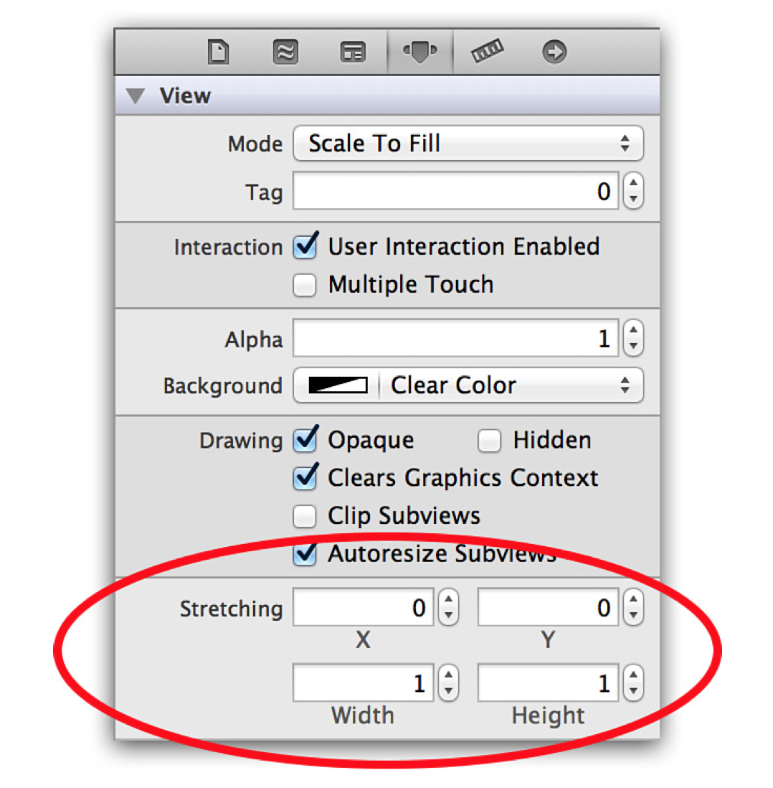

图2.11 用Interface Builder 探测窗口控制`contentsCenter`属性

##Custome Drawing

给`contents`赋CGImage的值不是唯一的设置寄宿图的方法。我们也可以直接用Core Graphics直接绘制寄宿图。能够通过继承UIView并实现`-drawRect:`方法来自定义绘制。

`-drawRect:` 方法没有默认的实现，因为对UIView来说，寄宿图并不是必须的，它不在意那到底是单调的颜色还是有一个图片的实例。如果UIView检测到`-drawRect:` 方法被调用了，它就会为视图分配一个寄宿图，这个寄宿图的像素尺寸等于视图大小乘以 `contentsScale`的值。

如果你不需要寄宿图，那就不要创建这个方法了，这会造成CPU资源和内存的浪费，这也是为什么苹果建议：如果没有自定义绘制的任务就不要在子类中写一个空的-drawRect:方法。

当视图在屏幕上出现的时候 `-drawRect:`方法就会被自动调用。`-drawRect:`方法里面的代码利用Core Graphics去绘制一个寄宿图，然后内容就会被缓存起来直到它需要被更新（通常是因为开发者调用了`-setNeedsDisplay`方法，尽管影响到表现效果的属性值被更改时，一些视图类型会被自动重绘，如`bounds`属性）。虽然`-drawRect:`方法是一个UIView方法，事实上都是底层的CALayer安排了重绘工作和保存了因此产生的图片。

CALayer有一个可选的`delegate`属性，实现了`CALayerDelegate`协议，当CALayer需要一个内容特定的信息时，就会从协议中请求。CALayerDelegate是一个非正式协议，其实就是说没有CALayerDelegate @protocol可以让你在类里面引用啦。你只需要调用你想调用的方法，CALayer会帮你做剩下的。（`delegate`属性被声明为id类型，所有的代理方法都是可选的）。

当需要被重绘时，CALayer会请求它的代理给它一个寄宿图来显示。它通过调用下面这个方法做到的:

```objective-c
(void)displayLayer:(CALayer *)layer;
```

趁着这个机会，如果代理想直接设置`contents`属性的话，它就可以这么做，不然没有别的方法可以调用了。如果代理不实现`-displayLayer:`方法，CALayer就会转而尝试调用下面这个方法：

```objective-c
- (void)drawLayer:(CALayer *)layer inContext:(CGContextRef)ctx;
```

在调用这个方法之前，CALayer创建了一个合适尺寸的空寄宿图（尺寸由`bounds`和`contentsScale`决定）和一个Core Graphics的绘制上下文环境，为绘制寄宿图做准备，它作为ctx参数传入。

让我们来继续第一章的项目让它实现CALayerDelegate并做一些绘图工作吧（见清单2.5）.图2.12是它的结果

清单2.5 实现CALayerDelegate

```objective-c
@implementation ViewController
- (void)viewDidLoad
{
  [super viewDidLoad];
  
  //create sublayer
  CALayer *blueLayer = [CALayer layer];
  blueLayer.frame = CGRectMake(50.0f, 50.0f, 100.0f, 100.0f);
  blueLayer.backgroundColor = [UIColor blueColor].CGColor;

  //set controller as layer delegate
  blueLayer.delegate = self;

  //ensure that layer backing image uses correct scale
  blueLayer.contentsScale = [UIScreen mainScreen].scale; //add layer to our view
  [self.layerView.layer addSublayer:blueLayer];

  //force layer to redraw
  [blueLayer display];
}

- (void)drawLayer:(CALayer *)layer inContext:(CGContextRef)ctx
{
  //draw a thick red circle
  CGContextSetLineWidth(ctx, 10.0f); 
  CGContextSetStrokeColorWithColor(ctx, [UIColor redColor].CGColor);
  CGContextStrokeEllipseInRect(ctx, layer.bounds);
}
@end
```

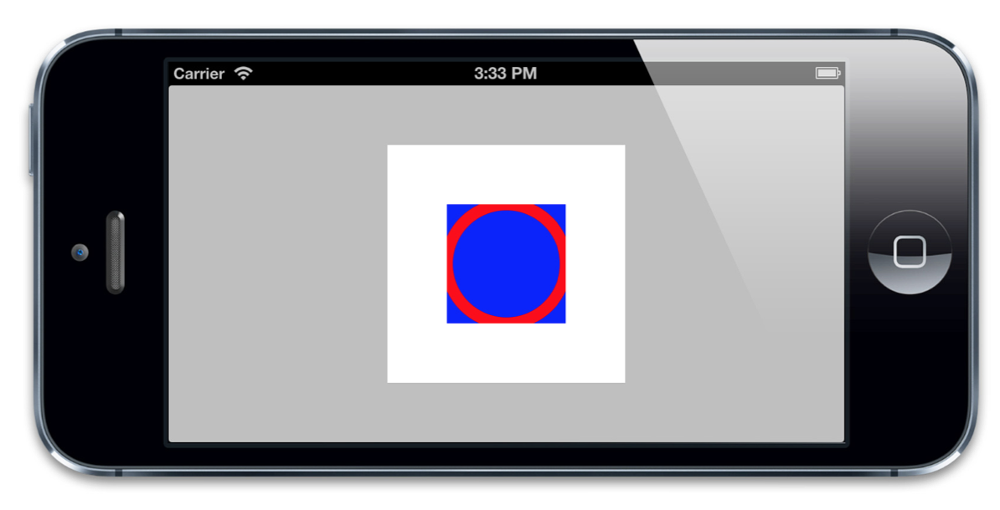

图2.12 实现CALayerDelegate来绘制图层

注意一下一些有趣的事情：

* 我们在blueLayer上显式地调用了`-display`。不同于UIView，当图层显示在屏幕上时，CALayer不会自动重绘它的内容。它把重绘的决定权交给了开发者。
* 尽管我们没有用`masksToBounds`属性，绘制的那个圆仍然沿边界被裁剪了。这是因为当你使用CALayerDelegate绘制寄宿图的时候，并没有对超出边界外的内容提供绘制支持。

现在你理解了CALayerDelegate，并知道怎么使用它。但是除非你创建了一个单独的图层，你几乎没有机会用到CALayerDelegate协议。因为当UIView创建了它的宿主图层时，它就会自动地把图层的delegate设置为它自己，并提供了一个`-displayLayer:`的实现，那所有的问题就都没了。

当使用寄宿了视图的图层的时候，你也不必实现`-displayLayer:`和`-drawLayer:inContext:`方法来绘制你的寄宿图。通常做法是实现UIView的`-drawRect:`方法，UIView就会帮你做完剩下的工作，包括在需要重绘的时候调用`-display`方法。

##总结

本章介绍了寄宿图和一些相关的属性。你学到了如何显示和放置图片， 使用拼合技术来显示， 以及用CALayerDelegate和Core Graphics来绘制图层内容。

在第三章，"图层几何学"中，我们将会探讨一下图层的几何，观察它们是如何放置和改变相互的尺寸的。
