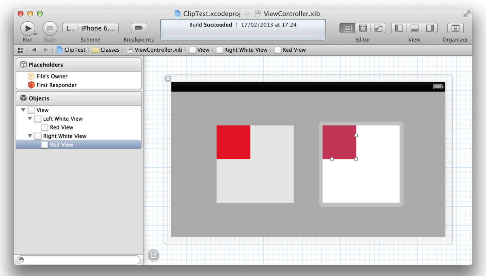
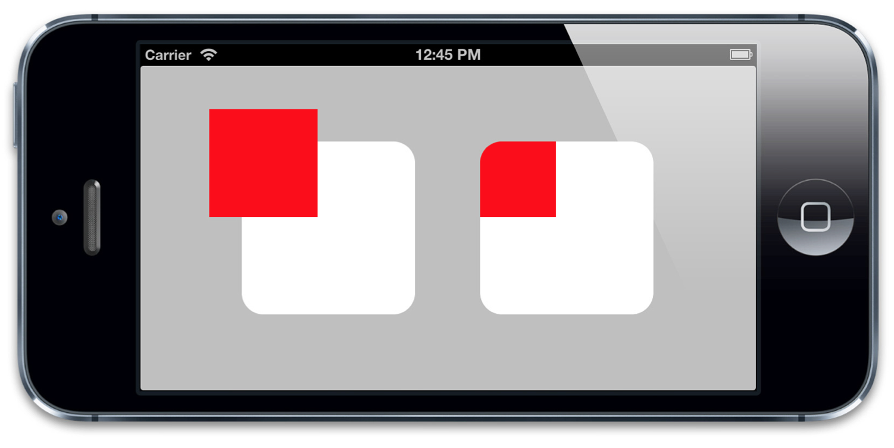
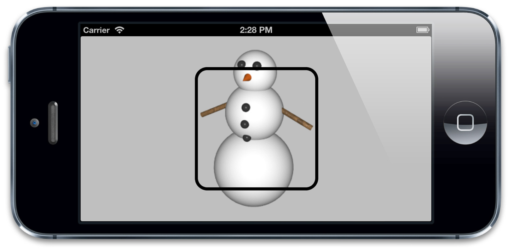

#视觉效果

>嗯，园和椭圆还不错，但如果是带圆角的矩形呢？

>我们现在能做到那样了么？

>史蒂芬·乔布斯

我们在第三章『图层几何学』中讨论了图层的frame，第二章『寄宿图』则讨论了图层的寄宿图。但是图层不仅仅可以是图片或是颜色的容器；还有一系列内建的特性使得创造美丽优雅的令人深刻的界面元素成为可能。在这一章，我们将会探索一些能够通过使用CALayer属性实现的视觉效果。

##圆角

圆角矩形是iOS的一个标志性审美特性。这在iOS的每一个地方都得到了体现，不论是主屏幕图标，还是警告弹框，甚至是文本框。按照这流行程度，你可能会认为一定有不借助Photoshop就能轻易创建圆角举行的方法。恭喜你，猜对了。

CALayer有一个叫做`conrnerRadius`的属性控制着图层角的曲率。它是一个浮点数，默认为0（为0的时候就是直角），但是你可以把它设置成任意值。默认情况下，这个曲率值只影响背景颜色而不影响背景图片或是子图层。不过，如果把`masksToBounds`设置成YES的话，图层里面的所有东西都会被截取。

我们可以通过一个简单的项目来演示这个效果。在Interface Builder中，我们放置一些视图，他们有一些子视图。而且这些子视图有一些超出了边界（如图4.1）。你可能无法看到他们超出了边界，因为在编辑界面的时候，超出的部分总是被Interface Builder裁切掉了。不过，你相信我就好了 :)



图4.1 两个白色的大视图，他们都包含了小一些的红色视图。

然后在代码中，我们设置角的半径为20个点，并裁剪掉第一个视图的超出部门（见列表4.1）。技术上来说，这些属性都可以在Interface Builder的探测板中分别通过『用户定义运行时属性』和勾选『裁剪子视图』选择框来直接设置属性的值。不过，在这个示例中，代码能够表示得更清楚。图4.2是运行代码的结果

列表4.1 设置`cornerRadius`和`masksToBounds`

```objective-c
@interface ViewController ()
@property (nonatomic, weak) IBOutlet UIView *layerView1; @property (nonatomic, weak) IBOutlet UIView *layerView2;
@end
@implementation ViewController
- (void)viewDidLoad {

[super viewDidLoad];
//set the corner radius on our layers
self.layerView1.layer.cornerRadius = 20.0f; self.layerView2.layer.cornerRadius = 20.0f;
//enable clipping on the second layer
self.layerView2.layer.masksToBounds = YES; }
@end
```



右图中，红色的子视图沿角半径被裁剪了

如你所见，右边的子视图沿边界被裁剪了。

单独控制每个层的圆角曲率也不是不可能的。如果想创建有些圆角有些直角的图层或视图时，你可能需要一些不同的方法。比如使用一个图层蒙板（本章稍后会讲到）或者是CAShapeLayer（见第六章『专用图层』）。

##图层边框

CALayer另外两个非常有用属性就是`borderWidth`和`borderColor`。二者共同定义了图层边的绘制样式。这条线（也被称作stroke）沿着图层的`bounds`绘制，同时也包含图层的角。

`borderWidth`是以点为单位的定义边框粗细的浮点数，默认为0.`borderColor`定义了边框的颜色，默认为黑色。

`borderColor`是CGColorRef类型，而不是UIColor，所以它不是Cocoa的内置对象。不过呢，你肯定也清楚图层引用了`borderColor`，虽然属性声明并不能证明这一点。`CGColorRef`在引用/释放时候的行为表现得与`NSObject`极其相似。但是Objective-C语法并不支持这一做法，所以`CGColorRef`属性即便是强引用也只能通过assign关键字来声明。

边框是绘制在图层边界里面的，而且在所有子内容之前，也在子图层之前。如果我们在之前的示例中（列表4.2）加入图层的边框，你就能看到到底是怎么一回事了（如图4.3）.

列表4.2 加上边框

```objective-c
@implementation ViewController
- (void)viewDidLoad {
[super viewDidLoad];
//set the corner radius on our layers
self.layerView1.layer.cornerRadius = 20.0f; self.layerView2.layer.cornerRadius = 20.0f;
//add a border to our layers
self.layerView1.layer.borderWidth = 5.0f; self.layerView2.layer.borderWidth = 5.0f;
//enable clipping on the second layer
self.layerView2.layer.masksToBounds = YES; }
@end
```


图4.3 给图层增加一个边框

仔细观察会发现边框并不会把寄宿图或子图层的形状计算进来，如果图层的子图层超过了边界，或者是寄宿图在透明区域有一个透明蒙板，边框仍然会沿着图层的边界绘制出来（如图4.4）.



图4.4 边框是跟随图层的边界变化的，而不是图层里面的内容

##阴影

iOS的另一个常见特性呢，就是阴影。阴影往往可以达到图层深度暗示的效果。也能够用来强调正在显示的图层和优先级（比如说一个在其他视图之前的弹出框），不过有时候他们也是单纯的装饰目的而已（让空间有更）