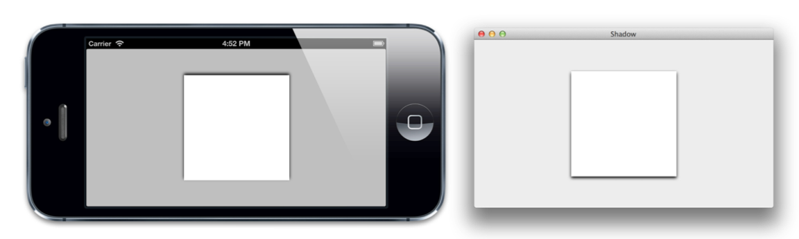
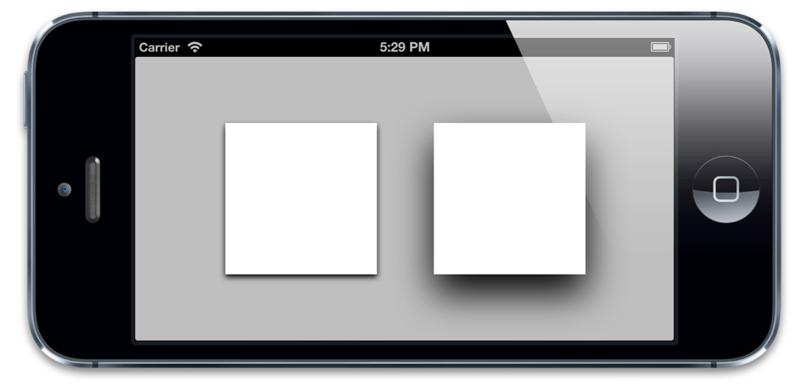
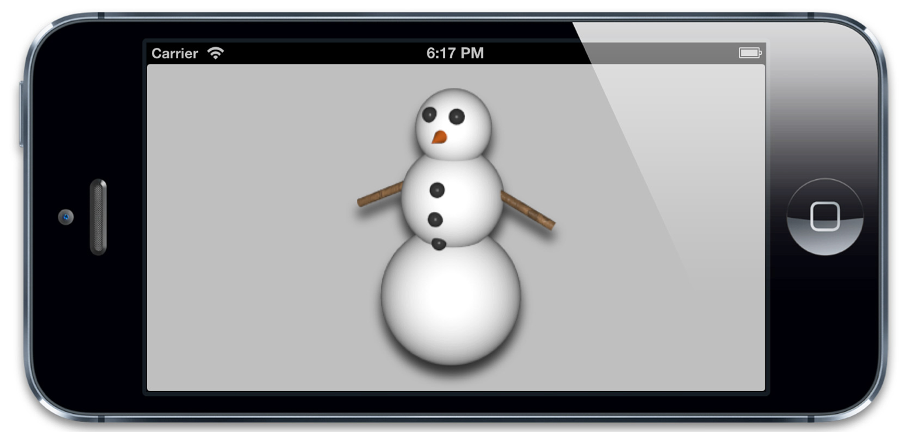
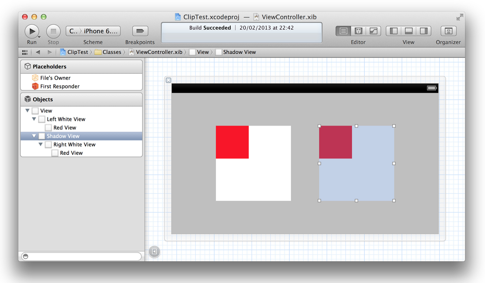
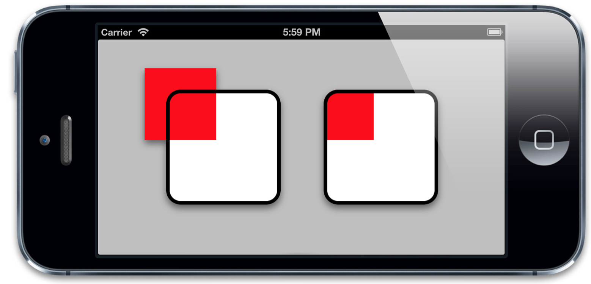
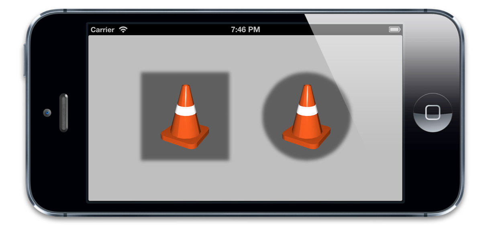
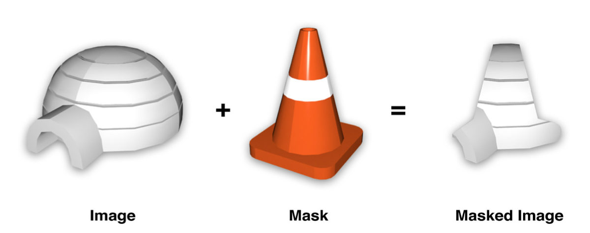
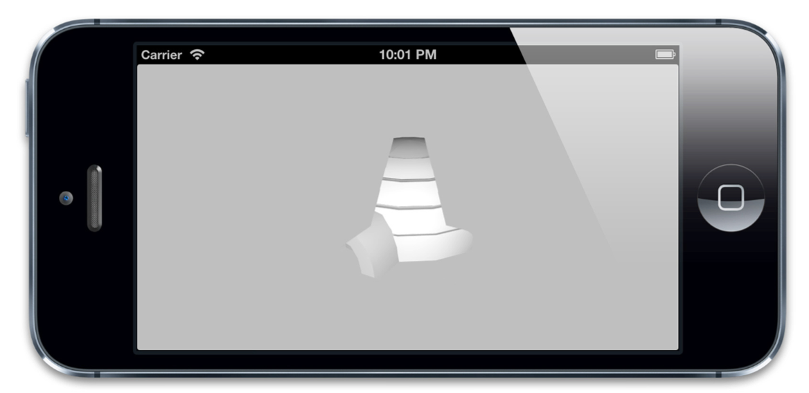

#视觉效果

>嗯，园和椭圆还不错，但如果是带圆角的矩形呢？

>我们现在能做到那样了么？

>史蒂芬·乔布斯

我们在第三章『图层几何学』中讨论了图层的frame，第二章『寄宿图』则讨论了图层的寄宿图。但是图层不仅仅可以是图片或是颜色的容器；还有一系列内建的特性使得创造美丽优雅的令人深刻的界面元素成为可能。在这一章，我们将会探索一些能够通过使用CALayer属性实现的视觉效果。

##圆角

圆角矩形是iOS的一个标志性审美特性。这在iOS的每一个地方都得到了体现，不论是主屏幕图标，还是警告弹框，甚至是文本框。按照这流行程度，你可能会认为一定有不借助Photoshop就能轻易创建圆角举行的方法。恭喜你，猜对了。

CALayer有一个叫做`conrnerRadius`的属性控制着图层角的曲率。它是一个浮点数，默认为0（为0的时候就是直角），但是你可以把它设置成任意值。默认情况下，这个曲率值只影响背景颜色而不影响背景图片或是子图层。不过，如果把`masksToBounds`设置成YES的话，图层里面的所有东西都会被截取。

我们可以通过一个简单的项目来演示这个效果。在Interface Builder中，我们放置一些视图，他们有一些子视图。而且这些子视图有一些超出了边界（如图4.1）。你可能无法看到他们超出了边界，因为在编辑界面的时候，超出的部分总是被Interface Builder裁切掉了。不过，你相信我就好了 :)


图4.1 两个白色的大视图，他们都包含了小一些的红色视图。

然后在代码中，我们设置角的半径为20个点，并裁剪掉第一个视图的超出部门（见列表4.1）。技术上来说，这些属性都可以在Interface Builder的探测板中分别通过『用户定义运行时属性』和勾选『裁剪子视图』选择框来直接设置属性的值。不过，在这个示例中，代码能够表示得更清楚。图4.2是运行代码的结果

列表4.1 设置`cornerRadius`和`masksToBounds`

```objective-c
@interface ViewController ()
@property (nonatomic, weak) IBOutlet UIView *layerView1; @property (nonatomic, weak) IBOutlet UIView *layerView2;
@end
@implementation ViewController
- (void)viewDidLoad {

[super viewDidLoad];
//set the corner radius on our layers
self.layerView1.layer.cornerRadius = 20.0f; self.layerView2.layer.cornerRadius = 20.0f;
//enable clipping on the second layer
self.layerView2.layer.masksToBounds = YES; }
@end
```


右图中，红色的子视图沿角半径被裁剪了

如你所见，右边的子视图沿边界被裁剪了。

单独控制每个层的圆角曲率也不是不可能的。如果想创建有些圆角有些直角的图层或视图时，你可能需要一些不同的方法。比如使用一个图层蒙板（本章稍后会讲到）或者是CAShapeLayer（见第六章『专用图层』）。

##图层边框

CALayer另外两个非常有用属性就是`borderWidth`和`borderColor`。二者共同定义了图层边的绘制样式。这条线（也被称作stroke）沿着图层的`bounds`绘制，同时也包含图层的角。

`borderWidth`是以点为单位的定义边框粗细的浮点数，默认为0.`borderColor`定义了边框的颜色，默认为黑色。

`borderColor`是CGColorRef类型，而不是UIColor，所以它不是Cocoa的内置对象。不过呢，你肯定也清楚图层引用了`borderColor`，虽然属性声明并不能证明这一点。`CGColorRef`在引用/释放时候的行为表现得与`NSObject`极其相似。但是Objective-C语法并不支持这一做法，所以`CGColorRef`属性即便是强引用也只能通过assign关键字来声明。

边框是绘制在图层边界里面的，而且在所有子内容之前，也在子图层之前。如果我们在之前的示例中（列表4.2）加入图层的边框，你就能看到到底是怎么一回事了（如图4.3）.

列表4.2 加上边框

```objective-c
@implementation ViewController
- (void)viewDidLoad {
[super viewDidLoad];
//set the corner radius on our layers
self.layerView1.layer.cornerRadius = 20.0f; self.layerView2.layer.cornerRadius = 20.0f;
//add a border to our layers
self.layerView1.layer.borderWidth = 5.0f; self.layerView2.layer.borderWidth = 5.0f;
//enable clipping on the second layer
self.layerView2.layer.masksToBounds = YES; }
@end
```


图4.3 给图层增加一个边框

仔细观察会发现边框并不会把寄宿图或子图层的形状计算进来，如果图层的子图层超过了边界，或者是寄宿图在透明区域有一个透明蒙板，边框仍然会沿着图层的边界绘制出来（如图4.4）.


图4.4 边框是跟随图层的边界变化的，而不是图层里面的内容

##阴影

iOS的另一个常见特性呢，就是阴影。阴影往往可以达到图层深度暗示的效果。也能够用来强调正在显示的图层和优先级（比如说一个在其他视图之前的弹出框），不过有时候他们只是单纯的装饰目的。

给`shadowOpacity`属性一个大于默认值（也就是0）的值，阴影就可以显示在任意图层之下。`shadowOpacity`是一个必须在0.0（不可见）和1.0（完全不透明）之间的浮点数。如果设置为1.0，将会显示一个有轻微模糊的黑色阴影稍微在图层之上。若要改动阴影的表现，你可以使用CALayer的另外三个属性：`shadowColor`，`shadowOffset`和`shadowRadius`。

显而易见，`shadowColor`属性控制着阴影的颜色，和`borderColor`和`backgroundColor`一样，它的类型也是`CGColorRef`。阴影默认是黑色，大多数时候你需要的阴影也是黑色的（其他颜色的阴影看起来是不是有一点点奇怪。。）。

`shadowOffset`属性控制着阴影的方向和距离。它是一个`CGSize`的值，宽度控制这阴影横向的位移，高度控制着纵向的位移。`shadowOffset`的默认值是 {0, -3}，意即阴影相对于Y轴有3个点的向上位移。

为什么要默认向上的阴影呢？尽管Core Animation是从图层套装演变而来（可以认为是为iOS创建的私有动画框架），但是呢，它却是在Mac OS上面世的，前面有提到，二者的Y轴是颠倒的。这就导致了默认的3个点位移的阴影是向上的。在Mac上，`shadowOffset`的默认值是阴影向下的，这样你就能理解为什么iOS上的阴影方向是向上的了（如图4.5）.



图4.5 在iOS（左）和Mac OS（右）上`shadowOffset`的表现。

苹果更倾向于用户界面的阴影应该是垂直向下的，所以在iOS把阴影宽度设为0，然后高度设为一个正值不失为一个做法。

`shadowRadius`属性控制着阴影的*模糊度*，当它的值是0的时候，阴影就和视图一样有一个非常确定的边界线。当值越来越大的时候，边界线看上去就会越来越模糊和自然。苹果自家的应用设计更偏向于自然的阴影，所以一个非零值再合适不过了。

通常来讲，如果你想让视图或控件非常醒目独立于背景之外（比如弹出框遮罩层），你就应该给`shadowRadius`设置一个稍大的值。阴影越模糊，图层的深度看上去就会更明显（如图4.6）.



图4.6 大一些的阴影位移和角半径会增加图层的深度即视感

##阴影裁剪

和图层边框不同，图层的阴影继承自内容的外形，而不是根据边界和角半径来确定。为了计算出阴影的形状，Core Animation会将寄宿图（包括子视图，如果有的话）考虑在内，然后通过这些来完美搭配图层形状从而创建一个阴影（见图4.7）。



图4.7 阴影是根据寄宿图的轮廓来确定的

当阴影和裁剪扯上关系的时候就有一个头疼的限制：阴影通常就是在Layer的边界之外，如果你开启了`masksToBounds`属性，所有从图层中突出来的内容都会被才剪掉。如果我们在我们之前的边框示例项目中增加图层的阴影属性时，你就会发现问题所在（见图4.8）.

图4.8 `maskToBounds`属性裁剪掉了阴影和内容

从技术角度来说，这个结果是可以是可以理解的，但确实又不是我们想要的效果。如果你想沿着内容裁切，你需要用到两个图层：一个只画阴影的空的外图层，和一个用`masksToBounds`裁剪内容的内图层。

如果我们把之前项目的右边用单独的视图把裁剪的视图包起来，我们就可以解决这个问题（如图4.9）.



图4.9 右边，用额外的阴影转换视图包裹被裁剪的视图

我们只把阴影用在最外层的视图上，内层视图进行裁剪。列表4.3是代码实现，图4.10是运行结果。

列表4.3 用一个额外的视图来解决阴影裁切的问题

```objective-c
@interface ViewController ()
@property (nonatomic, weak) IBOutlet UIView *layerView1; @property (nonatomic, weak) IBOutlet UIView *layerView2; @property (nonatomic, weak) IBOutlet UIView *shadowView;
@end
@implementation ViewController

- (void)viewDidLoad {
[super viewDidLoad];
//set the corner radius on our layers
self.layerView1.layer.cornerRadius = 20.0f; self.layerView2.layer.cornerRadius = 20.0f;
//add a border to our layers
self.layerView1.layer.borderWidth = 5.0f; self.layerView2.layer.borderWidth = 5.0f;
//add a shadow to layerView1
self.layerView1.layer.shadowOpacity = 0.5f; self.layerView1.layer.shadowOffset = CGSizeMake(0.0f, 5.0f); self.layerView1.layer.shadowRadius = 5.0f;
//add same shadow to shadowView (not layerView2)
self.shadowView.layer.shadowOpacity = 0.5f; self.shadowView.layer.shadowOffset = CGSizeMake(0.0f, 5.0f); self.shadowView.layer.shadowRadius = 5.0f;
//enable clipping on the second layer
self.layerView2.layer.masksToBounds = YES; }
@end
```



图4.10 右边视图，不受裁切阴影的阴影视图。

## `shadowPath`属性

我们已经知道图层阴影并不总是方的，而是从图层内容的形状继承而来。这看上去不错，但是实时计算阴影也是一个非常消耗资源的，尤其是图层有多个子图层，每个图层还有一个有透明效果的寄宿图的时候。

如果你事先知道你的阴影形状会是什么样子的，你可以通过指定一个`shadowPath`来提高性能。`shadowPath`是一个`CGPathRef`类型（一个指向`CGPath`的指针）。`CGPath`是一个Core Graphics对象，用来指定任意的一个矢量图形。我们可以通过这个属性单独于图层形状之外指定阴影的形状。

图4.11 展示了同一寄宿图的不同阴影设定。如你所见，我们使用的图形很简单，但是它的阴影可以是你想要的任何形状。列表4.4是代码实现。



图4.11 用`shadowPath`指定任意阴影形状

列表4.4 创建简单的阴影形状

```objective-c
@interface ViewController ()
@property (nonatomic, weak) IBOutlet UIView *layerView1;
@property (nonatomic, weak) IBOutlet UIView *layerView2; @end
@implementation ViewController
- (void)viewDidLoad {
[super viewDidLoad];
//enable layer shadows
self.layerView1.layer.shadowOpacity = 0.5f; self.layerView2.layer.shadowOpacity = 0.5f;
//create a square shadow
CGMutablePathRef squarePath = CGPathCreateMutable(); CGPathAddRect(squarePath, NULL, self.layerView1.bounds); self.layerView1.layer.shadowPath = squarePath; CGPathRelease(squarePath);
//create a circular shadow
CGMutablePathRef circlePath = CGPathCreateMutable(); CGPathAddEllipseInRect(circlePath, NULL, self.layerView2.bounds); self.layerView2.layer.shadowPath = circlePath; CGPathRelease(circlePath);
}
@end
```

如果是一个举行或是圆，用`CGPath`会相当简单明了。但是如果是更加复杂一点的图形，`UIBezierPath`类会更合适，它是一个由UIKit提供的在CGPath基础上的Objective-C包装类。

##图层蒙板

通过`masksToBounds`属性，我们可以沿边界裁剪图形；通过`cornerRadius`属性，我们还可以设定一个圆角。但是有时候你希望展现的内容不是在一个矩形或圆角矩形。比如，你想展示一个有星形框架的图片，又或者想让一些古卷文字慢慢渐变成背景色，而不是一个突兀的边界。

使用一个32位有alpha通道的png图片通常是创建一个无矩形视图最方便的方法，你可以给它指定一个透明蒙板来实现。但是这个方法不能让你以编码的方式动态地生成蒙板，也不能让子图层或子视图裁剪成同样的形状。

CALayer有一个属性叫做`mask`可以解决这个问题。这个属性本身就是个CALayer类型，有和其他图层一样的绘制和布局属性。它类似于一个子图层，相对于父图层（即拥有该属性的图层）布局，但是它却不是一个普通的子图层。不同于那些绘制在父图层中的子图层，`mask`图层定义了父图层的部分可见区域。

`mask`图层的`Color`属性是无关紧要的，真正重要的是图层的轮廓。`mask`属性就像是一个饼干切割机，`mask`图层实心的部分会被保留下来，其他的则会被抛弃。（如图4.12）

如果`mask`图层比父图层要小，只有在`mask`图层里面的内容才是它关心的，除此以外的一切都会被隐藏起来。


图4.12 把图片和蒙板图层作用在一起的效果

我们将代码演示一下这个过程，创建一个简单的项目，通过图层的`mask`属性来作用于图片之上。为了简便一些，我们用Interface Builder来创建一个包含UIImageView的图片图层。这样我们就只要代码实现蒙板图层了。列表4.5是最终的代码，图4.13是运行后的结果。

列表4.5 应用蒙板图层

```objective-c
@interface ViewController ()
@property (nonatomic, weak) IBOutlet UIImageView *imageView; @end
@implementation ViewController
- (void)viewDidLoad {
[super viewDidLoad];
//create mask layer
CALayer *maskLayer = [CALayer layer];
maskLayer.frame = self.layerView.bounds;
UIImage *maskImage = [UIImage imageNamed:@"Cone.png"]; maskLayer.contents = (__bridge id)maskImage.CGImage;
//apply mask to image layer

self.imageView.layer.mask = maskLayer; }
@end
```



图4.13 使用了`mask`之后的UIImageView

##拉伸过滤器

