#变换

>*很不幸，没人能告诉你母体是什么，你只能自己体会* -- 骇客帝国

在第四章“可视效果”中，我们研究了一些增强图层和它的内容显示效果的一些技术，在这一章中，我们将要研究可以用来对图层旋转，摆放或者扭曲的`CGAffineTransform`，以及可以将扁平物体转换成三维空间对象的`CATransform3D`（而不是仅仅对圆角矩形添加下沉阴影）。

##仿射变换

在第三章“图层几何学”中，我们使用了`UIView`的`transform`属性旋转了钟的指针，但并没有解释背后运作的原理，实际上`UIView`的`transform`属性是一个`CGAffineTransform`类型，用于在二维空间做旋转，缩放和平移。`CGAffineTransform`是一个可以和二维空间向量（例如`CGPoint`）做乘法的3X2的矩阵（见图5.1）。

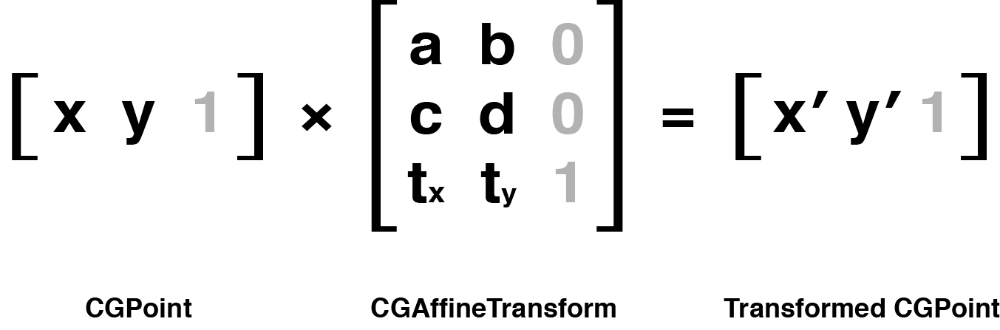

图5.1 用矩阵表示的`CGAffineTransform`和`CGPoint`

用`CGPoint`的每一列和`CGAffineTransform`矩阵的每一行对应元素相乘再求和，就形成了一个新的`CGPoint`类型的结果。要解释一下图中显示的灰色元素，为了能让矩阵做乘法，左边矩阵的列数一定要和右边矩阵的行数个数相同，所以要给矩阵填充一些标志值，使得既可以让矩阵做乘法，又不改变运算结果，并且没必要存储这些添加的值，因为它们的值不会发生变化，但是要用来做运算。

因此，通常会用3×3（而不是2×3）的矩阵来做二维变换，你可能会见到3行2列格式的矩阵，这是所谓的以列为主的格式，图5.1所示的是以行为主的格式，只要能保持一致，用哪种格式都无所谓。

当对图层应用变换矩阵，图层矩形内的每一个点都被相应地做变换，从而形成一个新的四边形的形状。`CGAffineTransform`中的“仿射”的意思是无论变换矩阵用什么值，图层中平行的两条线在变换之后任然保持平行，`CGAffineTransform`可以做出任意符合上述标注的变换，图5.2显示了一些仿射的和非仿射的变换：

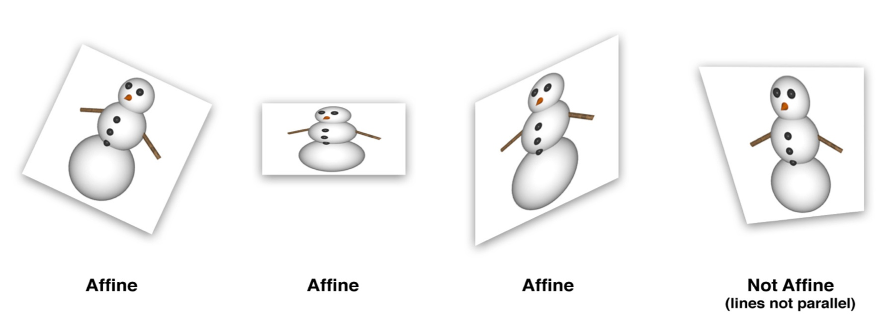

图5.2 仿射和非仿射变换

###创建一个`CGAffineTransform`

对矩阵数学做一个全面的阐述就超出本书的讨论范围了，不过如果你对矩阵完全不熟悉的话，矩阵变换可能会使你感到畏惧。幸运的是，Core Graphics提供了一系列函数，对完全没有数学基础的开发者也能够简单地做一些变换。如下几个函数都创建了一个`CGAffineTransform`实例：

    CGAffineTransformMakeRotation(CGFloat angle) 
    CGAffineTransformMakeScale(CGFloat sx, CGFloat sy)
    CGAffineTransformMakeTranslation(CGFloat tx, CGFloat ty)
    
旋转和缩放变换都可以很好解释--分别旋转或者缩放一个向量的值。平移变换是指每个点都移动了向量指定的x或者y值--所以如果向量代表了一个点，那它就平移了这个点的距离。

我们用一个很简单的项目来做个demo，把一个原始视图旋转45度角度（图5.3）

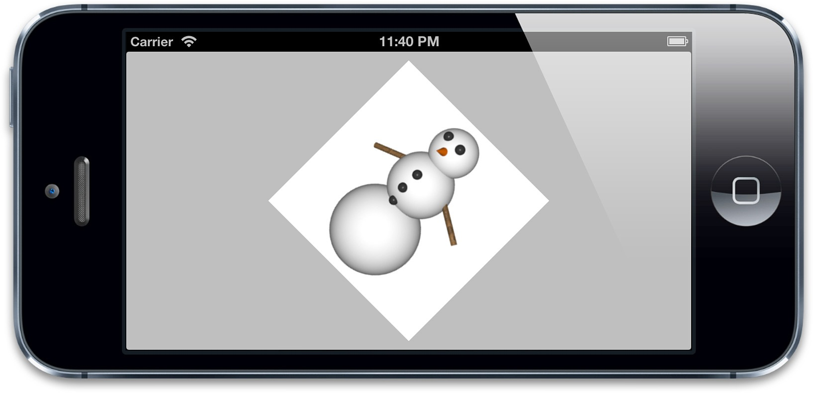

图5.3 使用仿射变换旋转45度角之后的视图

`UIView`可以通过设置`transform`属性做变换，但实际上它只是封装了内部图层的变换。

`CALayer`同样也有一个`transform`属性，但它的类型是`CATransform3D`，而不是`CGAffineTransform`，本章后续将会详细解释。`CALayer`对应于`UIView`的`transform`属性叫做`affineTransform`，清单5.1的例子就是使用`affineTransform`对图层做了45度顺时针旋转。

清单5.1 使用`affineTransform`对图层旋转45度
```objective-c
@interface ViewController ()

@property (nonatomic, weak) IBOutlet UIView *layerView;

@end

@implementation ViewController

- (void)viewDidLoad
{
    [super viewDidLoad];
    //rotate the layer 45 degrees
    CGAffineTransform transform = CGAffineTransformMakeRotation(M_PI_4);
    self.layerView.layer.affineTransform = transform;
}

@end
```

注意我们使用的旋转常量是`M_PI_4`，而不是你想象的45，因为iOS的变换函数使用弧度而不是角度作为单位。弧度用数学常量pi的倍数表示，一个pi代表180度，所以四分之一的pi就是45度。

C的数学函数库（iOS会自动引入）提供了pi的一些简便的换算，`M_PI_4`于是就是pi的四分之一，如果对换算不太清楚的话，可以用如下的宏做换算：

    #define RADIANS_TO_DEGREES(x) ((x)/M_PI*180.0) 
    #define DEGREES_TO_RADIANS(x) ((x)/180.0*M_PI)


###混合变换

Core Graphics提供了一系列的函数可以在一个变换的基础上做更深层次的变换，如果做一个既要*缩放*又要*旋转*的变换，这就会非常有用了。例如下面几个函数：

    CGAffineTransformRotate(CGAffineTransform t, CGFloat angle)     
    CGAffineTransformScale(CGAffineTransform t, CGFloat sx, CGFloat sy)      
    CGAffineTransformTranslate(CGAffineTransform t, CGFloat tx, CGFloat ty)

当操纵一个变换的时候，初始生成一个什么都不做的变换很重要--也就是创建一个`CGAffineTransform`类型的空值，矩阵论中称作*单位矩阵*，Core Graphics同样也提供了一个方便的常量：

	CGAffineTransformIdentity

最后，如果需要混合两个已经存在的变换矩阵，就可以使用如下方法，在两个变换的基础上创建一个新的变换：

	CGAffineTransformConcat(CGAffineTransform t1, CGAffineTransform t2);
	
我们来用这些函数组合一个更加复杂的变换，先缩小50%，再旋转30度，最后向右移动200个像素（清单5.2）。图5.4显示了图层变换最后的结果。

清单5.2 使用若干方法创建一个复合变换

```objective-c
- (void)viewDidLoad
{
    [super viewDidLoad]; 
    CGAffineTransform transform = CGAffineTransformIdentity; //create a new transform 
    transform = CGAffineTransformScale(transform, 0.5, 0.5); //scale by 50%
    transform = CGAffineTransformRotate(transform, M_PI / 180.0 * 30.0); //rotate by 30 degrees
    transform = CGAffineTransformTranslate(transform, 200, 0); //translate by 200 points
    //apply transform to layer
    self.layerView.layer.affineTransform = transform;
}
```

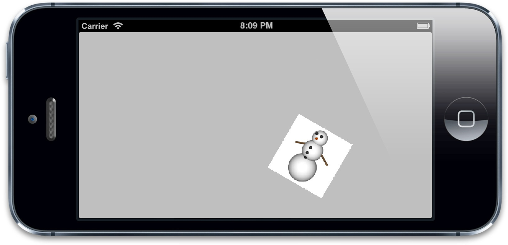

图5.4 顺序应用多个仿射变换之后的结果

图5.4中有些需要注意的地方：图片向右边发生了平移，但并没有指定距离那么远（200像素），另外它还有点向下发生了平移。原因在于当你按顺序做了变换，上一个变换的结果将会影响之后的变换，所以200像素的向右平移同样也被旋转了30度，缩小了50%，所以它实际上是斜向移动了100像素。

这意味着变换的顺序会影响最终的结果，也就是说旋转之后的平移和平移之后的旋转结果可能不同。

###剪切变换

Core Graphics为你提供了计算变换矩阵的一些方法，所以很少需要直接设置`CGAffineTransform`的值。除非需要创建一个*斜切*的变换，Core Graphics并没有提供直接的函数。

斜切变换是放射变换的第四种类型，较于平移，旋转和缩放并不常用（这也是Core Graphics没有提供相应函数的原因），但有些时候也会很有用。我们用一张图片可以很直接的说明效果（图5.5）。也许用“倾斜”描述更加恰当，具体做变换的代码见清单5.3。

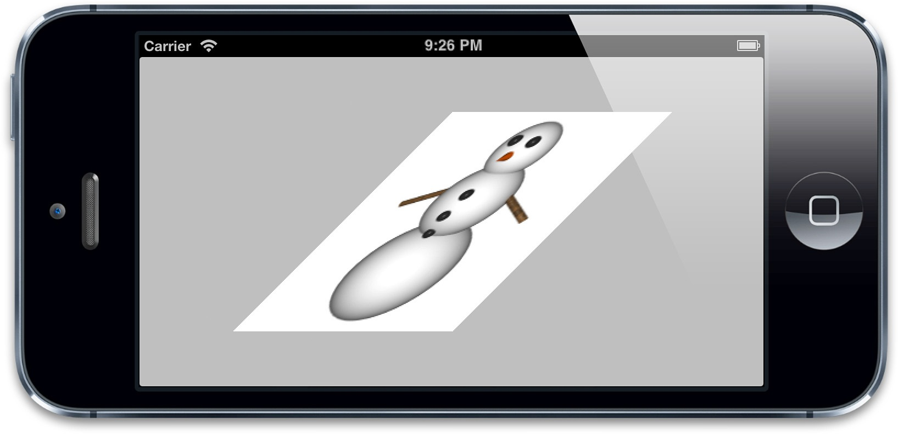

图5.5 水平方向的斜切变换

清单5.3 实现一个斜切变换

```objective-c
@implementation ViewController

CGAffineTransform CGAffineTransformMakeShear(CGFloat x, CGFloat y)
{
    CGAffineTransform transform = CGAffineTransformIdentity;
    transform.c = -x;
    transform.b = y;
    return transform;
}

- (void)viewDidLoad
{
    [super viewDidLoad];
    //shear the layer at a 45-degree angle
    self.layerView.layer.affineTransform = CGAffineTransformMakeShear(1, 0);
}

@end
```

##3D变换

CG的前缀告诉我们，`CGAffineTransform`类型属于Core Graphics框架，Core Graphics实际上是一个严格意义上的2D绘图API，并且`CGAffineTransform`仅仅对2D变换有效。

在第三章中，我们提到了`zPosition`属性，可以用来让图层靠近或者远离相机（用户视角），`transform`属性（`CATransform3D`类型）可以真正做到这点，即让图层在3D空间内移动或者旋转。

和`CGAffineTransform`类似，`CATransform3D`也是一个矩阵，但是和2x3的矩阵不同，`CATransform3D`是一个可以在3维空间内做变换的4x4的矩阵（图5.6）。

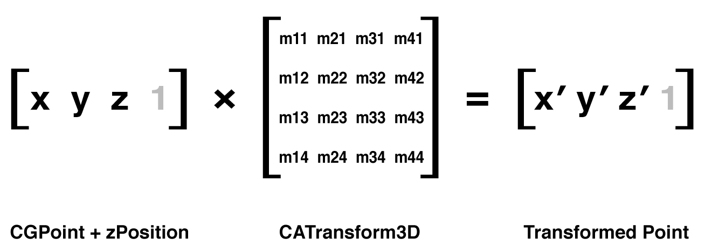

图5.6 对一个3D像素点做`CATransform3D`矩阵变换

和`CGAffineTransform`矩阵类似，Core Animation提供了一系列的方法用来创建和组合`CATransform3D`类型的矩阵，和Core Graphics的函数类似，但是3D的平移和旋转多处了一个`z`参数，并且旋转函数除了`angle`之外多出了`x`,`y`,`z`三个参数，分别决定了每个坐标轴方向上的旋转：

    CATransform3DMakeRotation(CGFloat angle, CGFloat x, CGFloat y, CGFloat z)
    CATransform3DMakeScale(CGFloat sx, CGFloat sy, CGFloat sz) 
    CATransform3DMakeTranslation(Gloat tx, CGFloat ty, CGFloat tz)

你应该对X轴和Y轴比较熟悉了，分别以右和下为正方向（回忆第三章，这是iOS上的标准结构，在Mac OS，Y轴朝上为正方向），Z轴和这两个轴分别垂直，指向视角外为正方向（图5.7）。

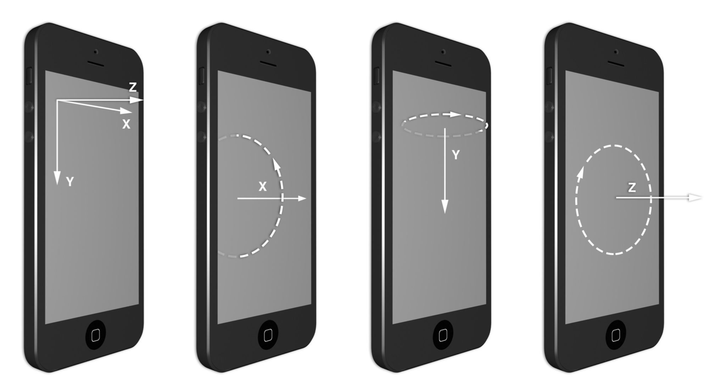

图5.7 X，Y，Z轴，以及围绕它们旋转的方向

由图所见，绕Z轴的旋转等同于之前二维空间的仿射旋转，但是绕X轴和Y轴的旋转就突破了屏幕的二维空间，并且在用户视角看来发生了倾斜。

举个例子：清单5.4的代码使用了`CATransform3DMakeRotation`对视图内的图层绕Y轴做了45度角的旋转，我们可以把视图向右倾斜，这样会看得更清晰。

结果见图5.8，但并不像我们期待的那样。

清单5.4 绕Y轴旋转图层

```objective-c
@implementation ViewController

- (void)viewDidLoad
{
    [super viewDidLoad];
    //rotate the layer 45 degrees along the Y axis
    CATransform3D transform = CATransform3DMakeRotation(M_PI_4, 0, 1, 0);
    self.layerView.layer.transform = transform;
}

@end
```

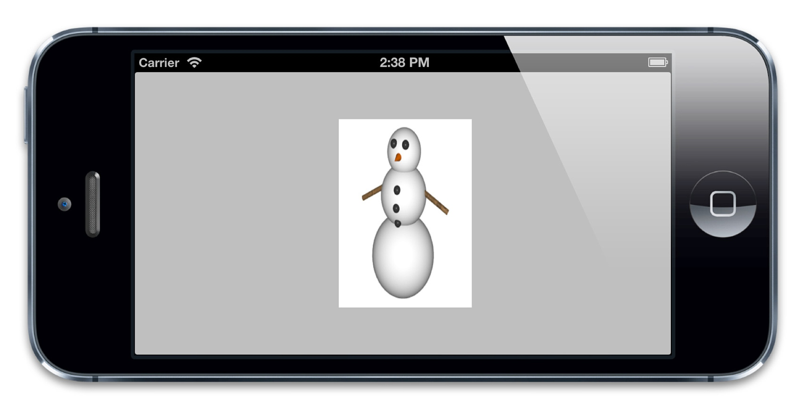

图5.8 绕y轴旋转45度的视图

看起来图层并没有被旋转，而是仅仅在水平方向上的一个压缩，是哪里出了问题呢？

其实完全没错，视图看起来更窄实际上是因为我们在用一个斜向的视角看它，而不是*透视*。

###透视投影

在真实世界中，当物体远离我们的时候，由于视角的原因看起来会变小，理论上说远离我们的视图的边要比靠近视角的边跟短，但实际上并没有发生，而我们当前的视角是等距离的，也就是在3D变换中任然保持平行，和之前提到的仿射变换类似。

在等距投影中，远处的物体和近处的物体保持同样的缩放比例，这种投影也有它自己的用处（例如建筑绘图，颠倒，和伪3D视频），但当前我们并不需要。

为了做一些修正，我们需要引入*投影变换*（又称作*z变换*）来对除了旋转之外的变换矩阵做一些修改，Core Animation并没有给我们提供设置透视变换的函数，因此我们需要手动修改矩阵值，幸运的是，很简单：

`CATransform3D`的透视效果通过一个矩阵中一个很简单的元素来控制：`m34`。`m34`（图5.9）用于按比例缩放X和Y的值来计算到底要离视角多远。

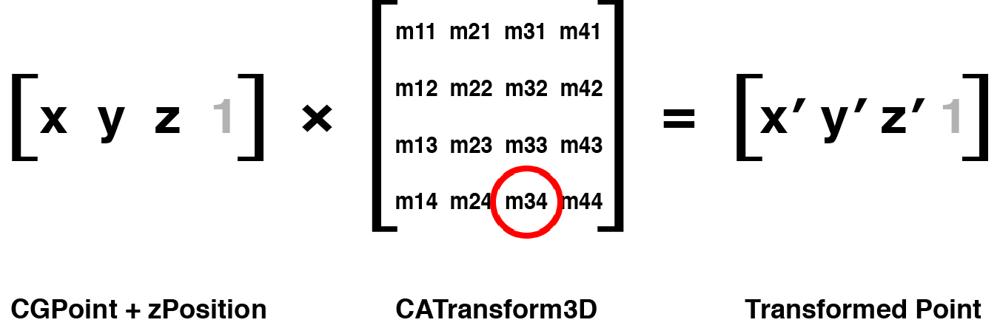

图5.9 `CATransform3D`的`m34`元素，用来做透视

`m34`的默认值是0，我们可以通过设置`m34`为-1.0 / `d`来应用透视效果，`d`代表了想象中视角相机和屏幕之间的距离，以像素为单位，那应该如何计算这个距离呢？实际上并不需要，大概估算一个就好了。

因为视角相机实际上并不存在，所以可以根据屏幕上的显示效果自由决定它的放置的位置。通常500-1000就已经很好了，但对于特定的图层有时候更小或者更大的值会看起来更舒服，减少距离的值会增强透视效果，所以一个非常微小的值会让它看起来更加失真，然而一个非常大的值会让它基本失去透视效果，对视图应用透视的代码见清单5.5，结果见图5.10。

清单5.5 对变换应用透视效果

```objective-c
@implementation ViewController

- (void)viewDidLoad
{
    [super viewDidLoad];
    //create a new transform
    CATransform3D transform = CATransform3DIdentity;
    //apply perspective
    transform.m34 = - 1.0 / 500.0;
    //rotate by 45 degrees along the Y axis
    transform = CATransform3DRotate(transform, M_PI_4, 0, 1, 0);
    //apply to layer
    self.layerView.layer.transform = transform;
}

@end
```

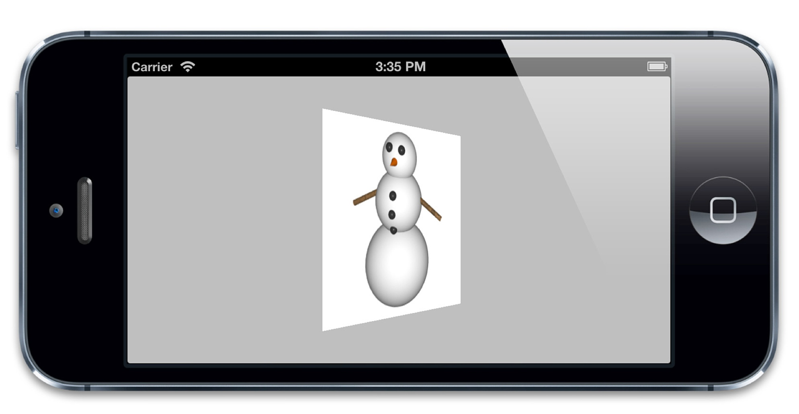

图5.10 应用透视效果之后再次对图层做旋转

###灭点

当在透视角度绘图的时候，远离相机视角的物体将会变小变远，当远离到一个极限距离，它们可能就缩成了一个点，于是所有的物体最后都汇聚消失在同一个点。

在现实中，这个点通常是视图的中心（图5.11），于是为了在应用中创建拟真效果的透视，这个点应该聚在屏幕中点，或者至少是包含所有3D对象的视图中点。

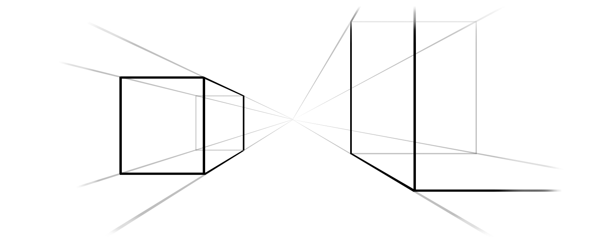

图5.11 灭点

Core Animation定义了这个点位于变换图层的`anchorPoint`（通常位于图层中心，但也有例外，见第三章）。这就是说，当图层发生变换时，这个点永远位于图层变换之前`anchorPoint`的位置。

当改变一个图层的`position`，你也改变了它的灭点，做3D变换的时候要时刻记住这一点，当你视图通过调整`m34`来让它更加有3D效果，应该首先把它放置于屏幕中央，然后通过平移来把它移动到指定位置（而不是直接改变它的`position`），这样所有的3D图层都共享一个灭点。

###`sublayerTransform`属性

如果有多个视图或者图层，每个都做3D变换，那就需要分别设置相同的m34值，并且确保在变换之前都在屏幕中央共享同一个`position`，如果用一个函数封装这些操作的确会更加方便，但仍然有限制（例如，你不能在Interface Builder中摆放视图），这里有一个更好的方法。

`CALayer`有一个属性叫做`sublayerTransform`。它也是`CATransform3D`类型，但和对一个图层的变换不同，它影响到所有的子图层。这意味着你可以一次性对包含这些图层的容器做变换，于是所有的子图层都自动继承了这个变换方法。

相较而言，通过在一个地方设置透视变换会很方便，同时它会带来另一个显著的优势：灭点被设置在*容器图层*的中点，从而不需要再对子图层分别设置了。这意味着你可以随意使用`position`和`frame`来放置子图层，而不需要把它们放置在屏幕中点，然后为了保证统一的灭点用变换来做平移。

我们来用一个demo举例说明。这里用Interface Builder并排放置两个视图（图5.12），然后通过设置它们容器视图的透视变换，我们可以保证它们有相同的透视和灭点，代码见清单5.6，结果见图5.13。

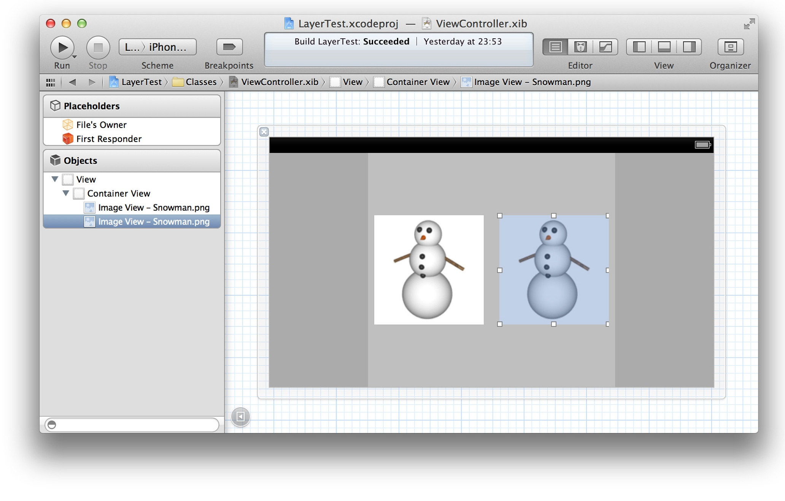

图5.12 在一个视图容器内并排放置两个视图

清单5.6 应用`sublayerTransform`

```objective-c
@interface ViewController ()

@property (nonatomic, weak) IBOutlet UIView *containerView;
@property (nonatomic, weak) IBOutlet UIView *layerView1;
@property (nonatomic, weak) IBOutlet UIView *layerView2;

@end

@implementation ViewController

- (void)viewDidLoad
{
    [super viewDidLoad];
    //apply perspective transform to container
    CATransform3D perspective = CATransform3DIdentity;
    perspective.m34 = - 1.0 / 500.0;
    self.containerView.layer.sublayerTransform = perspective;
    //rotate layerView1 by 45 degrees along the Y axis
    CATransform3D transform1 = CATransform3DMakeRotation(M_PI_4, 0, 1, 0);
    self.layerView1.layer.transform = transform1;
    //rotate layerView2 by 45 degrees along the Y axis
    CATransform3D transform2 = CATransform3DMakeRotation(-M_PI_4, 0, 1, 0);
    self.layerView2.layer.transform = transform2;
}
```

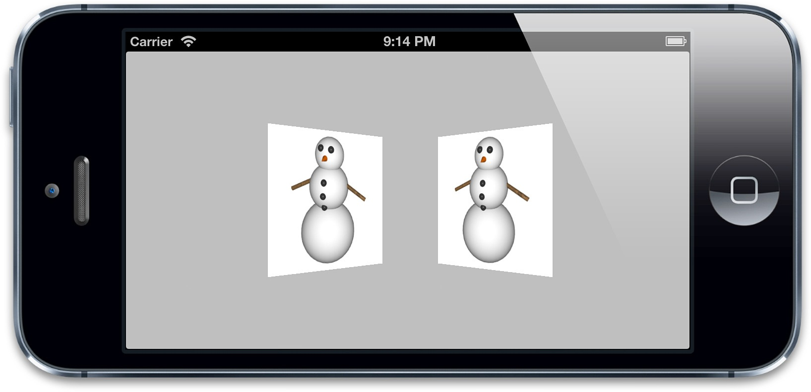

图5.13 通过相同的透视效果分别对视图做变换

###背面

我们既然可以在3D场景下旋转图层，那么也可以从*背面*去观察它。如果我们在清单5.4中把角度修改为`M_PI`（180度）而不是当前的` M_PI_4`（45度），那么将会把图层完全旋转一个半圈，于是完全背对了相机视角。

那么从背部看图层是什么样的呢，见图5.14

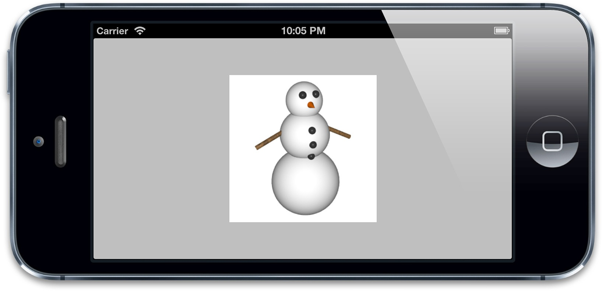

图5.14 视图的背面，一个镜像对称的图片

如你所见，图层是双面绘制的，反面显示的是正面的一个镜像图片。

但这并不是一个很好的特性，因为如果图层包含文本或者其他控件，那用户看到这些内容的镜像图片当然会感到困惑。另外也有可能造成资源的浪费：想象用这些图层形成一个不透明的固态立方体，既然永远都看不见这些图层的背面，那为什么浪费GPU来绘制它们呢？

`CALayer`有一个叫做`doubleSided`的属性来控制图层的背面是否要被绘制。这是一个`BOOL`类型，默认为`YES`，如果设置为`NO`，那么当图层正面从相机视角消失的时候，它将不会被绘制。

###扁平化图层

如果对包含已经做过变换的图层的图层做反方向的变换将会发什么什么呢？是不是有点困惑？见图5.15

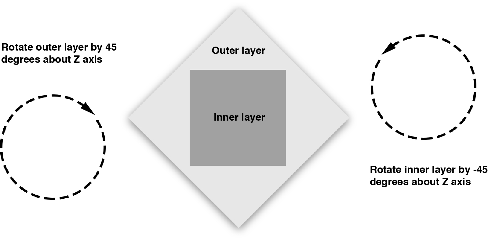

图5.15 反方向变换的嵌套图层

注意做了-45度旋转的内部图层是怎样抵消旋转45度的图层，从而恢复正常状态的。

如果内部图层相对外部图层做了相反的变换（这里是绕Z轴的旋转），那么按照逻辑这两个变换将被相互抵消。

验证一下，相应代码见清单5.7，结果见5.16

清单5.7 绕Z轴做相反的旋转变换

```objective-c
@interface ViewController ()

@property (nonatomic, weak) IBOutlet UIView *outerView;
@property (nonatomic, weak) IBOutlet UIView *innerView;

@end

@implementation ViewController

- (void)viewDidLoad
{
    [super viewDidLoad];
    //rotate the outer layer 45 degrees
    CATransform3D outer = CATransform3DMakeRotation(M_PI_4, 0, 0, 1);
    self.outerView.layer.transform = outer;
    //rotate the inner layer -45 degrees
    CATransform3D inner = CATransform3DMakeRotation(-M_PI_4, 0, 0, 1);
    self.innerView.layer.transform = inner;
}

@end
```

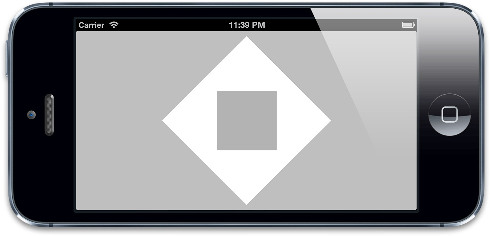

图5.16 旋转后的视图

运行结果和我们预期的一致。现在在3D情况下再试一次。修改代码，让内外两个视图绕Y轴旋转而不是Z轴，再加上透视效果，以便我们观察。注意不能用`sublayerTransform`属性，因为内部的图层并不直接是容器图层的子图层，所以这里分别对图层设置透视变换（清单5.8）。

清单5.8 绕Y轴相反的旋转变换

```objective-c
- (void)viewDidLoad
{
    [super viewDidLoad];
    //rotate the outer layer 45 degrees
    CATransform3D outer = CATransform3DIdentity;
    outer.m34 = -1.0 / 500.0;
    outer = CATransform3DRotate(outer, M_PI_4, 0, 1, 0);
    self.outerView.layer.transform = outer;
    //rotate the inner layer -45 degrees
    CATransform3D inner = CATransform3DIdentity;
    inner.m34 = -1.0 / 500.0;
    inner = CATransform3DRotate(inner, -M_PI_4, 0, 1, 0);
    self.innerView.layer.transform = inner;
}
```

预期的效果应该如图5.17所示。

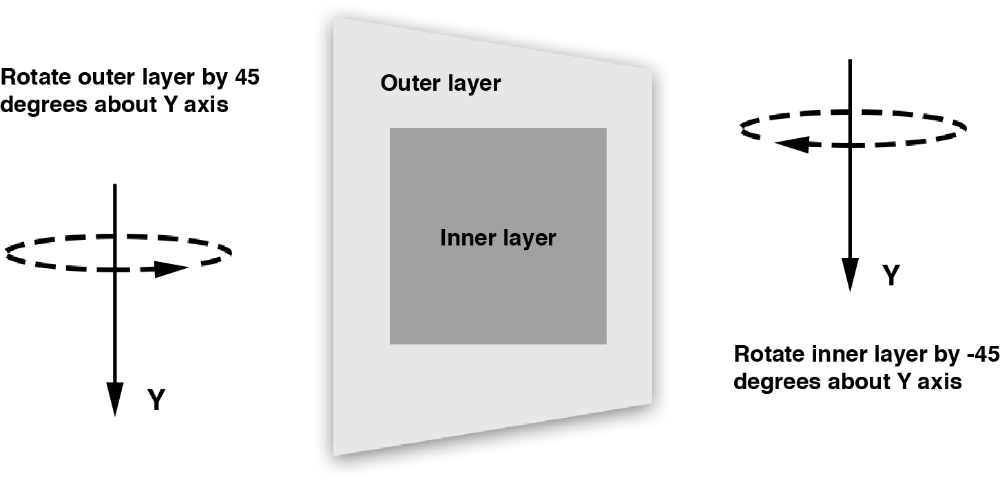

图5.17 绕Y轴做相反旋转的预期结果。

但其实这并不是我们所看到的，相反，我们看到的结果如图5.18所示。发什么了什么呢？内部的图层仍然向左侧旋转，并且发生了扭曲，但按道理说它应该保持正面朝上，并且显示正常的方块。

这是由于尽管Core Animation图层存在于3D空间之内，但它们并不都存在*同一个*3D空间。每个图层的3D场景其实是扁平化的，当你从正面观察一个图层，看到的实际上由子图层创建的想象出来的3D场景，但当你倾斜这个图层，你会发现实际上这个3D场景仅仅是被绘制在图层的表面。

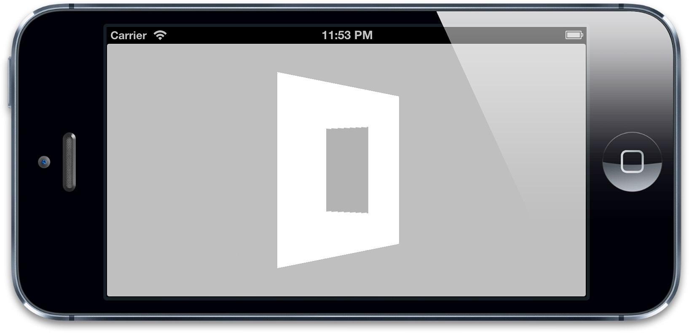

图5.18 绕Y轴做相反旋转的真实结果

类似的，当你在玩一个3D游戏，实际上仅仅是把屏幕做了一次倾斜，或许在游戏中可以看见有一面墙在你面前，但是倾斜屏幕并不能够看见墙里面的东西。所有场景里面绘制的东西并不会随着你观察它的角度改变而发生变化；图层也是同样的道理。

这使得用Core Animation创建非常复杂的3D场景变得十分困难。你不能够使用图层树去创建一个3D结构的层级关系--在相同场景下的任何3D表面必须和同样的图层保持一致，这是因为每个的父视图都把它的子视图扁平化了。

至少当你用正常的`CALayer`的时候是这样，`CALayer`有一个叫做`CATransformLayer`的子类来解决这个问题。具体在第六章“特殊的图层”中将会具体讨论。

##固体对象

现在你懂得了在3D空间的一些图层布局的基础，我们来试着创建一个固态的3D对象（实际上是一个技术上所谓的*空洞*对象，但它以固态呈现）。我们用六个独立的视图来构建一个立方体的各个面。

在这个例子中，我们用Interface Builder来构建立方体的面（图5.19），我们当然可以用代码来写，但是用Interface Builder的好处是可以方便的在每一个面上添加子视图。记住这些面仅仅是包含视图和控件的普通的用户界面元素，它们完全是我们界面交互的部分，并且当把它折成一个立方体之后也不会改变这个性质。

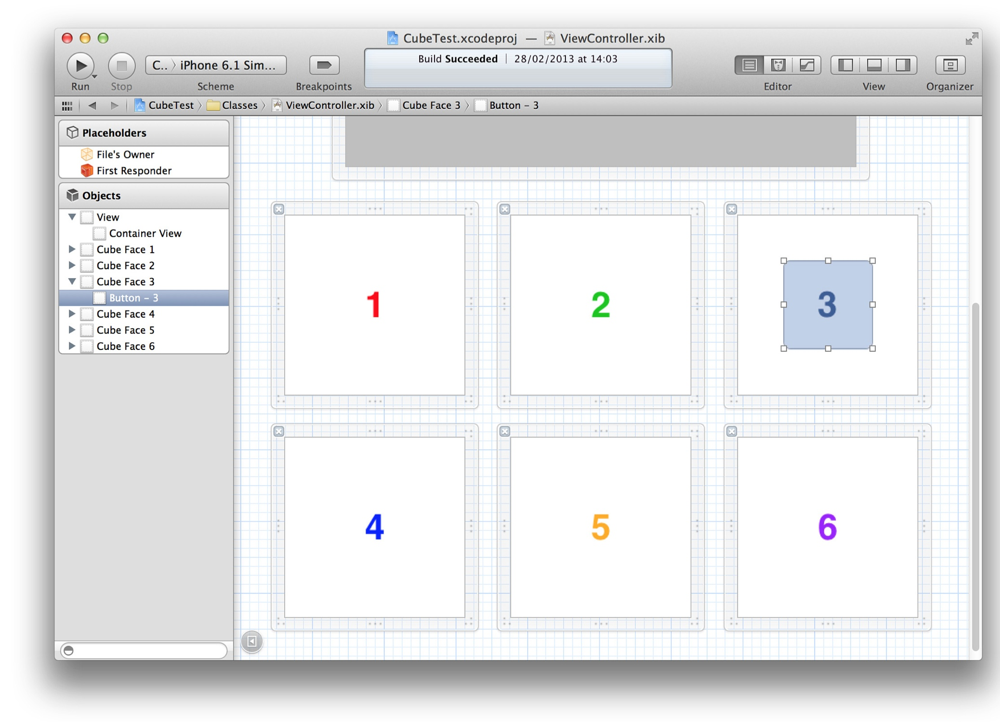

图5.19 用Interface Builder对立方体的六个面进行布局

这些面视图并没有放置在主视图当中，而是松散地排列在根nib文件里面。我们并不关心在这个容器中如何摆放它们的位置，因为后续将会用图层的`transform`对它们进行重新布局，并且用Interface Builder在容器视图之外摆放他们可以让我们容易看清楚它们的内容，如果把它们一个叠着一个都塞进主视图，将会变得很难看。

我们把一个有颜色的`UILabel`放置在视图内部，是为了清楚的辨别它们之间的关系，并且`UIButton`被放置在第三个面视图里面，后面会做简单的解释。

具体把视图组织成立方体的代码见清单5.9，结果见图5.20

清单5.9 创建一个立方体

```objective-c
@interface ViewController ()

@property (nonatomic, weak) IBOutlet UIView *containerView;
@property (nonatomic, strong) IBOutletCollection(UIView) NSArray *faces;

@end

@implementation ViewController

- (void)addFace:(NSInteger)index withTransform:(CATransform3D)transform
{
    //get the face view and add it to the container
    UIView *face = self.faces[index];
    [self.containerView addSubview:face];
    //center the face view within the container
    CGSize containerSize = self.containerView.bounds.size;
    face.center = CGPointMake(containerSize.width / 2.0, containerSize.height / 2.0);
    // apply the transform
    face.layer.transform = transform;
}

- (void)viewDidLoad
{
    [super viewDidLoad];
    //set up the container sublayer transform
    CATransform3D perspective = CATransform3DIdentity;
    perspective.m34 = -1.0 / 500.0;
    self.containerView.layer.sublayerTransform = perspective;
    //add cube face 1
    CATransform3D transform = CATransform3DMakeTranslation(0, 0, 100);
    [self addFace:0 withTransform:transform];
    //add cube face 2
    transform = CATransform3DMakeTranslation(100, 0, 0);
    transform = CATransform3DRotate(transform, M_PI_2, 0, 1, 0);
    [self addFace:1 withTransform:transform];
    //add cube face 3
    transform = CATransform3DMakeTranslation(0, -100, 0);
    transform = CATransform3DRotate(transform, M_PI_2, 1, 0, 0);
    [self addFace:2 withTransform:transform];
    //add cube face 4
    transform = CATransform3DMakeTranslation(0, 100, 0);
    transform = CATransform3DRotate(transform, -M_PI_2, 1, 0, 0);
    [self addFace:3 withTransform:transform];
    //add cube face 5
    transform = CATransform3DMakeTranslation(-100, 0, 0);
    transform = CATransform3DRotate(transform, -M_PI_2, 0, 1, 0);
    [self addFace:4 withTransform:transform];
    //add cube face 6
    transform = CATransform3DMakeTranslation(0, 0, -100);
    transform = CATransform3DRotate(transform, M_PI, 0, 1, 0);
    [self addFace:5 withTransform:transform];
}

@end
```

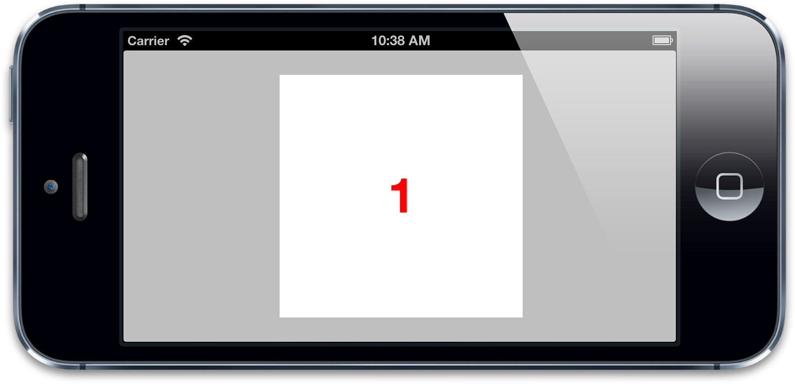

图5.20 正面朝上的立方体

从这个角度看立方体并不是很明显；看起来只是一个方块，为了更好地欣赏它，我们将更换一个*不同的视角*。

旋转这个立方体将会显得很笨重，因为我们要单独对每个面做旋转。另一个简单的方案是通过调整容器视图的`sublayerTransform`去旋转*照相机*。

添加如下几行去旋转`containerView`图层的`perspective`变换矩阵：

    perspective = CATransform3DRotate(perspective, -M_PI_4, 1, 0, 0); 
    perspective = CATransform3DRotate(perspective, -M_PI_4, 0, 1, 0);
    
这就对相机（或者相对相机的整个场景，你也可以这么认为）绕Y轴旋转45度，并且绕X轴旋转45度。现在从另一个角度去观察立方体，就能看出它的真实面貌（图5.21）。

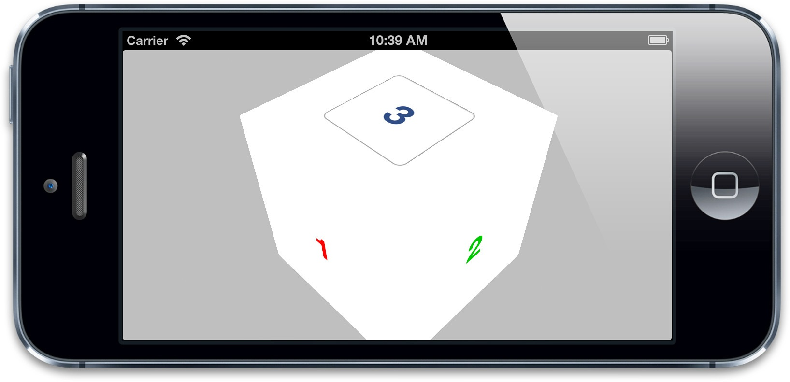

图5.21 从一个边角观察的立方体

###光亮和阴影

现在它看起来更像是一个立方体没错了，但是对每个面之间的连接还是很难分辨。Core Animation可以用3D显示图层，但是它对*光线*并没有概念。如果想让立方体看起来更加真实，需要自己做一个阴影效果。你可以通过改变每个面的背景颜色或者直接用带光亮效果的图片来调整。

如果需要*动态*地创建光线效果，你可以根据每个视图的方向应用不同的alpha值做出半透明的阴影图层，但为了计算阴影图层的不透明度，你需要得到每个面的*正太向量*（垂直于表面的向量），然后根据一个想象的光源计算出两个向量*叉乘*结果。叉乘代表了光源和图层之间的角度，从而决定了它有多大程度上的光亮。

清单5.10实现了这样一个结果，我们用GLKit框架来做向量的计算（你需要引入GLKit库来运行代码），每个面的`CATransform3D`都被转换成`GLKMatrix4`，然后通过`GLKMatrix4GetMatrix3`函数得出一个3×3的*旋转矩阵*。这个旋转矩阵指定了图层的方向，然后可以用它来得到正太向量的值。

结果如图5.22所示，试着调整`LIGHT_DIRECTION`和`AMBIENT_LIGHT`的值来切换光线效果

清单5.10 对立方体的表面应用动态的光线效果

```objective-c
#import "ViewController.h" 
#import <QuartzCore/QuartzCore.h> 
#import <GLKit/GLKit.h>

#define LIGHT_DIRECTION 0, 1, -0.5 
#define AMBIENT_LIGHT 0.5

@interface ViewController ()

@property (nonatomic, weak) IBOutlet UIView *containerView;
@property (nonatomic, strong) IBOutletCollection(UIView) NSArray *faces;

@end

@implementation ViewController

- (void)applyLightingToFace:(CALayer *)face
{
    //add lighting layer
    CALayer *layer = [CALayer layer];
    layer.frame = face.bounds;
    [face addSublayer:layer];
    //convert the face transform to matrix
    //(GLKMatrix4 has the same structure as CATransform3D)
    //译者注：GLKMatrix4和CATransform3D内存结构一致，但坐标类型有长度区别，所以理论上应该做一次float到CGFloat的转换，感谢[@zihuyishi](https://github.com/zihuyishi)同学~
    CATransform3D transform = face.transform;
    GLKMatrix4 matrix4 = *(GLKMatrix4 *)&transform;
    GLKMatrix3 matrix3 = GLKMatrix4GetMatrix3(matrix4);
    //get face normal
    GLKVector3 normal = GLKVector3Make(0, 0, 1);
    normal = GLKMatrix3MultiplyVector3(matrix3, normal);
    normal = GLKVector3Normalize(normal);
    //get dot product with light direction
    GLKVector3 light = GLKVector3Normalize(GLKVector3Make(LIGHT_DIRECTION));
    float dotProduct = GLKVector3DotProduct(light, normal);
    //set lighting layer opacity
    CGFloat shadow = 1 + dotProduct - AMBIENT_LIGHT;
    UIColor *color = [UIColor colorWithWhite:0 alpha:shadow];
    layer.backgroundColor = color.CGColor;
}

- (void)addFace:(NSInteger)index withTransform:(CATransform3D)transform
{
    //get the face view and add it to the container
    UIView *face = self.faces[index];
    [self.containerView addSubview:face];
    //center the face view within the container
    CGSize containerSize = self.containerView.bounds.size;
    face.center = CGPointMake(containerSize.width / 2.0, containerSize.height / 2.0);
    // apply the transform
    face.layer.transform = transform;
    //apply lighting
    [self applyLightingToFace:face.layer];
}

- (void)viewDidLoad
{
    [super viewDidLoad];
    //set up the container sublayer transform
    CATransform3D perspective = CATransform3DIdentity;
    perspective.m34 = -1.0 / 500.0;
    perspective = CATransform3DRotate(perspective, -M_PI_4, 1, 0, 0);
    perspective = CATransform3DRotate(perspective, -M_PI_4, 0, 1, 0);
    self.containerView.layer.sublayerTransform = perspective;
    //add cube face 1
    CATransform3D transform = CATransform3DMakeTranslation(0, 0, 100);
    [self addFace:0 withTransform:transform];
    //add cube face 2
    transform = CATransform3DMakeTranslation(100, 0, 0);
    transform = CATransform3DRotate(transform, M_PI_2, 0, 1, 0);
    [self addFace:1 withTransform:transform];
    //add cube face 3
    transform = CATransform3DMakeTranslation(0, -100, 0);
    transform = CATransform3DRotate(transform, M_PI_2, 1, 0, 0);
    [self addFace:2 withTransform:transform];
    //add cube face 4
    transform = CATransform3DMakeTranslation(0, 100, 0);
    transform = CATransform3DRotate(transform, -M_PI_2, 1, 0, 0);
    [self addFace:3 withTransform:transform];
    //add cube face 5
    transform = CATransform3DMakeTranslation(-100, 0, 0);
    transform = CATransform3DRotate(transform, -M_PI_2, 0, 1, 0);
    [self addFace:4 withTransform:transform];
    //add cube face 6
    transform = CATransform3DMakeTranslation(0, 0, -100);
    transform = CATransform3DRotate(transform, M_PI, 0, 1, 0);
    [self addFace:5 withTransform:transform];
}

@end
```


图5.22 动态计算光线效果之后的立方体

###点击事件

你应该能注意到现在可以在第三个表面的顶部看见按钮了，点击它，什么都没发生，为什么呢？

这并不是因为iOS在3D场景下正确地处理响应事件，实际上是可以做到的。问题在于*视图顺序*。在第三章中我们简要提到过，点击事件的处理由视图在父视图中的顺序决定的，并不是3D空间中的Z轴顺序。当给立方体添加视图的时候，我们实际上是按照一个顺序添加，所以按照视图/图层顺序来说，4，5，6在3的前面。

即使我们看不见4，5，6的表面（因为被1，2，3遮住了），iOS在事件响应上仍然保持之前的顺序。当试图点击表面3上的按钮，表面4，5，6截断了点击事件（取决于点击的位置），这就和普通的2D布局在按钮上覆盖物体一样。

你也许认为把`doubleSided`设置成`NO`可以解决这个问题，因为它不再渲染视图后面的内容，但实际上并不起作用。因为背对相机而隐藏的视图仍然会响应点击事件（这和通过设置`hidden`属性或者设置`alpha`为0而隐藏的视图不同，那两种方式将不会响应事件）。所以即使禁止了双面渲染仍然不能解决这个问题（虽然由于性能问题，还是需要把它设置成`NO`）。

这里有几种正确的方案：把除了表面3的其他视图`userInteractionEnabled`属性都设置成`NO`来禁止事件传递。或者简单通过代码把视图3覆盖在视图6上。无论怎样都可以点击按钮了（图5.23）。

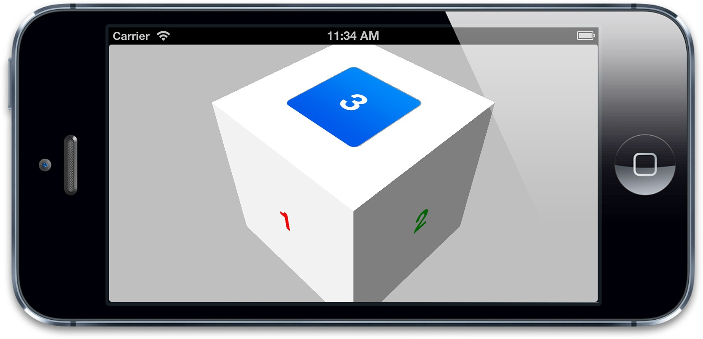

图5.23 背景视图不再阻碍按钮，我们可以点击它了


##总结

这一章涉及了一些2D和3D的变换。你学习了一些矩阵计算的基础，以及如何用Core Animation创建3D场景。你看到了图层背后到底是如何呈现的，并且知道了不能把扁平的图片做成真实的立体效果，最后我们用demo说明了触摸事件的处理，视图中图层添加的层级顺序会比屏幕上显示的顺序更有意义。

第六章我们会研究一些Core Animation提供不同功能的具体的`CALayer`子类。
