##专用图层

>复杂的组织都是专门化的

>Catharine R. Stimpson

到目前为止，我们已经探讨过`CALayer`类了，同时我们也了解到了一些非常有用的绘图和动画功能。但是Core Animation图层不仅仅能作用于图片和颜色而已。本章就会学习其他的一些图层类，进一步扩展使用Core Animation绘图的能力。

##CAShapeLayer

在第四章『视觉效果』我们学习到了不使用图片的情况下用`CGPath`去构造任意形状的阴影。如果我们能用同样的方式创建相同形状的图层就好了。

`CAShapeLayer`是一个通过矢量图形而不是bitmap来绘制的图层子类。你指定诸如颜色和线宽等属性，用`CGPath`来定义想要绘制的图形，最后`CAShapeLayer`就自动渲染出来了。当然，你也可以用Core Graphics直接向原始的`CALyer`的内容中绘制一个路径，相比直下，使用`CAShapeLayer`有以下一些优点：

* 渲染快速。`CAShapeLayer`使用了硬件加速，绘制同一图形会比用Core Graphics快很多。
* 高效使用内存。一个`CAShapeLayer`不需要像普通`CALayer`一样创建一个寄宿图形，所以无论有多大，都不会占用太多的内存。
* 不会被图层边界剪裁掉。一个`CAShapeLayer`可以在边界之外绘制。你的图层路径不会像在使用Core Graphics的普通`CALayer`一样被剪裁掉（如我们在第二章所见）。
* 不会出现像素化。当你给`CAShapeLayer`做3D变换时，它不像一个有寄宿图的普通图层一样变得像素化。

###创建一个`CGPath`

`CAShapeLayer`可以用来绘制所有能够通过`CGPath`来表示的形状。这个形状不一定要闭合，图层路径也不一定要不可破，事实上你可以在一个图层上绘制好几个不同的形状。你可以控制一些属性比如`lineWith`（线宽，用点表示单位），`lineCap`（线条结尾的样子），和`lineJoin`（线条之间的结合点的样子）；但是在图层层面你只有一次机会设置这些属性。如果你想用不同颜色或风格来绘制多个形状，就不得不为每个形状准备一个图层了。

清单6.1 的代码用一个`CAShapeLayer`渲染一个简单的火柴人。`CAShapeLayer`属性是`CGPathRef`类型，但是我们用`UIBezierPath`帮助类创建了图层路径，这样我们就不用考虑人工释放`CGPath`了。图6.1是代码运行的结果。虽然还不是很完美，但是总算知道了大意对吧！

清单6.1 用`CAShapeLayer`绘制一个火柴人

```objective-c
#import "DrawingView.h"
#import <QuartzCore/QuartzCore.h>

@interface ViewController ()

@property (nonatomic, weak) IBOutlet UIView *containerView;

@end

@implementation ViewController

- (void)viewDidLoad
{
  [super viewDidLoad];
  //create path
  UIBezierPath *path = [[UIBezierPath alloc] init];
  [path moveToPoint:CGPointMake(175, 100)];
  
  [path addArcWithCenter:CGPointMake(150, 100) radius:25 startAngle:0 endAngle:2*M_PI clockwise:YES];
  [path moveToPoint:CGPointMake(150, 125)];
  [path addLineToPoint:CGPointMake(150, 175)];
  [path addLineToPoint:CGPointMake(125, 225)];
  [path moveToPoint:CGPointMake(150, 175)];
  [path addLineToPoint:CGPointMake(175, 225)];
  [path moveToPoint:CGPointMake(100, 150)];
  [path addLineToPoint:CGPointMake(200, 150)];

  //create shape layer
  CAShapeLayer *shapeLayer = [CAShapeLayer layer];
  shapeLayer.strokeColor = [UIColor redColor].CGColor;
  shapeLayer.fillColor = [UIColor clearColor].CGColor;
  shapeLayer.lineWidth = 5;
  shapeLayer.lineJoin = kCALineJoinRound;
  shapeLayer.lineCap = kCALineCapRound;
  shapeLayer.path = path.CGPath;
  //add it to our view
  [self.containerView.layer addSublayer:shapeLayer];
}
@end
```

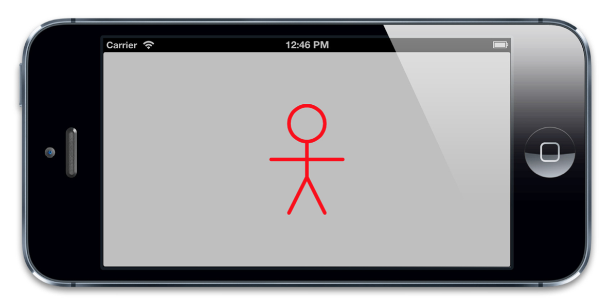

图6.1 用`CAShapeLayer`绘制一个简单的火柴人

###圆角

第二章里面提到了`CAShapeLayer`为创建圆角视图提供了一个方法，就是`CALayer`的`cornerRadius`属性（译者注：其实是在第四章提到的）。虽然使用`CAShapeLayer`类需要更多的工作，但是它有一个优势就是可以单独指定每个角。

我们创建圆角矩形其实就是人工绘制单独的直线和弧度，但是事实上`UIBezierPath`有自动绘制圆角矩形的构造方法，下面这段代码绘制了一个有三个圆角一个直角的矩形：

```objective-c
//define path parameters
CGRect rect = CGRectMake(50, 50, 100, 100);
CGSize radii = CGSizeMake(20, 20);
UIRectCorner corners = UIRectCornerTopRight | UIRectCornerBottomRight | UIRectCornerBottomLeft;
//create path
UIBezierPath *path = [UIBezierPath bezierPathWithRoundedRect:rect byRoundingCorners:corners cornerRadii:radii];
```

我们可以通过这个图层路径绘制一个既有直角又有圆角的视图。如果我们想依照此图形来剪裁视图内容，我们可以把`CAShapeLayer`作为视图的宿主图层，而不是添加一个子视图（图层蒙板的详细解释见第四章『视觉效果』）。

##CATextLayer

用户界面是无法从一个单独的图片里面构建的。一个设计良好的图标能够很好地表现一个按钮或控件的意图，不过你迟早都要需要一个不错的老式风格的文本标签。

如果你想在一个图层里面显示文字，完全可以借助图层代理直接将字符串使用Core Graphics写入图层的内容（这就是UILabel的精髓）。如果越过寄宿于图层的视图，直接在图层上操作，那其实相当繁琐。你要为每一个显示文字的图层创建一个能像图层代理一样工作的类，还要逻辑上判断哪个图层需要显示哪个字符串，更别提还要记录不同的字体，颜色等一系列乱七八糟的东西。

万幸的是这些都是不必要的，Core Animation提供了一个`CALayer`的子类`CATextLayer`，它以图层的形式包含了`UILabel`几乎所有的绘制特性，并且额外提供了一些新的特性。

同样，`CATextLayer`也要比`UILabel`渲染得快得多。很少有人知道在iOS 6及之前的版本，`UILabel`其实是通过WebKit来实现绘制的，这样就造成了当有很多文字的时候就会有极大的性能压力。而`CATextLayer`使用了Core text，并且渲染得非常快。

让我们来尝试用`CATextLayer`来显示一些文字。清单6.2的代码实现了这一功能，结果如图6.2所示。

清单6.2 用`CATextLayer`来实现一个`UILabel`

```objective-c
@interface ViewController ()

@property (nonatomic, weak) IBOutlet UIView *labelView;

@end

@implementation ViewController
- (void)viewDidLoad
{
  [super viewDidLoad];

  //create a text layer
  CATextLayer *textLayer = [CATextLayer layer];
  textLayer.frame = self.labelView.bounds;
  [self.labelView.layer addSublayer:textLayer];

  //set text attributes
  textLayer.foregroundColor = [UIColor blackColor].CGColor;
  textLayer.alignmentMode = kCAAlignmentJustified;
  textLayer.wrapped = YES;

  //choose a font
  UIFont *font = [UIFont systemFontOfSize:15];

  //set layer font
  CFStringRef fontName = (__bridge CFStringRef)font.fontName;
  CGFontRef fontRef = CGFontCreateWithFontName(fontName);
  textLayer.font = fontRef;
  textLayer.fontSize = font.pointSize;
  CGFontRelease(fontRef);

  //choose some text
  NSString *text = @"Lorem ipsum dolor sit amet, consectetur adipiscing \ elit. Quisque massa arcu, eleifend vel varius in, facilisis pulvinar \ leo. Nunc quis nunc at mauris pharetra condimentum ut ac neque. Nunc elementum, libero ut porttitor dictum, diam odio congue lacus, vel \ fringilla sapien diam at purus. Etiam suscipit pretium nunc sit amet \ lobortis";

  //set layer text
  textLayer.string = text;
}
@end
```

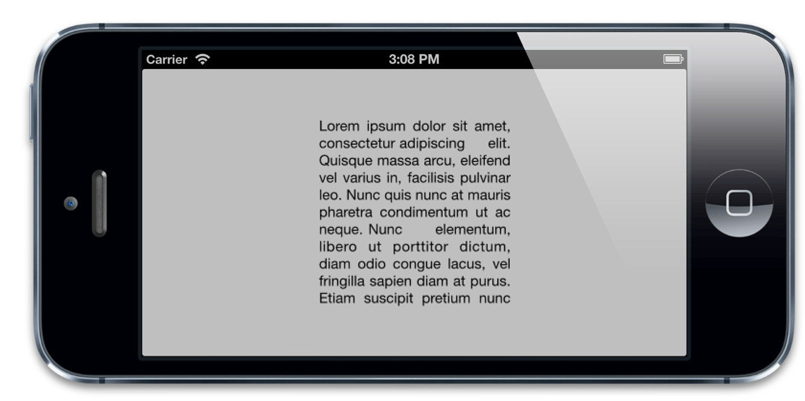

图6.2 用`CATextLayer`来显示一个纯文本标签

如果你仔细看这个文本，你会发现一个奇怪的地方：这些文本有一些像素化了。这是因为并没有以Retina的方式渲染，第二章提到了这个`contentScale`属性，用来决定图层内容应该以怎样的分辨率来渲染。`contentsScale`并不关心屏幕的拉伸因素而总是默认为1.0。如果我们想以Retina的质量来显示文字，我们就得手动地设置`CATextLayer`的`contentsScale`属性，如下：

```objective-c
textLayer.contentsScale = [UIScreen mainScreen].scale;
```

这样就解决了这个问题（如图6.3）


图6.3 设置`contentsScale`来匹配屏幕

`CATextLayer`的`font`属性不是一个`UIFont`类型，而是一个`CFTypeRef`类型。这样可以根据你的具体需要来决定字体属性应该是用`CGFontRef`类型还是`CTFontRef`类型（Core Text字体）。同时字体大小也是用`fontSize`属性单独设置的，因为`CTFontRef`和`CGFontRef`并不像UIFont一样包含点大小。这个例子会告诉你如何将`UIFont`转换成`CGFontRef`。

另外，`CATextLayer`的`string`属性并不是你想象的`NSString`类型，而是`id`类型。这样你既可以用`NSString`也可以用`NSAttributedString`来指定文本了（注意，`NSAttributedString`并不是`NSString`的子类）。属性化字符串是iOS用来渲染字体风格的机制，它以特定的方式来决定指定范围内的字符串的原始信息，比如字体，颜色，字重，斜体等。

###富文本

iOS 6中，Apple给`UILabel`和其他UIKit文本视图添加了直接的属性化字符串的支持，应该说这是一个很方便的特性。不过事实上从iOS3.2开始`CATextLayer`就已经支持属性化字符串了。这样的话，如果你想要支持更低版本的iOS系统，`CATextLayer`无疑是你向界面中增加富文本的好办法，而且也不用去跟复杂的Core Text打交道，也省了用`UIWebView`的麻烦。

让我们编辑一下示例使用到`NSAttributedString`（见清单6.3）.iOS 6及以上我们可以用新的`NSTextAttributeName`实例来设置我们的字符串属性，但是练习的目的是为了演示在iOS 5及以下，所以我们用了Core Text，也就是说你需要把Core Text framework添加到你的项目中。否则，编译器是无法识别属性常量的。

图6.4是代码运行结果（注意那个红色的下划线文本）

清单6.3 用NSAttributedString实现一个富文本标签。

```objective-c
#import "DrawingView.h"
#import <QuartzCore/QuartzCore.h>
#import <CoreText/CoreText.h>

@interface ViewController ()

@property (nonatomic, weak) IBOutlet UIView *labelView;

@end

@implementation ViewController

- (void)viewDidLoad
{
  [super viewDidLoad];

  //create a text layer
  CATextLayer *textLayer = [CATextLayer layer];
  textLayer.frame = self.labelView.bounds;
  textLayer.contentsScale = [UIScreen mainScreen].scale;
  [self.labelView.layer addSublayer:textLayer];

  //set text attributes
  textLayer.alignmentMode = kCAAlignmentJustified;
  textLayer.wrapped = YES;

  //choose a font
  UIFont *font = [UIFont systemFontOfSize:15];

  //choose some text
  NSString *text = @"Lorem ipsum dolor sit amet, consectetur adipiscing \ elit. Quisque massa arcu, eleifend vel varius in, facilisis pulvinar \ leo. Nunc quis nunc at mauris pharetra condimentum ut ac neque. Nunc \ elementum, libero ut porttitor dictum, diam odio congue lacus, vel \ fringilla sapien diam at purus. Etiam suscipit pretium nunc sit amet \ lobortis";
  
  //create attributed string
  NSMutableAttributedString *string = nil;
  string = [[NSMutableAttributedString alloc] initWithString:text];

  //convert UIFont to a CTFont
  CFStringRef fontName = (__bridge CFStringRef)font.fontName;
  CGFloat fontSize = font.pointSize;
  CTFontRef fontRef = CTFontCreateWithName(fontName, fontSize, NULL);

  //set text attributes
  NSDictionary *attribs = @{
    (__bridge id)kCTForegroundColorAttributeName:(__bridge id)[UIColor blackColor].CGColor,
    (__bridge id)kCTFontAttributeName: (__bridge id)fontRef
  };

  [string setAttributes:attribs range:NSMakeRange(0, [text length])];
  attribs = @{
    (__bridge id)kCTForegroundColorAttributeName: (__bridge id)[UIColor redColor].CGColor,
    (__bridge id)kCTUnderlineStyleAttributeName: @(kCTUnderlineStyleSingle),
    (__bridge id)kCTFontAttributeName: (__bridge id)fontRef
  };
  [string setAttributes:attribs range:NSMakeRange(6, 5)];

  //release the CTFont we created earlier
  CFRelease(fontRef);

  //set layer text
  textLayer.string = string;
}
@end
```

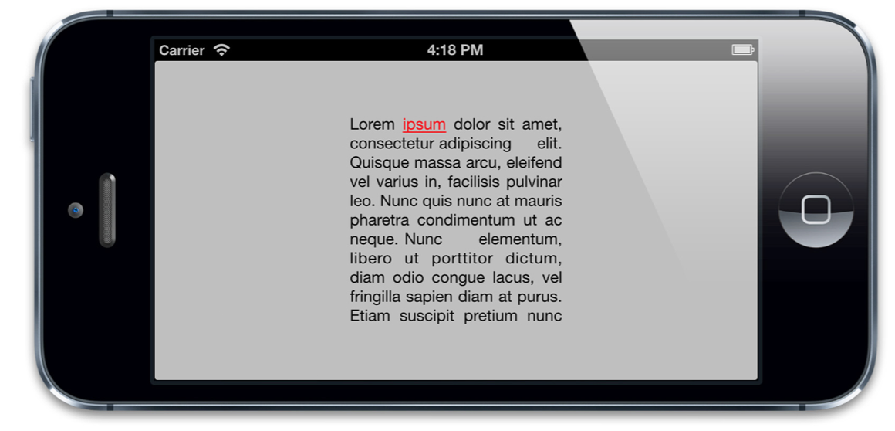

图6.4 用CATextLayer实现一个富文本标签。

###行距和字距

有必要提一下的是，由于绘制的实现机制不同（Core Text和WebKit），用`CATextLayer`渲染和用`UILabel`渲染出的文本行距和字距也不是不尽相同的。

二者的差异程度（由使用的字体和字符决定）总的来说挺小，但是如果你想正确的显示普通便签和`CATextLayer`就一定要记住这一点。

### `UILabel`的替代品

我们已经证实了`CATextLayer`比`UILabel`有着更好的性能表现，同时还有额外的布局选项并且在iOS 5上支持富文本。但是与一般的标签比较而言会更加繁琐一些。如果我们真的在需求一个`UILabel`的可用替代品，最好是能够在Interface Builder上创建我们的标签，而且尽可能地像一般的视图一样正常工作。

我们应该继承`UILabel`，然后添加一个子图层`CATextLayer`并重写显示文本的方法。但是仍然会有由`UILabel`的`-drawRect:`方法创建的空寄宿图。而且由于`CALayer`不支持自动缩放和自动布局，子视图并不是主动跟踪视图边界的大小，所以每次视图大小被更改，我们不得不手动更新子图层的边界。

我们真正想要的是一个用`CATextLayer`作为宿主图层的`UILabel`子类，这样就可以随着视图自动调整大小而且也没有冗余的寄宿图啦。

就像我们在第一章『图层树』讨论的一样，每一个`UIView`都是寄宿在一个`CALayer`的示例上。这个图层是由视图自动创建和管理的，那我们可以用别的图层类型替代它么？一旦被创建，我们就无法代替这个图层了。但是如果我们继承了`UIView`，那我们就可以重写`+layerClass`方法使得在创建的时候能返回一个不同的图层子类。`UIView`会在初始化的时候调用`+layerClass`方法，然后用它的返回类型来创建宿主图层。

清单6.4 演示了一个`UILabel`子类`LayerLabel`用`CATextLayer`绘制它的问题，而不是调用一般的`UILabel`使用的较慢的`-drawRect：`方法。`LayerLabel`示例既可以用代码实现，也可以在Interface Builder实现，只要把普通的标签拖入视图之中，然后设置它的类是LayerLabel就可以了。

清单6.4 使用`CATextLayer`的`UILabel`子类：`LayerLabel`

```objective-c
#import "LayerLabel.h"
#import <QuartzCore/QuartzCore.h>

@implementation LayerLabel
+ (Class)layerClass
{
  //this makes our label create a CATextLayer //instead of a regular CALayer for its backing layer
  return [CATextLayer class];
}

- (CATextLayer *)textLayer
{
  return (CATextLayer *)self.layer;
}

- (void)setUp
{
  //set defaults from UILabel settings
  self.text = self.text;
  self.textColor = self.textColor;
  self.font = self.font;

  //we should really derive these from the UILabel settings too
  //but that's complicated, so for now we'll just hard-code them
  [self textLayer].alignmentMode = kCAAlignmentJustified;
  
  [self textLayer].wrapped = YES;
  [self.layer display];
}

- (id)initWithFrame:(CGRect)frame
{
  //called when creating label programmatically
  if (self = [super initWithFrame:frame]) {
    [self setUp];
  }
  return self;
}

- (void)awakeFromNib
{
  //called when creating label using Interface Builder
  [self setUp];
}

- (void)setText:(NSString *)text
{
  super.text = text;
  //set layer text
  [self textLayer].string = text;
}

- (void)setTextColor:(UIColor *)textColor
{
  super.textColor = textColor;
  //set layer text color
  [self textLayer].foregroundColor = textColor.CGColor;
}

- (void)setFont:(UIFont *)font
{
  super.font = font;
  //set layer font
  CFStringRef fontName = (__bridge CFStringRef)font.fontName;
  CGFontRef fontRef = CGFontCreateWithFontName(fontName);
  [self textLayer].font = fontRef;
  [self textLayer].fontSize = font.pointSize;
  
  CGFontRelease(fontRef);
}
@end
```

如果你运行代码，你会发现文本并没有像素化，而我们也没有设置`contentsScale`属性。把`CATextLayer`作为宿主图层的另一好处就是视图自动设置了`contentsScale`属性。

在这个简单的例子中，我们只是实现了`UILabel`的一部分风格和布局属性，不过稍微再改进一下我们就可以创建一个支持`UILabel`所有功能甚至更多功能的`LayerLabel`类（你可以在一些线上的开源项目中找到）。

如果你打算支持iOS 6及以上，基于`CATextLayer`的标签可能就有有些局限性。但是总得来说，如果想在app里面充分利用`CALayer`子类，用`+layerClass`来创建基于不同图层的视图是一个简单可复用的方法。

### CATransformLayer

当我们在构造复杂的3D事物的时候，如果能够组织独立元素就太方便了。比如说，你想创造一个孩子的手臂：你就需要确定哪一部分是孩子的手腕，哪一部分是孩子的前臂，哪一部分是孩子的肘，哪一部分是孩子的上臂，哪一部分是孩子的肩膀等等。

当然是允许独立地移动每个区域的啦。以肘为指点会移动前臂和手，而不是肩膀。Core Animation图层很容易就可以让你在2D环境下做出这样的层级体系下的变换，但是3D情况下就不太可能，因为所有的图层都把他的孩子都平面化到一个场景中（第五章『变换』有提到）。

`CATransformLayer`解决了这个问题，`CATransformLayer`不同于普通的`CALayer`，因为它不能显示它自己的内容。只有当存在了一个能作用于子图层的变换它才真正存在。`CATransformLayer`并不平面化它的子图层，所以它能够用于构造一个层级的3D结构，比如我的手臂示例。

用代码创建一个手臂需要相当多的代码，所以我就演示得更简单一些吧：在第五章的立方体示例，我们将通过旋转`camara`来解决图层平面化问题而不是像立方体示例代码中用的`sublayerTransform`。这是一个非常不错的技巧，但是只能作用域单个对象上，如果你的场景包含两个立方体，那我们就不能用这个技巧单独旋转他们了。

那么，就让我们来试一试`CATransformLayer`吧，第一个问题就来了：在第五章，我们是用多个视图来构造了我们的立方体，而不是单独的图层。我们不能在不打乱已有的视图层次的前提下在一个本身不是有寄宿图的图层中放置一个寄宿图图层。我们可以创建一个新的`UIView`子类寄宿在`CATransformLayer`（用`+layerClass`方法）之上。但是，为了简化案例，我们仅仅重建了一个单独的图层，而不是使用视图。这意味着我们不能像第五章一样在立方体表面显示按钮和标签，不过我们现在也用不到这个特性。

清单6.5就是代码。我们以我们在第五章使用过的相同基本逻辑放置立方体。但是并不像以前那样直接将立方面添加到容器视图的宿主图层，我们将他们放置到一个`CATransformLayer`中创建一个独立的立方体对象，然后将两个这样的立方体放进容器中。我们随机地给立方面染色以将他们区分开来，这样就不用靠标签或是光亮来区分他们。图6.5是运行结果。

清单6.5 用`CATransformLayer`装配一个3D图层体系

```objective-c
@interface ViewController ()

@property (nonatomic, weak) IBOutlet UIView *containerView;

@end

@implementation ViewController

- (CALayer *)faceWithTransform:(CATransform3D)transform
{
  //create cube face layer
  CALayer *face = [CALayer layer];
  face.frame = CGRectMake(-50, -50, 100, 100);

  //apply a random color
  CGFloat red = (rand() / (double)INT_MAX);
  CGFloat green = (rand() / (double)INT_MAX);
  CGFloat blue = (rand() / (double)INT_MAX);
  face.backgroundColor = [UIColor colorWithRed:red green:green blue:blue alpha:1.0].CGColor;

  //apply the transform and return
  face.transform = transform;
  return face;
}

- (CALayer *)cubeWithTransform:(CATransform3D)transform
{
  //create cube layer
  CATransformLayer *cube = [CATransformLayer layer];

  //add cube face 1
  CATransform3D ct = CATransform3DMakeTranslation(0, 0, 50);
  [cube addSublayer:[self faceWithTransform:ct]];

  //add cube face 2
  ct = CATransform3DMakeTranslation(50, 0, 0);
  ct = CATransform3DRotate(ct, M_PI_2, 0, 1, 0);
  [cube addSublayer:[self faceWithTransform:ct]];

  //add cube face 3
  ct = CATransform3DMakeTranslation(0, -50, 0);
  ct = CATransform3DRotate(ct, M_PI_2, 1, 0, 0);
  [cube addSublayer:[self faceWithTransform:ct]];

  //add cube face 4
  ct = CATransform3DMakeTranslation(0, 50, 0);
  ct = CATransform3DRotate(ct, -M_PI_2, 1, 0, 0);
  [cube addSublayer:[self faceWithTransform:ct]];

  //add cube face 5
  ct = CATransform3DMakeTranslation(-50, 0, 0);
  ct = CATransform3DRotate(ct, -M_PI_2, 0, 1, 0);
  [cube addSublayer:[self faceWithTransform:ct]];

  //add cube face 6
  ct = CATransform3DMakeTranslation(0, 0, -50);
  ct = CATransform3DRotate(ct, M_PI, 0, 1, 0);
  [cube addSublayer:[self faceWithTransform:ct]];

  //center the cube layer within the container
  CGSize containerSize = self.containerView.bounds.size;
  cube.position = CGPointMake(containerSize.width / 2.0, containerSize.height / 2.0);

  //apply the transform and return
  cube.transform = transform;
  return cube;
}

- (void)viewDidLoad
{
  [super viewDidLoad];

  //set up the perspective transform
  CATransform3D pt = CATransform3DIdentity;
  pt.m34 = -1.0 / 500.0;
  self.containerView.layer.sublayerTransform = pt;

  //set up the transform for cube 1 and add it
  CATransform3D c1t = CATransform3DIdentity;
  c1t = CATransform3DTranslate(c1t, -100, 0, 0);
  CALayer *cube1 = [self cubeWithTransform:c1t];
  [self.containerView.layer addSublayer:cube1];

  //set up the transform for cube 2 and add it
  CATransform3D c2t = CATransform3DIdentity;
  c2t = CATransform3DTranslate(c2t, 100, 0, 0);
  c2t = CATransform3DRotate(c2t, -M_PI_4, 1, 0, 0);
  c2t = CATransform3DRotate(c2t, -M_PI_4, 0, 1, 0);
  CALayer *cube2 = [self cubeWithTransform:c2t];
  [self.containerView.layer addSublayer:cube2];
}
@end
```

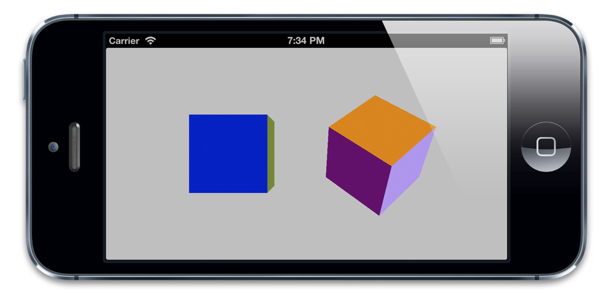

图6.5 同一视角下的俩不同变换的立方体

##CAGradientLayer

`CAGradientLayer`是用来生成两种或更多颜色平滑渐变的。用Core Graphics复制一个`CAGradientLayer`并将内容绘制到一个普通图层的寄宿图也是有可能的，但是`CAGradientLayer`的真正好处在于绘制使用了硬件加速。

###基础渐变

我们将从一个简单的红变蓝的对角线渐变开始（见清单6.6）.这些渐变色彩放在一个数组中，并赋给`colors`属性。这个数组成员接受`CGColorRef`类型的值（并不是从`NSObject`派生而来），所以我们要用通过bridge转换以确保编译正常。

`CAGradientLayer`也有`startPoint`和`endPoint`属性，他们决定了渐变的方向。这两个参数是以单位坐标系进行的定义，所以左上角坐标是{0, 0}，右下角坐标是{1, 1}。代码运行结果如图6.6

清单6.6 简单的两种颜色的对角线渐变

```objective-c
@interface ViewController ()

@property (nonatomic, weak) IBOutlet UIView *containerView;

@end

@implementation ViewController

- (void)viewDidLoad
{
  [super viewDidLoad];
  //create gradient layer and add it to our container view
  CAGradientLayer *gradientLayer = [CAGradientLayer layer];
  gradientLayer.frame = self.containerView.bounds;
  [self.containerView.layer addSublayer:gradientLayer];

  //set gradient colors
  gradientLayer.colors = @[(__bridge id)[UIColor redColor].CGColor, (__bridge id)[UIColor blueColor].CGColor];

  //set gradient start and end points
  gradientLayer.startPoint = CGPointMake(0, 0);
  gradientLayer.endPoint = CGPointMake(1, 1);
}
@end
```

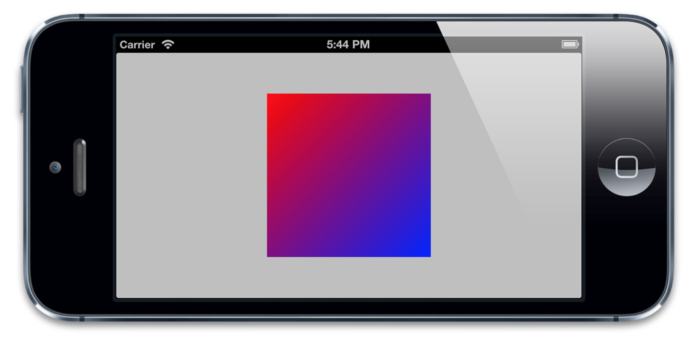

图6.6 用`CAGradientLayer`实现简单的两种颜色的对角线渐变

###多重渐变


如果你愿意，`colors`属性可以包含很多颜色，所以创建一个彩虹一样的多重渐变也是很简单的。默认情况下，这些颜色在空间上均匀地被渲染，但是我们可以用`locations`属性来调整空间。`locations`属性是一个浮点数值的数组（以`NSNumber`包装）。这些浮点数定义了`colors`属性中每个不同颜色的位置，同样的，也是以单位坐标系进行标定。0.0代表着渐变的开始，1.0代表着结束。

`locations`数组并不是强制要求的，但是如果你给它赋值了就一定要确保`locations`的数组大小和`colors`数组大小一定要相同，否则你将会得到一个空白的渐变。

清单6.7展示了一个基于清单6.6的对角线渐变的代码改造。现在变成了从红到黄最后到绿色的渐变。`locations`数组指定了0.0，0.25和0.5三个数值，这样这三个渐变就有点像挤在了左上角。（如图6.7）.

清单6.7 在渐变上使用`locations`

```objective-c
- (void)viewDidLoad {
	[super viewDidLoad];

	//create gradient layer and add it to our container view
	CAGradientLayer *gradientLayer = [CAGradientLayer layer];
	gradientLayer.frame = self.containerView.bounds;
	[self.containerView.layer addSublayer:gradientLayer];

	//set gradient colors
	gradientLayer.colors = @[(__bridge id)[UIColor redColor].CGColor, (__bridge id) [UIColor yellowColor].CGColor, (__bridge id)[UIColor greenColor].CGColor];

	//set locations
	gradientLayer.locations = @[@0.0, @0.25, @0.5];

	//set gradient start and end points
	gradientLayer.startPoint = CGPointMake(0, 0);
	gradientLayer.endPoint = CGPointMake(1, 1);
}
```

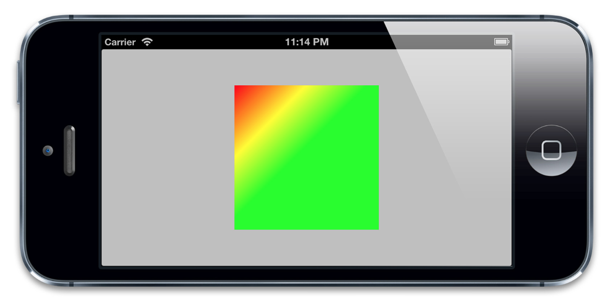

图6.7 用`locations`构造偏移至左上角的三色渐变

##CAReplicatorLayer

`CAReplicatorLayer`的目的是为了高效生成许多相似的图层。它会绘制一个或多个图层的子图层，并在每个复制体上应用不同的变换。看上去演示能够更加解释这些，我们来写个例子吧。

###重复图层（Repeating Layers）

清单6.8中，我们在屏幕的中间创建了一个小白色方块图层，然后用`CAReplicatorLayer`生成十个图层组成一个圆圈。`instanceCount`属性指定了图层需要重复多少次。`instanceTransform`指定了一个`CATransform3D`3D变换（这种情况下，下一图层的位移和旋转将会移动到圆圈的下一个点）。

变换是逐步增加的，每个实例都是相对于前一实例布局。这就是为什么这些复制体最终不会出现在同意位置上，图6.8是代码运行结果。

清单6.8 用`CAReplicatorLayer`重复图层

```objective-c
@interface ViewController ()

@property (nonatomic, weak) IBOutlet UIView *containerView;

@end

@implementation ViewController
- (void)viewDidLoad
{
    [super viewDidLoad];
    //create a replicator layer and add it to our view
    CAReplicatorLayer *replicator = [CAReplicatorLayer layer];
    replicator.frame = self.containerView.bounds;
    [self.containerView.layer addSublayer:replicator];

    //configure the replicator
    replicator.instanceCount = 10;

    //apply a transform for each instance
    CATransform3D transform = CATransform3DIdentity;
    transform = CATransform3DTranslate(transform, 0, 200, 0);
    transform = CATransform3DRotate(transform, M_PI / 5.0, 0, 0, 1);
    transform = CATransform3DTranslate(transform, 0, -200, 0);
    replicator.instanceTransform = transform;

    //apply a color shift for each instance
    replicator.instanceBlueOffset = -0.1;
    replicator.instanceGreenOffset = -0.1;

    //create a sublayer and place it inside the replicator
    CALayer *layer = [CALayer layer];
    layer.frame = CGRectMake(100.0f, 100.0f, 100.0f, 100.0f);
    layer.backgroundColor = [UIColor whiteColor].CGColor;
    [replicator addSublayer:layer];
}
@end
```

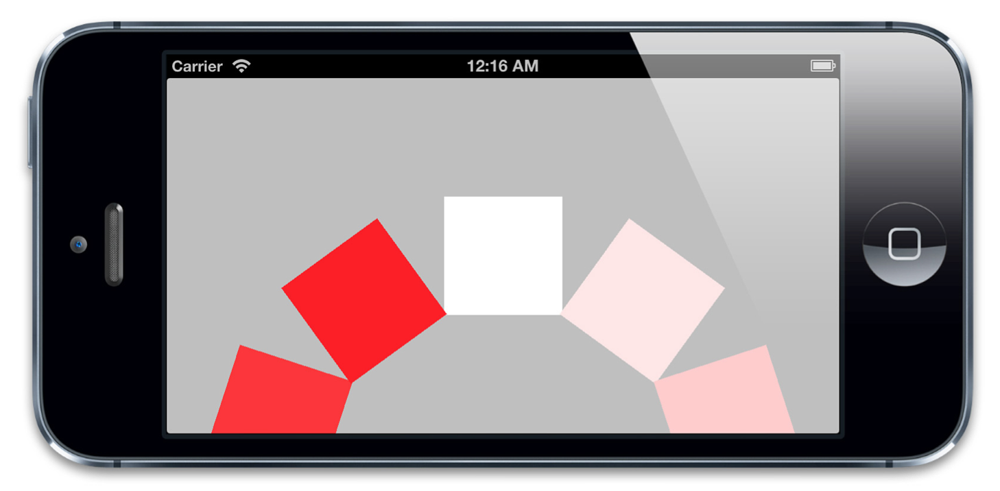

图6.8 用`CAReplicatorLayer`创建一圈图层

注意到当图层在重复的时候，他们的颜色也在变化：这是用`instanceBlueOffset`和`instanceGreenOffset`属性实现的。通过逐步减少蓝色和绿色通道，我们逐渐将图层颜色转换成了红色。这个复制效果看起来很酷，但是`CAReplicatorLayer`真正应用到实际程序上的场景比如：一个游戏中导弹的轨迹云，或者粒子爆炸（尽管iOS 5已经引入了`CAEmitterLayer`，它更适合创建任意的粒子效果）。除此之外，还有一个实际应用是：反射。

###反射

使用`CAReplicatorLayer`并应用一个负比例变换于一个复制图层，你就可以创建指定视图（或整个视图层次）内容的镜像图片，这样就创建了一个实时的『反射』效果。让我们来尝试实现这个创意：指定一个继承于`UIView`的`ReflectionView`，它会自动产生内容的反射效果。实现这个效果的代码很简单（见清单6.9），实际上用`ReflectionView`实现这个效果会更简单，我们只需要把`ReflectionView`的实例放置于Interface Builder（见图6.9），它就会实时生成子视图的反射，而不需要别的代码（见图6.10）.

清单6.9 用`CAReplicatorLayer`自动绘制反射

```objective-c
#import "ReflectionView.h"
#import <QuartzCore/QuartzCore.h>

@implementation ReflectionView

+ (Class)layerClass
{
    return [CAReplicatorLayer class];
}

- (void)setUp
{
    //configure replicator
    CAReplicatorLayer *layer = (CAReplicatorLayer *)self.layer;
    layer.instanceCount = 2;

    //move reflection instance below original and flip vertically
    CATransform3D transform = CATransform3DIdentity;
    CGFloat verticalOffset = self.bounds.size.height + 2;
    transform = CATransform3DTranslate(transform, 0, verticalOffset, 0);
    transform = CATransform3DScale(transform, 1, -1, 0);
    layer.instanceTransform = transform;

    //reduce alpha of reflection layer
    layer.instanceAlphaOffset = -0.6;
}

- (id)initWithFrame:(CGRect)frame
{
    //this is called when view is created in code
    if ((self = [super initWithFrame:frame])) {
        [self setUp];
    }
    return self;
}

- (void)awakeFromNib
{
    //this is called when view is created from a nib
    [self setUp];
}
@end
```

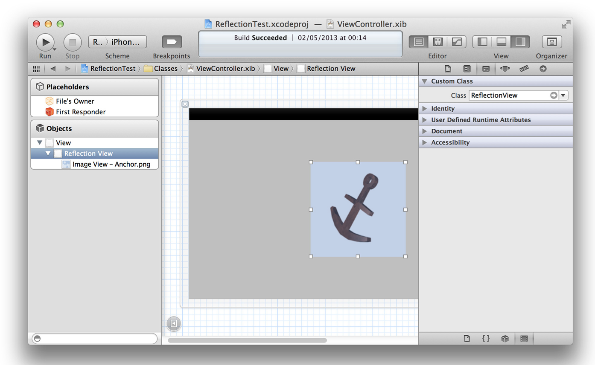

图6.9 在Interface Builder中使用`ReflectionView`

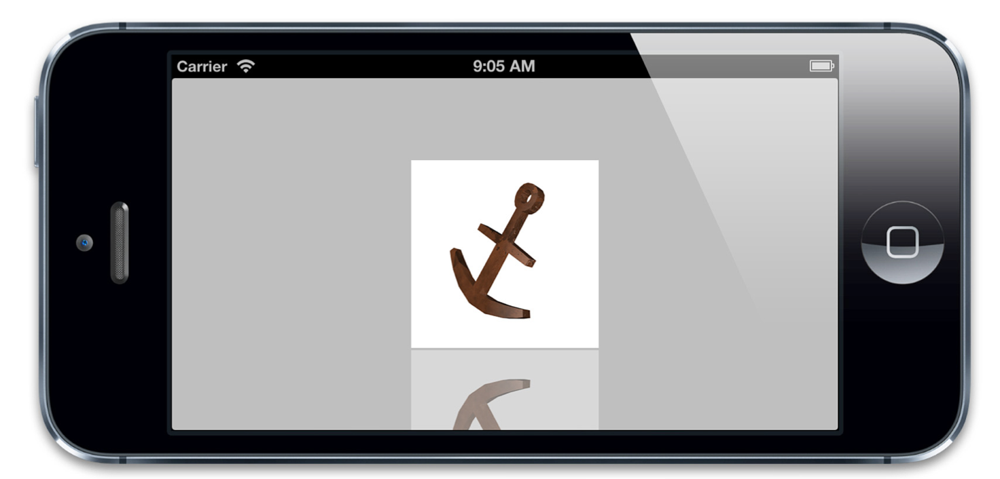

图6.10 `ReflectionView`自动实时产生反射效果。

开源代码`ReflectionView`完成了一个自适应的渐变淡出效果（用`CAGradientLayer`和图层蒙板实现），代码见 https://github.com/nicklockwood/ReflectionView

##CAScrollLayer

对于一个未转换的图层，它的`bounds`和它的`frame`是一样的，`frame`属性是由`bounds`属性自动计算而出的，所以更改任意一个值都会更新其他值。

但是如果你只想显示一个大图层里面的一小部分呢。比如说，你可能有一个很大的图片，你希望用户能够随意滑动，或者是一个数据或文本的长列表。在一个典型的iOS应用中，你可能会用到`UITableView`或是`UIScrollView`，但是对于独立的图层来说，什么会等价于刚刚提到的`UITableView`和`UIScrollView`呢？

在第二章中，我们探索了图层的`contentsRect`属性的用法，它的确是能够解决在图层中小地方显示大图片的解决方法。但是如果你的图层包含子图层那它就不是一个非常好的解决方案，因为，这样做的话每次你想『滑动』可视区域的时候，你就需要手工重新计算并更新所有的子图层位置。

这个时候就需要`CAScrollLayer`了。`CAScrollLayer`有一个`-scrollToPoint:`方法，它自动适应`bounds`的原点以便图层内容出现在滑动的地方。注意，这就是它做的所有事情。前面提到过，Core Animation并不处理用户输入，所以`CAScrollLayer`并不负责将触摸事件转换为滑动事件，既不渲染滚动条，也不实现任何iOS指定行为例如滑动反弹（当视图滑动超多了它的边界的将会反弹回正确的地方）。

让我们来用`CAScrollLayer`来常见一个基本的`UIScrollView`替代品。我们将会用`CAScrollLayer`作为视图的宿主图层，并创建一个自定义的`UIView`，然后用`UIPanGestureRecognizer`实现触摸事件响应。这段代码见清单6.10. 图6.11是运行效果：`ScrollView`显示了一个大于它的`frame`的`UIImageView`。

清单6.10 用`CAScrollLayer`实现滑动视图

```objective-c
#import "ScrollView.h"
#import <QuartzCore/QuartzCore.h> @implementation ScrollView
+ (Class)layerClass
{
    return [CAScrollLayer class];
}

- (void)setUp
{
    //enable clipping
    self.layer.masksToBounds = YES;

    //attach pan gesture recognizer
    UIPanGestureRecognizer *recognizer = nil;
    recognizer = [[UIPanGestureRecognizer alloc] initWithTarget:self action:@selector(pan:)];
    [self addGestureRecognizer:recognizer];
}

- (id)initWithFrame:(CGRect)frame
{
    //this is called when view is created in code
    if ((self = [super initWithFrame:frame])) {
        [self setUp];
    }
    return self;
}

- (void)awakeFromNib {
    //this is called when view is created from a nib
    [self setUp];
}

- (void)pan:(UIPanGestureRecognizer *)recognizer
{
    //get the offset by subtracting the pan gesture
    //translation from the current bounds origin
    CGPoint offset = self.bounds.origin;
    offset.x -= [recognizer translationInView:self].x;
    offset.y -= [recognizer translationInView:self].y;

    //scroll the layer
    [(CAScrollLayer *)self.layer scrollToPoint:offset];

    //reset the pan gesture translation
    [recognizer setTranslation:CGPointZero inView:self];
}
@end
```

图6.11 用`UIScrollView`创建一个凑合的滑动视图

不同于`UIScrollView`，我们定制的滑动视图类并没有实现任何形式的边界检查（bounds checking）。图层内容极有可能滑出视图的边界并无限滑下去。`CAScrollLayer`并没有等同于`UIScrollView`中`contentSize`的属性，所以当`CAScrollLayer`滑动的时候完全没有一个全局的可滑动区域的概念，也无法自适应它的边界原点至你指定的值。它之所以不能自适应边界大小是因为它不需要，内容完全可以超过边界。

那你一定会奇怪用`CAScrollLayer`的意义到底何在，因为你可以简单地用一个普通的`CALayer`然后手动适应边界原点啊。真相其实并不复杂，`UIScrollView`并没有用`CAScrollLayer`，事实上，就是简单的通过直接操作图层边界来实现滑动。

`CAScrollLayer`有一个潜在的有用特性。如果你查看`CAScrollLayer`的头文件，你就会注意到有一个扩展分类实现了一些方法和属性：

```objective-c
- (void)scrollPoint:(CGPoint)p;
- (void)scrollRectToVisible:(CGRect)r;
@property(readonly) CGRect visibleRect;
```

看到这些方法和属性名，你也许会以为这些方法给每个`CALayer`实例增加了滑动功能。但是事实上他们只是放置在`CAScrollLayer`中的图层的实用方法。`scrollPoint:`方法从图层树中查找并找到第一个可用的`CAScrollLayer`，然后滑动它使得指定点成为可视的。`scrollRectToVisible:`方法实现了同样的事情只不过是作用在一个矩形上的。`visibleRect`属性决定图层（如果存在的话）的哪部分是当前的可视区域。如果你自己实现这些方法就会相对容易明白一点，但是`CAScrollLayer`帮你省了这些麻烦，所以当涉及到实现图层滑动的时候就可以用上了。

##CATiledLayer

有些时候你可能需要绘制一个很大的图片，常见的例子就是一个高像素的照片或者是地球表面的详细地图。iOS应用通畅运行在内存受限的设备上，所以读取整个图片到内存中是不明智的。载入大图可能会相当地慢，那些对你看上去比较方便的做法（在主线程调用`UIImage`的`-imageNamed:`方法或者`-imageWithContentsOfFile:`方法）将会阻塞你的用户界面，至少会引起动画卡顿现象。

能高效绘制在iOS上的图片也有一个大小限制。所有显示在屏幕上的图片最终都会被转化为OpenGL纹理，同时OpenGL有一个最大的纹理尺寸（通常是2048\*2048，或4096\*4096，这个取决于设备型号）。如果你想在单个纹理中显示一个比这大的图，即便图片已经存在于内存中了，你仍然会遇到很大的性能问题，因为Core Animation强制用CPU处理图片而不是更快的GPU（见第12章『速度的曲调』，和第13章『高效绘图』，它更加详细地解释了软件绘制和硬件绘制）。

`CATiledLayer`为载入大图造成的性能问题提供了一个解决方案：将大图分解成小片然后将他们单独按需载入。让我们用实验来证明一下。

###小片裁剪

这个示例中，我们将会从一个2048*2048分辨率的雪人图片入手。为了能够从`CATiledLayer`中获益，我们需要把这个图片裁切成许多小一些的图片。你可以通过代码来完成这件事情，但是如果你在运行时读入整个图片并裁切，那`CATiledLayer`这些所有的性能优点就损失殆尽了。理想情况下来说，最好能够逐个步骤来实现。

清单6.11 演示了一个简单的Mac OS命令行程序，它用`CATiledLayer`将一个图片裁剪成小图并存储到不同的文件中。

清单6.11 裁剪图片成小图的终端程序

```objective-c
#import <AppKit/AppKit.h>

int main(int argc, const char * argv[])
{
    @autoreleasepool{
        //handle incorrect arguments
        if (argc < 2) {
            NSLog(@"TileCutter arguments: inputfile");
            return 0;
        }

        //input file
        NSString *inputFile = [NSString stringWithCString:argv[1] encoding:NSUTF8StringEncoding];

        //tile size
        CGFloat tileSize = 256; //output path
        NSString *outputPath = [inputFile stringByDeletingPathExtension];

        //load image
        NSImage *image = [[NSImage alloc] initWithContentsOfFile:inputFile];
        NSSize size = [image size];
        NSArray *representations = [image representations];
        if ([representations count]){
            NSBitmapImageRep *representation = representations[0];
            size.width = [representation pixelsWide];
            size.height = [representation pixelsHigh];
        }
        NSRect rect = NSMakeRect(0.0, 0.0, size.width, size.height);
        CGImageRef imageRef = [image CGImageForProposedRect:&rect context:NULL hints:nil];

        //calculate rows and columns
        NSInteger rows = ceil(size.height / tileSize);
        NSInteger cols = ceil(size.width / tileSize);

        //generate tiles
        for (int y = 0; y < rows; ++y) {
            for (int x = 0; x < cols; ++x) {
            //extract tile image
            CGRect tileRect = CGRectMake(x*tileSize, y*tileSize, tileSize, tileSize);
            CGImageRef tileImage = CGImageCreateWithImageInRect(imageRef, tileRect);

            //convert to jpeg data
            NSBitmapImageRep *imageRep = [[NSBitmapImageRep alloc] initWithCGImage:tileImage];
            NSData *data = [imageRep representationUsingType: NSJPEGFileType properties:nil];
            CGImageRelease(tileImage);

            //save file
            NSString *path = [outputPath stringByAppendingFormat: @"_%02i_%02i.jpg", x, y];
            [data writeToFile:path atomically:NO];
            }
        }
    }
    return 0;
}
```

这个程序将2048\*2048分辨率的雪人图案裁剪成了64个不同的256\*256的小图。（256*256是`CATiledLayer`的默认小图大小，默认大小可以通过`tileSize`属性更改）。程序接受一个图片路径作为命令行的第一个参数。我们可以在编译的scheme将路径参数硬编码然后就可以在Xcode中运行了，但是以后作用在另一个图片上就不方便了。所以，我们编译了这个程序并把它保存到敏感的地方，然后从终端调用，如下面所示：

```objective-c
> path/to/TileCutterApp path/to/Snowman.jpg
```

The app is very basic, but could easily be extended to support additional arguments such as tile size, or to export images in formats other than JPEG. The result of running it is a sequence of 64 new images, named as follows:

这个程序相当基础，但是能够轻易地扩展支持额外的参数比如小图大小，或者导出格式等等。运行结果是64个新图的序列，如下面命名：

```
Snowman_00_00.jpg
Snowman_00_01.jpg
Snowman_00_02.jpg
...
Snowman_07_07.jpg
```

既然我们有了裁切后的小图，我们就要让iOS程序用到他们。`CATiledLayer`很好地和`UIScrollView`集成在一起。除了设置图层和滑动视图边界以适配整个图片大小，我们真正要做的就是实现`-drawLayer:inContext:`方法，当需要载入新的小图时，`CATiledLayer`就会调用到这个方法。

清单6.12演示了代码。图6.12是代码运行结果。

清单6.12 一个简单的滚动`CATiledLayer`实现

```objective-c
#import "ViewController.h"
#import <QuartzCore/QuartzCore.h>

@interface ViewController ()

@property (nonatomic, weak) IBOutlet UIScrollView *scrollView;

@end

@implementation ViewController

- (void)viewDidLoad
{
    [super viewDidLoad];
    //add the tiled layer
    CATiledLayer *tileLayer = [CATiledLayer layer];
    tileLayer.frame = CGRectMake(0, 0, 2048, 2048);
    tileLayer.delegate = self; [self.scrollView.layer addSublayer:tileLayer];

    //configure the scroll view
    self.scrollView.contentSize = tileLayer.frame.size;

    //draw layer
    [tileLayer setNeedsDisplay];
}

- (void)drawLayer:(CATiledLayer *)layer inContext:(CGContextRef)ctx
{
    //determine tile coordinate
    CGRect bounds = CGContextGetClipBoundingBox(ctx);
    NSInteger x = floor(bounds.origin.x / layer.tileSize.width);
    NSInteger y = floor(bounds.origin.y / layer.tileSize.height);

    //load tile image
    NSString *imageName = [NSString stringWithFormat: @"Snowman_%02i_%02i", x, y];
    NSString *imagePath = [[NSBundle mainBundle] pathForResource:imageName ofType:@"jpg"];
    UIImage *tileImage = [UIImage imageWithContentsOfFile:imagePath];

    //draw tile
    UIGraphicsPushContext(ctx);
    [tileImage drawInRect:bounds];
    UIGraphicsPopContext();
}
@end
```

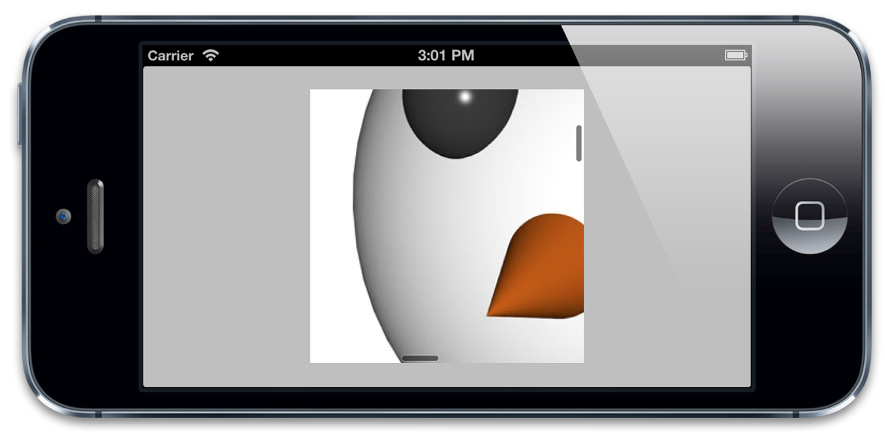

图6.12 用`UIScrollView`滚动`CATiledLayer`

当你滑动这个图片，你会发现当`CATiledLayer`载入小图的时候，他们会淡入到界面中。这是`CATiledLayer`的默认行为。（你可能已经在iOS 6之前的苹果地图程序中见过这个效果）你可以用`fadeDuration`属性改变淡入时长或直接禁用掉。`CATiledLayer`（不同于大部分的`UIKit`和Core Animation方法）支持多线程绘制，`-drawLayer:inContext:`方法可以在多个线程中同时地并发调用，所以请小心谨慎地确保你在这个方法中实现的绘制代码是线程安全的。

###Retina小图

你也许已经注意到了这些小图并不是以Retina的分辨率显示的。为了以屏幕的原生分辨率来渲染`CATiledLayer`，我们需要设置图层的`contentsScale`来匹配`UIScreen`的`scale`属性：

```objective-c
tileLayer.contentsScale = [UIScreen mainScreen].scale;
```

有趣的是，`tileSize`是以像素为单位，而不是点，所以增大了`contentsScale`就自动有了默认的小图尺寸（现在它是128\*128的点而不是256\*256）.所以，我们不需要手工更新小图的尺寸或是在Retina分辨率下指定一个不同的小图。我们需要做的是适应小图渲染代码以对应安排`scale`的变化，然而：

```objective-c
//determine tile coordinate
CGRect bounds = CGContextGetClipBoundingBox(ctx);
CGFloat scale = [UIScreen mainScreen].scale;
NSInteger x = floor(bounds.origin.x / layer.tileSize.width * scale);
NSInteger y = floor(bounds.origin.y / layer.tileSize.height * scale);
```

通过这个方法纠正`scale`也意味着我们的雪人图将以一半的大小渲染在Retina设备上（总尺寸是1024\*1024，而不是2048\*2048）。这个通常都不会影响到用`CATiledLayer`正常显示的图片类型（比如照片和地图，他们在设计上就是要支持放大缩小，能够在不同的缩放条件下显示），但是也需要在心里明白。

##CAEmitterLayer

在iOS 5中，苹果引入了一个新的`CALayer`子类叫做`CAEmitterLayer`。`CAEmitterLayer`是一个高性能的粒子引擎，被用来创建实时例子动画如：烟雾，火，雨等等这些效果。

`CAEmitterLayer`看上去像是许多`CAEmitterCell`的容器，这些`CAEmitierCell`定义了一个例子效果。你将会为不同的例子效果定义一个或多个`CAEmitterCell`作为模版，同时`CAEmitterLayer`负责基于这些模版实例化一个粒子流。一个`CAEmitterCell`类似于一个`CALayer`：它有一个`contents`属性可以定义为一个`CGImage`，另外还有一些可设置属性控制着表现和行为。我们不会对这些属性逐一进行详细的描述，你们可以在`CAEmitterCell`类的头文件中找到。

我们来举个例子。我们将利用在一圆中发射不同速度和透明度的粒子创建一个火爆炸的效果。清单6.13包含了生成爆炸的代码。图6.13是运行结果

清单6.13 用`CAEmitterLayer`创建爆炸效果

```objective-c
#import "ViewController.h"
#import <QuartzCore/QuartzCore.h>

@interface ViewController ()

@property (nonatomic, weak) IBOutlet UIView *containerView;

@end


@implementation ViewController

- (void)viewDidLoad
{
    [super viewDidLoad];
    
    //create particle emitter layer
    CAEmitterLayer *emitter = [CAEmitterLayer layer];
    emitter.frame = self.containerView.bounds;
    [self.containerView.layer addSublayer:emitter];

    //configure emitter
    emitter.renderMode = kCAEmitterLayerAdditive;
    emitter.emitterPosition = CGPointMake(emitter.frame.size.width / 2.0, emitter.frame.size.height / 2.0);

    //create a particle template
    CAEmitterCell *cell = [[CAEmitterCell alloc] init];
    cell.contents = (__bridge id)[UIImage imageNamed:@"Spark.png"].CGImage;
    cell.birthRate = 150;
    cell.lifetime = 5.0;
    cell.color = [UIColor colorWithRed:1 green:0.5 blue:0.1 alpha:1.0].CGColor;
    cell.alphaSpeed = -0.4;
    cell.velocity = 50;
    cell.velocityRange = 50;
    cell.emissionRange = M_PI * 2.0;

    //add particle template to emitter
    emitter.emitterCells = @[cell];
}
@end
```

图6.13 火焰爆炸效果

`CAEMitterCell`的属性基本上可以分为三种：

* 这种粒子的某一属性的初始值。比如，`color`属性指定了一个可以混合图片内容颜色的混合色。在示例中，我们将它设置为桔色。
* 粒子某一属性的变化范围。比如`emissionRange`属性的值是2π，这意味着粒子可以从360度任意位置反射出来。如果指定一个小一些的值，就可以创造出一个圆锥形。
* 指定值在时间线上的变化。比如，在示例中，我们将`alphaSpeed`设置为-0.4，就是说粒子的透明度每过一秒就是减少0.4，这样就有发射出去之后逐渐消失的效果。

`CAEmitterLayer`的属性它自己控制着整个粒子系统的位置和形状。一些属性比如`birthRate`，`lifetime`和`celocity`，这些属性在`CAEmitterCell`中也有。这些属性会以相乘的方式作用在一起，这样你就可以用一个值来加速或者扩大整个粒子系统。其他值得提到的属性有以下这些：

* `preservesDepth`，是否将3D粒子系统平面化到一个图层（默认值）或者可以在3D空间中混合其他的图层。
* `renderMode`，控制着在视觉上粒子图片是如何混合的。你可能已经注意到了示例中我们把它设置为`kCAEmitterLayerAdditive`，它实现了这样一个效果：合并粒子重叠部分的亮度使得看上去更亮。如果我们把它设置为默认的`kCAEmitterLayerUnordered`，效果就没那么好看了（见图6.14）。

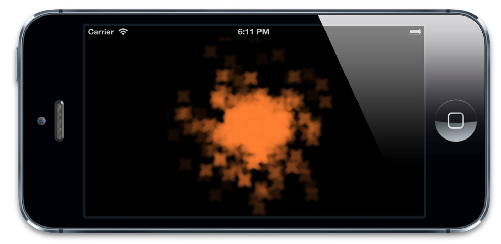

图6.14 禁止混色之后的火焰粒子

##CAEAGLLayer

当iOS要处理高性能图形绘制，必要时就是OpenGL。应该说它应该是最后的杀手锏，至少对于非游戏的应用来说是的。因为相比Core Animation和UIkit框架，它不可思议地复杂。

OpenGL提供了Core Animation的基础，它是底层的C接口，直接和iPhone，iPad的硬件通信，极少地抽象出来的方法。OpenGL没有对象或是图层的继承概念。它只是简单地处理三角形。OpenGL中所有东西都是3D空间中有颜色和纹理的三角形。用起来非常复杂和强大，但是用OpenGL绘制iOS用户界面就需要很多很多的工作了。

为了能够以高性能使用Core Animation，你需要判断你需要绘制哪种内容（矢量图形，例子，文本，等等），但后选择合适的图层去呈现这些内容，Core Animation中只有一些类型的内容是被高度优化的；所以如果你想绘制的东西并不能找到标准的图层类，想要得到高性能就比较费事情了。

因为OpenGL根本不会对你的内容进行假设，它能够绘制得相当快。利用OpenGL，你可以绘制任何你知道必要的集合信息和形状逻辑的内容。所以很多游戏都喜欢用OpenGL（这些情况下，Core Animation的限制就明显了：它优化过的内容类型并不一定能满足需求），但是这样依赖，方便的高度抽象接口就没了。

在iOS 5中，苹果引入了一个新的框架叫做GLKit，它去掉了一些设置OpenGL的复杂性，提供了一个叫做`CLKView`的`UIView`的子类，帮你处理大部分的设置和绘制工作。前提是各种各样的OpenGL绘图缓冲的底层可配置项仍然需要你用`CAEAGLLayer`完成，它是`CALayer`的一个子类，用来显示任意的OpenGL图形。

大部分情况下你都不需要手动设置`CAEAGLLayer`（假设用GLKView），过去的日子就不要再提了。特别的，我们将设置一个OpenGL ES 2.0的上下文，它是现代的iOS设备的标准做法。

尽管不需要GLKit也可以做到这一切，但是GLKit囊括了很多额外的工作，比如设置顶点和片段着色器，这些都以类C语言叫做GLSL自包含在程序中，同时在运行时载入到图形硬件中。编写GLSL代码和设置`EAGLayer`没有什么关系，所以我们将用`GLKBaseEffect`类将着色逻辑抽象出来。其他的事情，我们还是会有以往的方式。

在开始之前，你需要将GLKit和OpenGLES框架加入到你的项目中，然后就可以实现清单6.14中的代码，里面是设置一个`GAEAGLLayer`的最少工作，它使用了OpenGL ES 2.0 的绘图上下文，并渲染了一个有色三角（见图6.15）.

清单6.14 用`CAEAGLLayer`绘制一个三角形

```objective-c
#import "ViewController.h"
#import <QuartzCore/QuartzCore.h>
#import <GLKit/GLKit.h>

@interface ViewController ()

@property (nonatomic, weak) IBOutlet UIView *glView;
@property (nonatomic, strong) EAGLContext *glContext;
@property (nonatomic, strong) CAEAGLLayer *glLayer;
@property (nonatomic, assign) GLuint framebuffer;
@property (nonatomic, assign) GLuint colorRenderbuffer;
@property (nonatomic, assign) GLint framebufferWidth;
@property (nonatomic, assign) GLint framebufferHeight;
@property (nonatomic, strong) GLKBaseEffect *effect;

@end

@implementation ViewController

- (void)setUpBuffers
{
    //set up frame buffer
    glGenFramebuffers(1, &_framebuffer);
    glBindFramebuffer(GL_FRAMEBUFFER, _framebuffer);

    //set up color render buffer
    glGenRenderbuffers(1, &_colorRenderbuffer);
    glBindRenderbuffer(GL_RENDERBUFFER, _colorRenderbuffer);
    glFramebufferRenderbuffer(GL_FRAMEBUFFER, GL_COLOR_ATTACHMENT0, GL_RENDERBUFFER, _colorRenderbuffer);
    [self.glContext renderbufferStorage:GL_RENDERBUFFER fromDrawable:self.glLayer];
    glGetRenderbufferParameteriv(GL_RENDERBUFFER, GL_RENDERBUFFER_WIDTH, &_framebufferWidth);
    glGetRenderbufferParameteriv(GL_RENDERBUFFER, GL_RENDERBUFFER_HEIGHT, &_framebufferHeight);

    //check success
    if (glCheckFramebufferStatus(GL_FRAMEBUFFER) != GL_FRAMEBUFFER_COMPLETE) {
        NSLog(@"Failed to make complete framebuffer object: %i", glCheckFramebufferStatus(GL_FRAMEBUFFER));
    }
}

- (void)tearDownBuffers
{
    if (_framebuffer) {
        //delete framebuffer
        glDeleteFramebuffers(1, &_framebuffer);
        _framebuffer = 0;
    }

    if (_colorRenderbuffer) {
        //delete color render buffer
        glDeleteRenderbuffers(1, &_colorRenderbuffer);
        _colorRenderbuffer = 0;
    }
}

- (void)drawFrame {
    //bind framebuffer & set viewport
    glBindFramebuffer(GL_FRAMEBUFFER, _framebuffer);
    glViewport(0, 0, _framebufferWidth, _framebufferHeight);

    //bind shader program
    [self.effect prepareToDraw];

    //clear the screen
    glClear(GL_COLOR_BUFFER_BIT); glClearColor(0.0, 0.0, 0.0, 1.0);

    //set up vertices
    GLfloat vertices[] = {
        -0.5f, -0.5f, -1.0f, 0.0f, 0.5f, -1.0f, 0.5f, -0.5f, -1.0f,
    };

    //set up colors
    GLfloat colors[] = {
        0.0f, 0.0f, 1.0f, 1.0f, 0.0f, 1.0f, 0.0f, 1.0f, 1.0f, 0.0f, 0.0f, 1.0f,
    };

    //draw triangle
    glEnableVertexAttribArray(GLKVertexAttribPosition);
    glEnableVertexAttribArray(GLKVertexAttribColor);
    glVertexAttribPointer(GLKVertexAttribPosition, 3, GL_FLOAT, GL_FALSE, 0, vertices);
    glVertexAttribPointer(GLKVertexAttribColor,4, GL_FLOAT, GL_FALSE, 0, colors);
    glDrawArrays(GL_TRIANGLES, 0, 3);

    //present render buffer
    glBindRenderbuffer(GL_RENDERBUFFER, _colorRenderbuffer);
    [self.glContext presentRenderbuffer:GL_RENDERBUFFER];
}

- (void)viewDidLoad
{
    [super viewDidLoad];
    //set up context
    self.glContext = [[EAGLContext alloc] initWithAPI: kEAGLRenderingAPIOpenGLES2];
    [EAGLContext setCurrentContext:self.glContext];

    //set up layer
    self.glLayer = [CAEAGLLayer layer];
    self.glLayer.frame = self.glView.bounds;
    [self.glView.layer addSublayer:self.glLayer];
    self.glLayer.drawableProperties = @{kEAGLDrawablePropertyRetainedBacking:@NO, kEAGLDrawablePropertyColorFormat: kEAGLColorFormatRGBA8};

    //set up base effect
    self.effect = [[GLKBaseEffect alloc] init];

    //set up buffers
    [self setUpBuffers];

    //draw frame
    [self drawFrame];
}

- (void)viewDidUnload
{
    [self tearDownBuffers];
    [super viewDidUnload];
}

- (void)dealloc
{
    [self tearDownBuffers];
    [EAGLContext setCurrentContext:nil];
}
@end
```

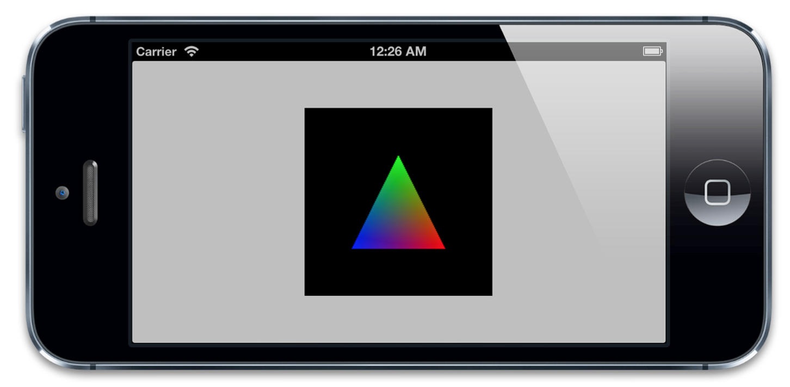

图6.15 用OpenGL渲染的`CAEAGLLayer`图层

在一个真正的OpenGL应用中，我们可能会用`NSTimer`或`CADisplayLink`周期性地每秒钟调用`-drawRrame`方法60次，同时会将几何图形生成和绘制分开以便不会每次都重新生成三角形的顶点（这样也可以让我们绘制其他的一些东西而不是一个三角形而已），不过上面这个例子已经足够演示了绘图原则了。

##AVPlayerLayer

最后一个图层类型是`AVPlayerLayer`。尽管它不是Core Animation框架的一部分（AV前缀看上去像），`AVPlayerLayer`是有别的框架（AVFoundation）提供的，它和Core Animation紧密地结合在一起，提供了一个`CALayer`子类来显示自定义的内容类型。

`AVPlayerLayer`是用来在iOS上播放视频的。他是高级接口例如`MPMoivePlayer`的底层实现，提供了显示视频的底层控制。`AVPlayerLayer`的使用相当简单：你可以用`+playerLayerWithPlayer:`方法创建一个已经绑定了视频播放器的图层，或者你可以先创建一个图层，然后用`player`属性绑定一个`AVPlayer`实例。

在我们开始之前，我们需要添加AVFoundation到我们的项目中。然后，清单6.15创建了一个简单的电影播放器，图6.16是代码运行结果。

清单6.15 用`AVPlayerLayer`播放视频

```objective-c
#import "ViewController.h"
#import <QuartzCore/QuartzCore.h>
#import <AVFoundation/AVFoundation.h>

@interface ViewController ()

@property (nonatomic, weak) IBOutlet UIView *containerView; @end

@implementation ViewController

- (void)viewDidLoad
{
    [super viewDidLoad];
    //get video URL
    NSURL *URL = [[NSBundle mainBundle] URLForResource:@"Ship" withExtension:@"mp4"];

    //create player and player layer
    AVPlayer *player = [AVPlayer playerWithURL:URL];
    AVPlayerLayer *playerLayer = [AVPlayerLayer playerLayerWithPlayer:player];

    //set player layer frame and attach it to our view
    playerLayer.frame = self.containerView.bounds;
    [self.containerView.layer addSublayer:playerLayer];

    //play the video
    [player play];
}
@end
```

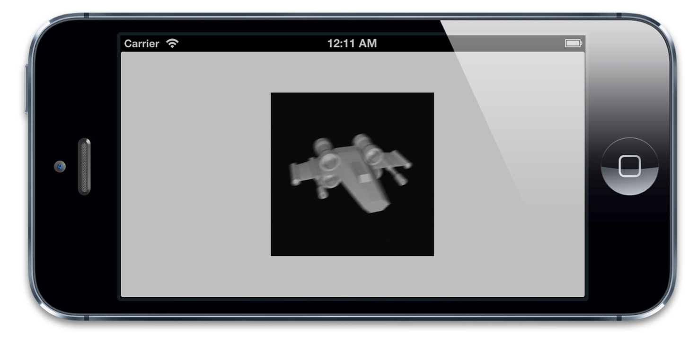

图6.16 用`AVPlayerLayer`图层播放视频的截图

我们用代码创建了一个`AVPlayerLayer`，但是我们仍然把它添加到了一个容器视图中，而不是直接在controller中的主视图上添加。这样其实是为了可以使用自动布局限制使得图层在最中间；否则，一旦设备被旋转了我们就要手动重新放置位置，因为Core Animation并不支持自动大小和自动布局（见第三章『图层几何学』）。

当然，因为`AVPlayerLayer`是`CALayer`的子类，它继承了父类的所有特性。我们并不会受限于要在一个矩形中播放视频；清单6.16演示了在3D，圆角，有色边框，蒙板，阴影等效果（见图6.17）.

清单6.16 给视频增加变换，边框和圆角

```objective-c
- (void)viewDidLoad
{
    ...
    //set player layer frame and attach it to our view
    playerLayer.frame = self.containerView.bounds;
    [self.containerView.layer addSublayer:playerLayer];

    //transform layer
    CATransform3D transform = CATransform3DIdentity;
    transform.m34 = -1.0 / 500.0;
    transform = CATransform3DRotate(transform, M_PI_4, 1, 1, 0);
    playerLayer.transform = transform;
    
    //add rounded corners and border
    playerLayer.masksToBounds = YES;
    playerLayer.cornerRadius = 20.0;
    playerLayer.borderColor = [UIColor redColor].CGColor;
    playerLayer.borderWidth = 5.0;

    //play the video
    [player play];
}
```

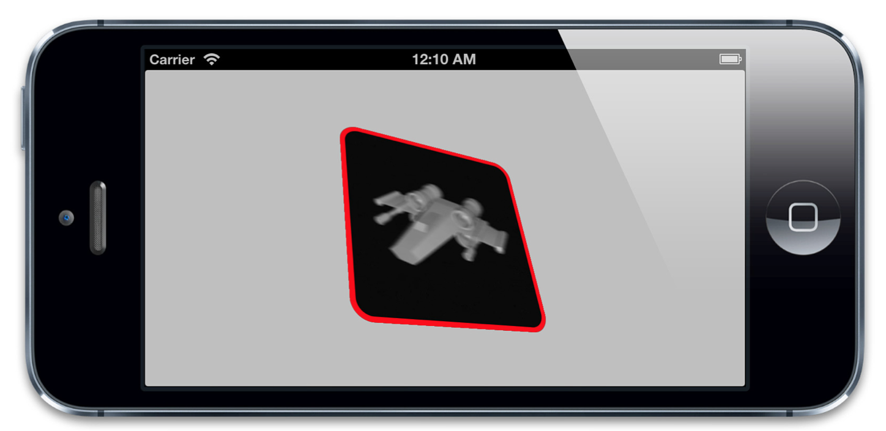

图6.17 3D视角下的边框和圆角`AVPlayerLayer`

##总结

这一章我们简要概述了一些专用图层以及用他们实现的一些效果，我们只是了解到这些图层的皮毛，像`CATiledLayer`和`CAEMitterLayer`这些类可以单独写一章的。但是，重点是记住`CALayer`是用处很大的，而且它并没有为所有可能的场景进行优化。为了获得Core Animation最好的性能，你需要为你的工作选对正确的工具，希望你能够挖掘这些不同的`CALayer`子类的功能。
这一章我们通过`CAEmitterLayer`和`AVPlayerLayer`类简单地接触到了一些动画，在第二章，我们将继续深入研究动画，就从隐式动画开始。
