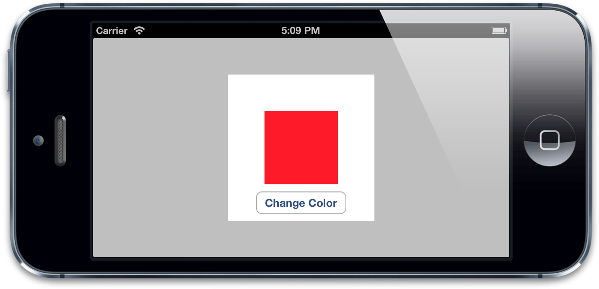
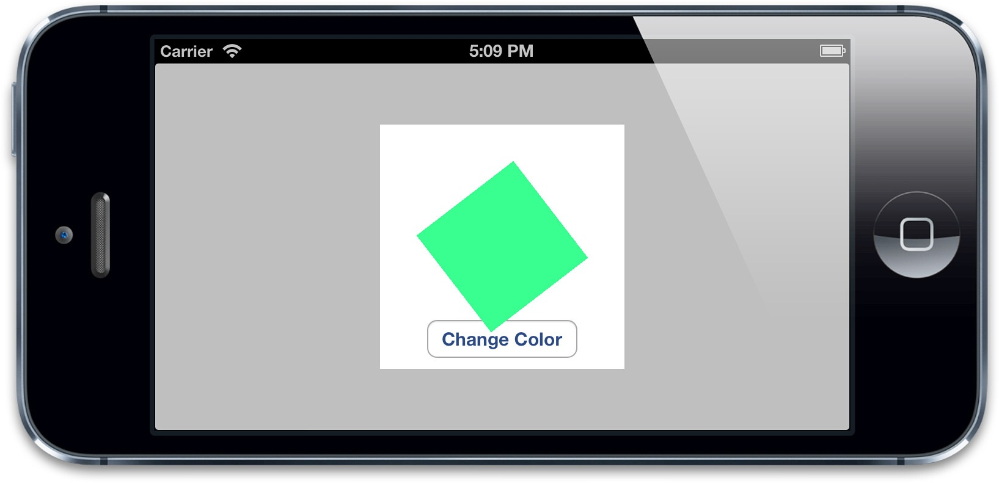
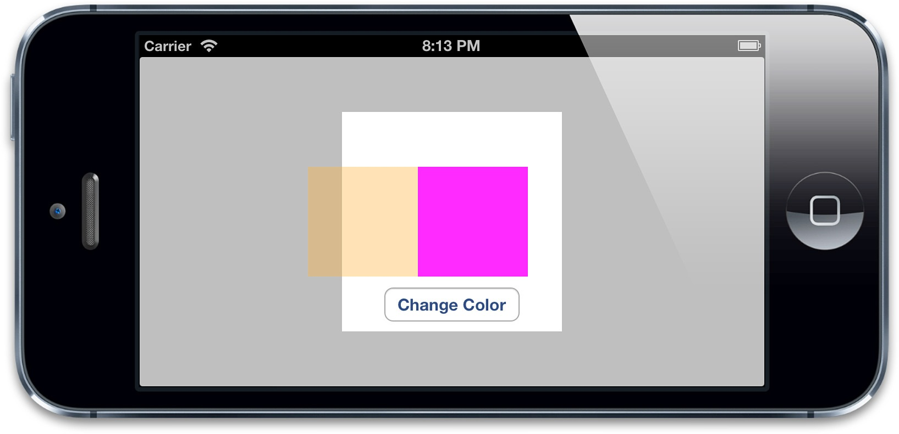
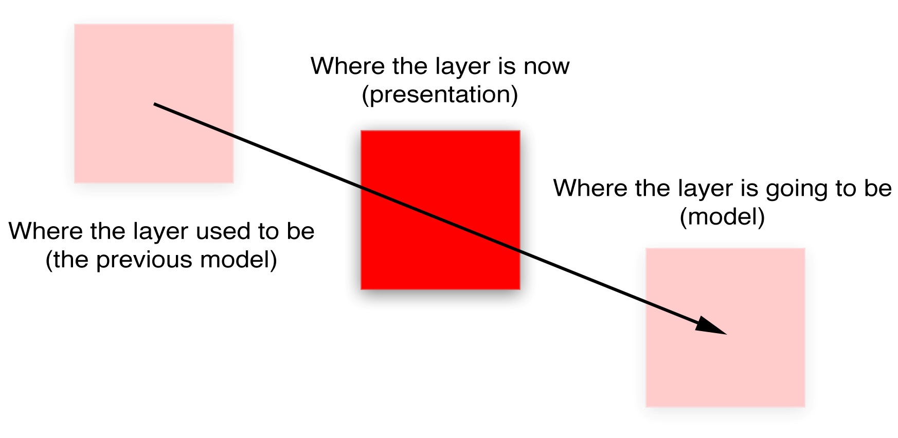

#隐式动画

>*按照我的意思去做，而不是我说的。* -- 埃德娜，辛普森

我们在第一部分讨论了Core Animation除了动画之外可以做到的任何事情。但是动画是Core Animation库一个非常显著的特性。这一章我们来看看它是怎么做到的。具体来说，我们先来讨论框架自动完成的*隐式动画*（除非你明确禁用了这个功能）。

##事务

Core Animation基于一个假设，说屏幕上的任何东西都可以（或者可能）做动画。动画并不需要你在Core Animation中手动打开，相反需要明确地关闭，否则他会一直存在。

当你改变`CALayer`的一个可做动画的属性，它并不能立刻在屏幕上体现出来。相反，它是从先前的值平滑过渡到新的值。这一切都是默认的行为，你不需要做额外的操作。

这看起来这太棒了，似乎不太真实，我们来用一个demo解释一下：首先和第一章“图层树”一样创建一个蓝色的方块，然后添加一个按钮，随机改变它的颜色。代码见清单7.1。点击按钮，你会发现图层的颜色平滑过渡到一个新值，而不是跳变（图7.1）。

清单7.1 随机改变图层颜色

```objective-c
@interface ViewController ()

@property (nonatomic, weak) IBOutlet UIView *layerView;
@property (nonatomic, weak) IBOutlet CALayer *colorLayer;

@end

@implementation ViewController

- (void)viewDidLoad
{
    [super viewDidLoad];
    //create sublayer
    self.colorLayer = [CALayer layer];
    self.colorLayer.frame = CGRectMake(50.0f, 50.0f, 100.0f, 100.0f);
    self.colorLayer.backgroundColor = [UIColor blueColor].CGColor;
    //add it to our view
    [self.layerView.layer addSublayer:self.colorLayer];
}

- (IBAction)changeColor
{
    //randomize the layer background color
    CGFloat red = arc4random() / (CGFloat)INT_MAX;
    CGFloat green = arc4random() / (CGFloat)INT_MAX;
    CGFloat blue = arc4random() / (CGFloat)INT_MAX;
    self.colorLayer.backgroundColor = [UIColor colorWithRed:red green:green blue:blue alpha:1.0].CGColor;                                                                                       
}

@end
```



图7.1 添加一个按钮来控制图层颜色

这其实就是所谓的*隐式*动画。之所以叫隐式是因为我们并没有指定任何动画的类型。我们仅仅改变了一个属性，然后Core Animation来决定如何并且何时去做动画。Core Animaiton同样支持*显式*动画，下章详细说明。

但当你改变一个属性，Core Animation是如何判断动画类型和持续时间的呢？实际上动画执行的时间取决于当前*事务*的设置，动画类型取决于*图层行为*。

事务实际上是Core Animation用来包含一系列属性动画集合的机制，任何用指定事务去改变可以做动画的图层属性都不会立刻发生变化，而是当事务一旦*提交*的时候开始用一个动画过渡到新值。

事务是通过`CATransaction`类来做管理，这个类的设计有些奇怪，不像你从它的命名预期的那样去管理一个简单的事务，而是管理了一叠你不能访问的事务。`CATransaction`没有属性或者实例方法，并且也不能用`+alloc`和`-init`方法创建它。但是可以用`+begin`和`+commit`分别来入栈或者出栈。

任何可以做动画的图层属性都会被添加到栈顶的事务，你可以通过`+setAnimationDuration:`方法设置当前事务的动画时间，或者通过`+animationDuration`方法来获取值（默认0.25秒）。

Core Animation在每个*run loop*周期中自动开始一次新的事务（run loop是iOS负责收集用户输入，处理定时器或者网络事件并且重新绘制屏幕的东西），即使你不显式的用`[CATransaction begin]`开始一次事务，任何在一次run loop循环中属性的改变都会被集中起来，然后做一次0.25秒的动画。

明白这些之后，我们就可以轻松修改变色动画的时间了。我们当然可以用当前事务的`+setAnimationDuration:`方法来修改动画时间，但在这里我们首先起一个新的事务，于是修改时间就不会有别的副作用。因为修改当前事务的时间可能会导致同一时刻别的动画（如屏幕旋转），所以最好还是在调整动画之前压入一个新的事务。

修改后的代码见清单7.2。运行程序，你会发现色块颜色比之前变得更慢了。

清单7.2 使用`CATransaction`控制动画时间

```objective-c
- (IBAction)changeColor
{
    //begin a new transaction
    [CATransaction begin];
    //set the animation duration to 1 second
    [CATransaction setAnimationDuration:1.0];
    //randomize the layer background color
    CGFloat red = arc4random() / (CGFloat)INT_MAX;
    CGFloat green = arc4random() / (CGFloat)INT_MAX;
    CGFloat blue = arc4random() / (CGFloat)INT_MAX;
    self.colorLayer.backgroundColor = [UIColor colorWithRed:red green:green blue:blue alpha:1.0].CGColor;
    //commit the transaction
    [CATransaction commit];
}
```

如果你用过`UIView`的动画方法做过一些动画效果，那么应该对这个模式不陌生。`UIView`有两个方法，`+beginAnimations:context:`和`+commitAnimations`，和`CATransaction`的`+begin`和`+commit`方法类似。实际上在`+beginAnimations:context:`和`+commitAnimations`之间所有视图或者图层属性的改变而做的动画都是由于设置了`CATransaction`的原因。

在iOS4中，苹果对UIView添加了一种基于block的动画方法：`+animateWithDuration:animations:`。这样写对做一堆的属性动画在语法上会更加简单，但实质上它们都是在做同样的事情。

`CATransaction`的`+begin`和`+commit`方法在`+animateWithDuration:animations:`内部自动调用，这样block中所有属性的改变都会被事务所包含。这样也可以避免开发者由于对`+begin`和`+commit`匹配的失误造成的风险。

##完成块

基于`UIView`的block的动画允许你在动画结束的时候提供一个完成的动作。`CATranscation`接口提供的`+setCompletionBlock:`方法也有同样的功能。我们来调整上个例子，在颜色变化结束之后执行一些操作。我们来添加一个完成之后的block，用来在每次颜色变化结束之后切换到另一个旋转90的动画。代码见清单7.3，运行结果见图7.2。

清单7.3 在颜色动画完成之后添加一个回调

```objective-c
- (IBAction)changeColor
{
    //begin a new transaction
    [CATransaction begin];
    //set the animation duration to 1 second
    [CATransaction setAnimationDuration:1.0];
    //add the spin animation on completion
    [CATransaction setCompletionBlock:^{
        //rotate the layer 90 degrees
        CGAffineTransform transform = self.colorLayer.affineTransform;
        transform = CGAffineTransformRotate(transform, M_PI_2);
        self.colorLayer.affineTransform = transform;
    }];
    //randomize the layer background color
    CGFloat red = arc4random() / (CGFloat)INT_MAX;
    CGFloat green = arc4random() / (CGFloat)INT_MAX;
    CGFloat blue = arc4random() / (CGFloat)INT_MAX;
    self.colorLayer.backgroundColor = [UIColor colorWithRed:red green:green blue:blue alpha:1.0].CGColor;
    //commit the transaction
    [CATransaction commit];
}
```



图7.2 颜色渐变之完成之后再做一次旋转

注意旋转动画要比颜色渐变快得多，这是因为完成块是在颜色渐变的事务提交并出栈之后才被执行，于是，用默认的事务做变换，默认的时间也就变成了0.25秒。

##图层行为

现在来做个实验，试着直接对UIView关联的图层做动画而不是一个单独的图层。清单7.4是对清单7.2代码的一点修改，移除了`colorLayer`，并且直接设置`layerView`关联图层的背景色。

清单7.4 直接设置图层的属性

```objective-c
@interface ViewController ()

@property (nonatomic, weak) IBOutlet UIView *layerView;

@end

@implementation ViewController

- (void)viewDidLoad
{
    [super viewDidLoad];
    //set the color of our layerView backing layer directly
    self.layerView.layer.backgroundColor = [UIColor blueColor].CGColor;
}

- (IBAction)changeColor
{
    //begin a new transaction
    [CATransaction begin];
    //set the animation duration to 1 second
    [CATransaction setAnimationDuration:1.0];
    //randomize the layer background color
    CGFloat red = arc4random() / (CGFloat)INT_MAX;
    CGFloat green = arc4random() / (CGFloat)INT_MAX;
    CGFloat blue = arc4random() / (CGFloat)INT_MAX;
    self.layerView.layer.backgroundColor = [UIColor colorWithRed:red green:green blue:blue alpha:1.0].CGColor;
    //commit the transaction
    [CATransaction commit];
}
```

运行程序，你会发现当按下按钮，图层颜色瞬间切换到新的值，而不是之前平滑过渡的动画。发生了什么呢？隐式动画好像被`UIView`关联图层给禁用了。

试想一下，如果`UIView`的属性都有动画特性的话，那么无论在什么时候修改它，我们都应该能注意到的。所以，如果说UIKit建立在Core Animation（默认对所有东西都做动画）之上，那么隐式动画是如何被UIKit禁用掉呢？

我们知道Core Animation通常对`CALayer`的所有属性（可动画的属性）做动画，但是`UIView`把它关联的图层的这个特性关闭了。为了更好说明这一点，我们需要知道隐式动画是如何实现的。

我们把改变属性时`CALayer`自动应用的动画称作*行为*，当`CALayer`的属性被修改时候，它会调用`-actionForKey:`方法，传递属性的名称。剩下的操作都在`CALayer`的头文件中有详细的说明，实质上是如下几步：

* 图层首先检测它是否有委托，并且是否实现`CALayerDelegate`协议指定的`-actionForLayer:forKey`方法。如果有，直接调用并返回结果。
* 如果没有委托，或者委托没有实现`-actionForLayer:forKey`方法，图层接着检查包含属性名称对应行为映射的`actions`字典。
* 如果`actions字典`没有包含对应的属性，那么图层接着在它的`style`字典接着搜索属性名。
* 最后，如果在`style`里面也找不到对应的行为，那么图层将会直接调用定义了每个属性的标准行为的`-defaultActionForKey:`方法。

所以一轮完整的搜索结束之后，`-actionForKey:`要么返回空（这种情况下将不会有动画发生），要么是`CAAction`协议对应的对象，最后`CALayer`拿这个结果去对先前和当前的值做动画。

于是这就解释了UIKit是如何禁用隐式动画的：每个`UIView`对它关联的图层都扮演了一个委托，并且提供了`-actionForLayer:forKey`的实现方法。当不在一个动画块的实现中，`UIView`对所有图层行为返回`nil`，但是在动画block范围之内，它就返回了一个非空值。我们可以用一个demo做个简单的实验（清单7.5）

清单7.5 测试UIView的`actionForLayer:forKey:`实现

```objective-c
@interface ViewController ()

@property (nonatomic, weak) IBOutlet UIView *layerView;

@end

@implementation ViewController

- (void)viewDidLoad
{
    [super viewDidLoad];
    //test layer action when outside of animation block
    NSLog(@"Outside: %@", [self.layerView actionForLayer:self.layerView.layer forKey:@"backgroundColor"]);
    //begin animation block
    [UIView beginAnimations:nil context:nil];
    //test layer action when inside of animation block
    NSLog(@"Inside: %@", [self.layerView actionForLayer:self.layerView.layer forKey:@"backgroundColor"]);
    //end animation block
    [UIView commitAnimations];
}

@end
```

运行程序，控制台显示结果如下：

    $ LayerTest[21215:c07] Outside: <null>
    $ LayerTest[21215:c07] Inside: <CABasicAnimation: 0x757f090>

于是我们可以预言，当属性在动画块之外发生改变，`UIView`直接通过返回`nil`来禁用隐式动画。但如果在动画块范围之内，根据动画具体类型返回相应的属性，在这个例子就是`CABasicAnimation`（第八章“显式动画”将会提到）。

当然返回`nil`并不是禁用隐式动画唯一的办法，`CATransaction`有个方法叫做`+setDisableActions:`，可以用来对所有属性打开或者关闭隐式动画。如果在清单7.2的`[CATransaction begin]`之后添加下面的代码，同样也会阻止动画的发生：

    [CATransaction setDisableActions:YES];

总结一下，我们知道了如下几点

* `UIView`关联的图层禁用了隐式动画，对这种图层做动画的唯一办法就是使用`UIView`的动画函数（而不是依赖`CATransaction`），或者继承`UIView`，并覆盖`-actionForLayer:forKey:`方法，或者直接创建一个显式动画（具体细节见第八章）。
* 对于单独存在的图层，我们可以通过实现图层的`-actionForLayer:forKey:`委托方法，或者提供一个`actions`字典来控制隐式动画。

我们来对颜色渐变的例子使用一个不同的行为，通过给`colorLayer`设置一个自定义的`actions`字典。我们也可以使用委托来实现，但是`actions`字典可以写更少的代码。那么到底改如何创建一个合适的行为对象呢？

行为通常是一个被Core Animation*隐式*调用的*显式*动画对象。这里我们使用的是一个实现了`CATransition`的实例，叫做*推进过渡*。

第八章中将会详细解释过渡，不过对于现在，知道`CATransition`响应`CAAction`协议，并且可以当做一个图层行为就足够了。结果很赞，不论在什么时候改变背景颜色，新的色块都是从左侧滑入，而不是默认的渐变效果。

清单7.6 实现自定义行为

```objective-c
@interface ViewController ()

@property (nonatomic, weak) IBOutlet UIView *layerView;
@property (nonatomic, weak) IBOutlet CALayer *colorLayer;

@end

@implementation ViewController

- (void)viewDidLoad
{
    [super viewDidLoad];
    
    //create sublayer
    self.colorLayer = [CALayer layer];
    self.colorLayer.frame = CGRectMake(50.0f, 50.0f, 100.0f, 100.0f);
    self.colorLayer.backgroundColor = [UIColor blueColor].CGColor;
    //add a custom action
    CATransition *transition = [CATransition animation];
    transition.type = kCATransitionPush;
    transition.subtype = kCATransitionFromLeft;
    self.colorLayer.actions = @{@"backgroundColor": transition};
    //add it to our view
    [self.layerView.layer addSublayer:self.colorLayer];
}

- (IBAction)changeColor
{
    //randomize the layer background color
    CGFloat red = arc4random() / (CGFloat)INT_MAX;
    CGFloat green = arc4random() / (CGFloat)INT_MAX;
    CGFloat blue = arc4random() / (CGFloat)INT_MAX;
    self.colorLayer.backgroundColor = [UIColor colorWithRed:red green:green blue:blue alpha:1.0].CGColor;
}

@end
```



图7.3 使用推进过渡的色值动画

##呈现与模型

`CALayer`的属性行为其实很不正常，因为改变一个图层的属性并没有立刻生效，而是通过一段时间渐变更新。这是怎么做到的呢？

当你改变一个图层的属性，属性值的确是立刻更新的（如果你读取它的数据，你会发现它的值在你设置它的那一刻就已经生效了），但是屏幕上并没有马上发生改变。这是因为你设置的属性并没有直接调整图层的外观，相反，他只是定义了图层动画结束之后将要变化的外观。

当设置`CALayer`的属性，实际上是在定义当前事务结束之后图层如何显示的*模型*。Core Animation扮演了一个*控制器*的角色，并且负责根据图层行为和事务设置去不断更新*视图*的这些属性在屏幕上的状态。

我们讨论的就是一个典型的*微型MVC模式*。`CALayer`是一个连接用户界面（就是MVC中的*view*）虚构的类，但是在界面本身这个场景下，`CALayer`的行为更像是存储了视图如何显示和动画的数据模型。实际上，在苹果自己的文档中，图层树通常都是值的图层树模型。

在iOS中，屏幕每秒钟重绘60次。如果动画时长比60分之一秒要长，Core Animation就需要在设置一次新值和新值生效之间，对屏幕上的图层进行重新组织。这意味着`CALayer`除了“真实”值（就是你设置的值）之外，必须要知道当前*显示*在屏幕上的属性值的记录。

每个图层属性的显示值都被存储在一个叫做*呈现图层*的独立图层当中，他可以通过`-presentationLayer`方法来访问。这个呈现图层实际上是模型图层的复制，但是它的属性值代表了在任何指定时刻当前外观效果。换句话说，你可以通过呈现图层的值来获取当前屏幕上真正显示出来的值（图7.4）。

我们在第一章中提到除了图层树，另外还有*呈现树*。呈现树通过图层树中所有图层的呈现图层所形成。注意呈现图层仅仅当图层首次被*提交*（就是首次第一次在屏幕上显示）的时候创建，所以在那之前调用`-presentationLayer`将会返回`nil`。

你可能注意到有一个叫做`–modelLayer`的方法。在呈现图层上调用`–modelLayer`将会返回它正在呈现所依赖的`CALayer`。通常在一个图层上调用`-modelLayer`会返回`–self`（实际上我们已经创建的原始图层就是一种数据模型）。



图7.4 一个移动的图层是如何通过数据模型呈现的

大多数情况下，你不需要直接访问呈现图层，你可以通过和模型图层的交互，来让Core Animation更新显示。两种情况下呈现图层会变得很有用，一个是同步动画，一个是处理用户交互。

* 如果你在实现一个基于定时器的动画（见第11章“基于定时器的动画”），而不仅仅是基于事务的动画，这个时候准确地知道在某一时刻图层显示在什么位置就会对正确摆放图层很有用了。
* 如果你想让你做动画的图层响应用户输入，你可以使用`-hitTest:`方法（见第三章“图层几何学”）来判断指定图层是否被触摸，这时候对*呈现*图层而不是*模型*图层调用`-hitTest:`会显得更有意义，因为呈现图层代表了用户当前看到的图层位置，而不是当前动画结束之后的位置。

我们可以用一个简单的案例来证明后者（见清单7.7）。在这个例子中，点击屏幕上的任意位置将会让图层平移到那里。点击图层本身可以随机改变它的颜色。我们通过对呈现图层调用`-hitTest:`来判断是否被点击。

如果修改代码让`-hitTest:`直接作用于*colorLayer*而不是呈现图层，你会发现当图层移动的时候它并不能正确显示。这时候你就需要点击图层将要移动到的位置而不是图层本身来响应点击（这就是为什么用呈现图层来响应交互的原因）。

清单7.7 使用`presentationLayer`图层来判断当前图层位置

```objective-c
@interface ViewController ()

@property (nonatomic, strong) CALayer *colorLayer;

@end

@implementation ViewController

- (void)viewDidLoad
{
    [super viewDidLoad];
    //create a red layer
    self.colorLayer = [CALayer layer];
    self.colorLayer.frame = CGRectMake(0, 0, 100, 100);
    self.colorLayer.position = CGPointMake(self.view.bounds.size.width / 2, self.view.bounds.size.height / 2);
    self.colorLayer.backgroundColor = [UIColor redColor].CGColor;
    [self.view.layer addSublayer:self.colorLayer];
}

- (void)touchesBegan:(NSSet *)touches withEvent:(UIEvent *)event
{
    //get the touch point
    CGPoint point = [[touches anyObject] locationInView:self.view];
    //check if we've tapped the moving layer
    if ([self.colorLayer.presentationLayer hitTest:point]) {
        //randomize the layer background color
        CGFloat red = arc4random() / (CGFloat)INT_MAX;
        CGFloat green = arc4random() / (CGFloat)INT_MAX;
        CGFloat blue = arc4random() / (CGFloat)INT_MAX;
        self.colorLayer.backgroundColor = [UIColor colorWithRed:red green:green blue:blue alpha:1.0].CGColor;
    } else {
        //otherwise (slowly) move the layer to new position
        [CATransaction begin];
        [CATransaction setAnimationDuration:4.0];
        self.colorLayer.position = point;
        [CATransaction commit];
    }
}
```
@end

##总结

这一章讨论了隐式动画，还有Core Animation对指定属性选择合适的动画行为的机制。同时你知道了UIKit是如何充分利用Core Animation的隐式动画机制来强化它的显式系统，以及动画是如何被默认禁用并且当需要的时候启用的。最后，你了解了呈现和模型图层，以及Core Animation是如何通过它们来判断出图层当前位置以及将要到达的位置。

在下一章中，我们将研究Core Animation提供的*显式*动画类型，既可以直接对图层属性做动画，也可以覆盖默认的图层行为。
