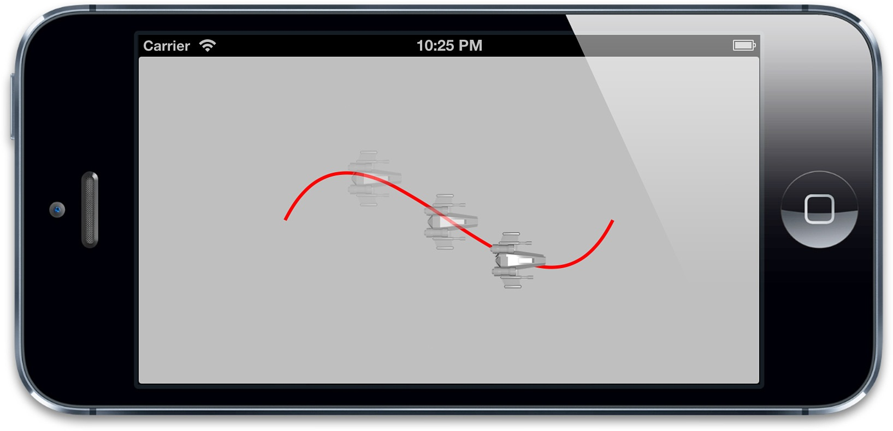
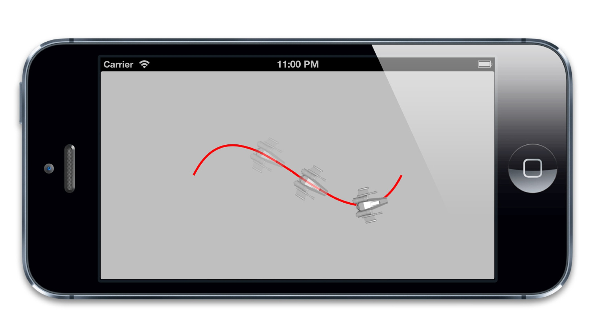
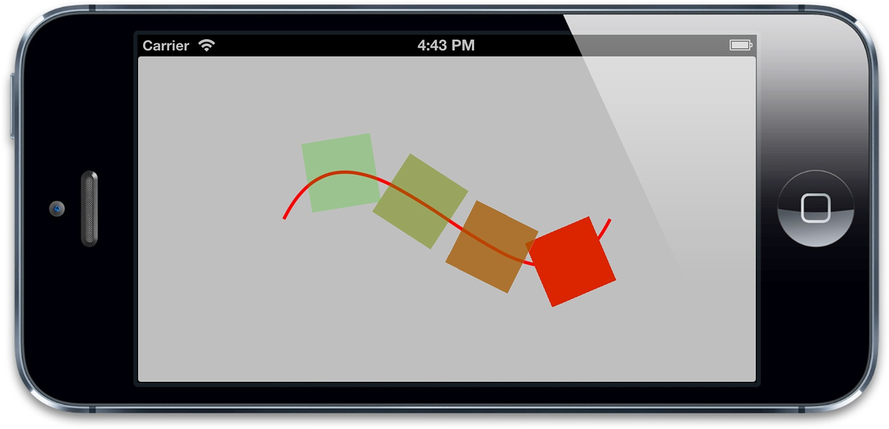
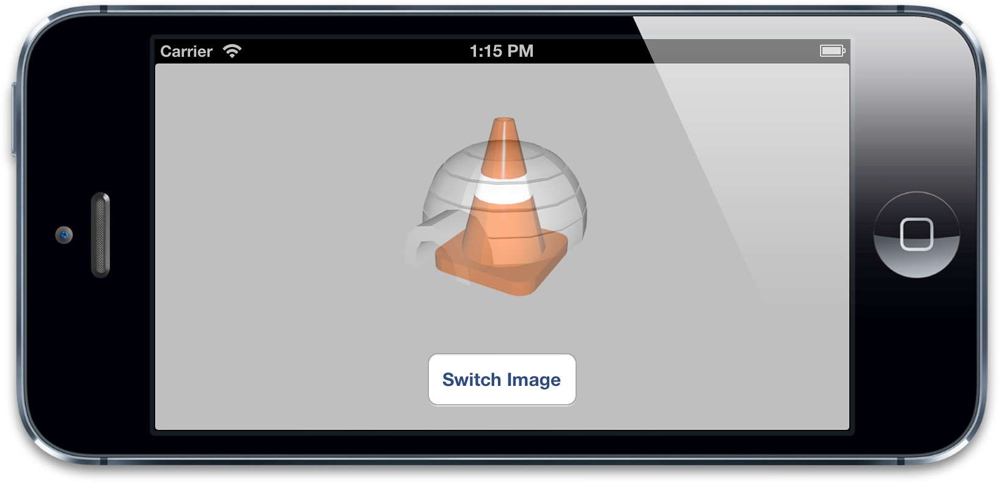
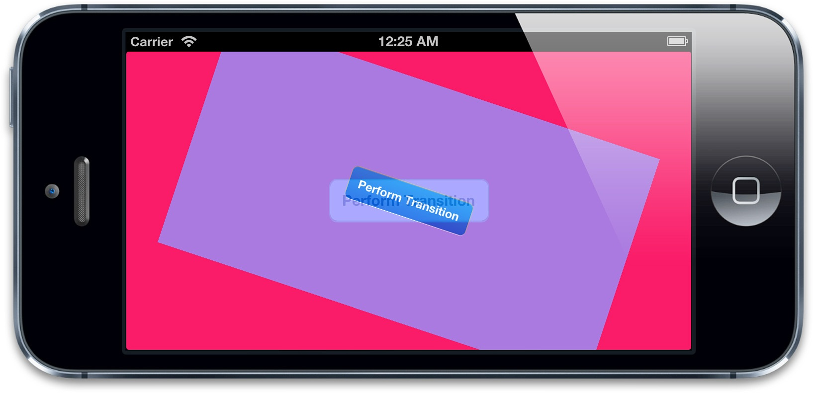
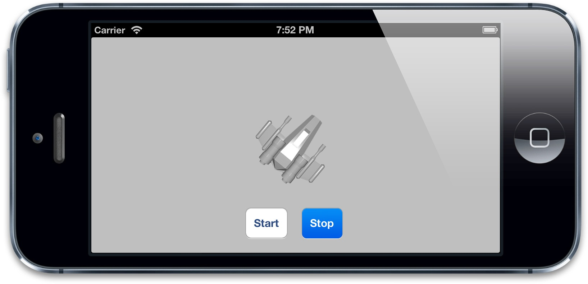

#显式动画

> 如果想让事情变得顺利，只有靠自己 -- 夏尔·纪尧姆

上一章介绍了隐式动画的概念。隐式动画是iOS平台上创建动态用户界面的一种简单方式，也是UIKit动画机制的基础，不过它并不能涵盖所有的动画类型。在这一章中，我们将要研究一下*显式动画*，它能够对一些属性做指定的自定义动画，或者创建非线性动画，比如沿着任意一条曲线移动。

##属性动画

首先我们来探讨一下*属性动画*。属性动画作用于图层的某个单一属性，并指定了它的一个目标值，或者一连串将要做动画的值。属性动画分为两种：*基础*和*关键帧*。

###基础动画

动画其实就是一段时间内发生的改变，最简单的形式就是从一个值改变到另一个值，这也是`CABasicAnimation`最主要的功能。`CABasicAnimation`是`CAPropertyAnimation`的一个子类，而`CAPropertyAnimation`的父类是`CAAnimation`，`CAAnimation`同时也是Core Animation所有动画类型的抽象基类。作为一个抽象类，`CAAnimation`本身并没有做多少工作，它提供了一个计时函数（见第十章“缓冲”），一个委托（用于反馈动画状态）以及一个`removedOnCompletion`，用于标识动画是否该在结束后自动释放（默认`YES`，为了防止内存泄露）。`CAAnimation`同时实现了一些协议，包括`CAAction`（允许`CAAnimation`的子类可以提供图层行为），以及`CAMediaTiming`（第九章“图层时间”将会详细解释）。

`CAPropertyAnimation`通过指定动画的`keyPath`作用于一个单一属性，`CAAnimation`通常应用于一个指定的`CALayer`，于是这里指的也就是一个图层的`keyPath`了。实际上它是一个关键*路径*（一些用点表示法可以在层级关系中指向任意嵌套的对象），而不仅仅是一个属性的名称，因为这意味着动画不仅可以作用于图层本身的属性，而且还包含了它的子成员的属性，甚至是一些*虚拟*的属性（后面会详细解释）。

`CABasicAnimation`继承于`CAPropertyAnimation`，并添加了如下属性：

    id fromValue 
    id toValue 
    id byValue
    
从命名就可以得到很好的解释：`fromValue`代表了动画开始之前属性的值，`toValue`代表了动画结束之后的值，`byValue`代表了动画执行过程中改变的值。

通过组合这三个属性就可以有很多种方式来指定一个动画的过程。它们被定义成`id`类型而不是一些具体的类型是因为属性动画可以用作很多不同种的属性类型，包括数字类型，矢量，变换矩阵，甚至是颜色或者图片。

`id`类型可以包含任意由`NSObject`派生的对象，但有时候你会希望对一些不直接从`NSObject`继承的属性类型做动画，这意味着你需要把这些值用一个对象来封装，或者强转成一个对象，就像某些功能和Objective-C对象类似的Core Foundation类型。但是如何从一个具体的数据类型转换成id看起来并不明显，一些普通的例子见表8.1。

表8.1 用于`CAPropertyAnimation`的一些类型转换

Type          | Object Type | Code Example
--------------|-------------|-----------------------------------------------------
CGFloat       | NSNumber    | id obj = @(float);
CGPoint       | NSValue     | id obj = [NSValue valueWithCGPoint:point);
CGSize        | NSValue     | id obj = [NSValue valueWithCGSize:size);
CGRect		    | NSValue     | id obj = [NSValue valueWithCGRect:rect);
CATransform3D | NSValue     | id obj = [NSValue valueWithCATransform3D:transform);
CGImageRef    | id          | id obj = (__bridge id)imageRef;
CGColorRef    | id          | id obj = (__bridge id)colorRef;

`fromValue`，`toValue`和`byValue`属性可以用很多种方式来组合，但为了防止冲突，不能一次性同时指定这三个值。例如，如果指定了`fromValue`等于2，`toValue`等于4，`byValue`等于3，那么Core Animation就不知道结果到底是4（`toValue`）还是5（`fromValue + byValue`）了。他们的用法在`CABasicAnimation`头文件中已经描述的很清楚了，所以在这里就不重复了。总的说来，就是只需要指定`toValue`或者`byValue`，剩下的值都可以通过上下文自动计算出来。

举个例子：我们修改一下第七章中的颜色渐变的动画，用显式的`CABasicAnimation`来取代之前的隐式动画，代码见清单8.1。

清单8.1 通过`CABasicAnimation`来设置图层背景色

```objective-c
@interface ViewController ()

@property (nonatomic, weak) IBOutlet UIView *layerView;
@property (nonatomic, strong) IBOutlet CALayer *colorLayer;

@end

@implementation ViewController

- (void)viewDidLoad
{
    [super viewDidLoad];
    //create sublayer
    self.colorLayer = [CALayer layer];
    self.colorLayer.frame = CGRectMake(50.0f, 50.0f, 100.0f, 100.0f);
    self.colorLayer.backgroundColor = [UIColor blueColor].CGColor;
    //add it to our view
    [self.layerView.layer addSublayer:self.colorLayer];
}

- (IBAction)changeColor
{
    //create a new random color
    CGFloat red = arc4random() / (CGFloat)INT_MAX;
    CGFloat green = arc4random() / (CGFloat)INT_MAX;
    CGFloat blue = arc4random() / (CGFloat)INT_MAX;
    UIColor *color = [UIColor colorWithRed:red green:green blue:blue alpha:1.0];
    //create a basic animation
    CABasicAnimation *animation = [CABasicAnimation animation];
    animation.keyPath = @"backgroundColor";
    animation.toValue = (__bridge id)color.CGColor;
    //apply animation to layer
    [self.colorLayer addAnimation:animation forKey:nil];
}

@end
```

运行程序，结果有点差强人意，点击按钮，的确可以使图层动画过渡到一个新的颜色，然动画结束之后又立刻变回原始值。

这是因为动画并没有改变图层的*模型*，而只是*呈现*（第七章）。一旦动画结束并从图层上移除之后，图层就立刻恢复到之前定义的外观状态。我们从没改变过`backgroundColor`属性，所以图层就返回到原始的颜色。

当之前在使用隐式动画的时候，实际上它就是用例子中`CABasicAnimation`来实现的（回忆第七章，我们在`-actionForLayer:forKey:`委托方法打印出来的结果就是`CABasicAnimation`）。但是在那个例子中，我们通过设置属性来打开动画。在这里我们做了相同的动画，但是并没有设置任何属性的值（这就是为什么会立刻变回初始状态的原因）。

把动画设置成一个图层的行为（然后通过改变属性值来启动动画）是到目前为止同步属性值和动画状态最简单的方式了，假设由于某些原因我们不能这么做（通常因为`UIView`关联的图层不能这么做动画），那么有两种可以更新属性值的方式：在动画开始之前或者动画结束之后。

动画之前改变属性的值是最简单的办法，但这意味着我们不能使用`fromValue`这么好的特性了，而且要手动将`fromValue`设置成图层当前的值。

于是在动画创建之前插入如下代码，就可以解决问题了

    animation.fromValue = (__bridge id)self.colorLayer.backgroundColor; 
    self.colorLayer.backgroundColor = color.CGColor;
    
这的确是可行的，但还是有些问题，如果这里已经正在进行一段动画，我们需要从*呈现*图层那里去获得`fromValue`，而不是模型图层。另外，由于这里的图层并不是`UIView`关联的图层，我们需要用`CATransaction`来禁用隐式动画行为，否则默认的图层行为会干扰我们的显式动画（实际上，显式动画通常会覆盖隐式动画，但在文章中并没有提到，所以为了安全最好这么做）。

更新之后的代码如下：
```objective-c
CALayer *layer = self.colorLayer.presentationLayer ?:
self.colorLayer;
 animation.fromValue = (__bridge id)layer.backgroundColor;
[CATransaction begin];
[CATransaction setDisableActions:YES];
self.colorLayer.backgroundColor = color.CGColor;
[CATransaction commit];
```

如果给每个动画都添加这些，代码会显得特别臃肿。幸运的是，我们可以从`CABasicAnimation`去自动设置这些。于是可以创建一个可复用的代码。清单8.2修改了之前的示例，通过使用`CABasicAnimation`的一个函数来避免在每次动画时候都重复那些臃肿的代码。

清单8.2 修改动画立刻恢复到原始状态的一个可复用函数

```objective-c
- (void)applyBasicAnimation:(CABasicAnimation *)animation toLayer:(CALayer *)layer
{

    //set the from value (using presentation layer if available)
    animation.fromValue = [layer.presentationLayer ?: layer valueForKeyPath:animation.keyPath];
    //update the property in advance
    //note: this approach will only work if toValue != nil 
    [CATransaction begin];
    [CATransaction setDisableActions:YES];
    [layer setValue:animation.toValue forKeyPath:animation.keyPath];
    [CATransaction commit];
    //apply animation to layer
    [layer addAnimation:animation forKey:nil];
}

- (IBAction)changeColor
{
    //create a new random color
    CGFloat red = arc4random() / (CGFloat)INT_MAX;
    CGFloat green = arc4random() / (CGFloat)INT_MAX;
    CGFloat blue = arc4random() / (CGFloat)INT_MAX;
    UIColor *color = [UIColor colorWithRed:red green:green blue:blue alpha:1.0];
    //create a basic animation
    CABasicAnimation *animation = [CABasicAnimation animation];
    animation.keyPath = @"backgroundColor";
    animation.toValue = (__bridge id)color.CGColor;
    //apply animation without snap-back
    [self applyBasicAnimation:animation toLayer:self.colorLayer];
}
```

这种简单的实现方式通过`toValue`而不是`byValue`来处理动画，不过这已经是朝更好的解决方案迈出一大步了。你可以把它添加给`CALayer`作为一个分类，以方便更好地使用。

解决看起来如此简单的一个问题都着实麻烦，但是别的方案会更加复杂。如果不在动画开始之前去更新目标属性，那么就只能在动画完全结束或者取消的时候更新它。这意味着我们需要精准地在动画结束之后，图层返回到原始值之前更新属性。那么该如何找到这个点呢？

###CAAnimationDelegate

在第七章使用隐式动画的时候，我们可以在`CATransaction`完成块中检测到动画的完成。但是这种方式并不适用于显式动画，因为这里的动画和事务并没太多关联。

那么为了知道一个显式动画在何时结束，我们需要使用一个实现了`CAAnimationDelegate`协议的`delegate`。

`CAAnimationDelegate`在任何头文件中都找不到，但是可以在`CAAnimation`头文件或者苹果开发者文档中找到相关函数。在这个例子中，我们用`-animationDidStop:finished:`方法在动画结束之后来更新图层的`backgroundColor`。

当更新属性的时候，我们需要设置一个新的事务，并且禁用图层行为。否则动画会发生两次，一个是因为显式的`CABasicAnimation`，另一次是因为隐式动画，具体实现见订单8.3。

清单8.3 动画完成之后修改图层的背景色

```objective-c
@implementation ViewController

- (void)viewDidLoad
{
    [super viewDidLoad];
    //create sublayer
    self.colorLayer = [CALayer layer];
    self.colorLayer.frame = CGRectMake(50.0f, 50.0f, 100.0f, 100.0f);
    self.colorLayer.backgroundColor = [UIColor blueColor].CGColor;
    //add it to our view
    [self.layerView.layer addSublayer:self.colorLayer];
}

- (IBAction)changeColor
{
    //create a new random color
    CGFloat red = arc4random() / (CGFloat)INT_MAX;
    CGFloat green = arc4random() / (CGFloat)INT_MAX;
    CGFloat blue = arc4random() / (CGFloat)INT_MAX;
    UIColor *color = [UIColor colorWithRed:red green:green blue:blue alpha:1.0];
    //create a basic animation
    CABasicAnimation *animation = [CABasicAnimation animation];
    animation.keyPath = @"backgroundColor";
    animation.toValue = (__bridge id)color.CGColor;
    animation.delegate = self;
    //apply animation to layer
    [self.colorLayer addAnimation:animation forKey:nil];
}

- (void)animationDidStop:(CABasicAnimation *)anim finished:(BOOL)flag
{
    //set the backgroundColor property to match animation toValue
    [CATransaction begin];
    [CATransaction setDisableActions:YES];
    self.colorLayer.backgroundColor = (__bridge CGColorRef)anim.toValue;
    [CATransaction commit];
}

@end
```

对`CAAnimation`而言，使用委托模式而不是一个完成块会带来一个问题，就是当你有多个动画的时候，无法在在回调方法中区分。在一个视图控制器中创建动画的时候，通常会用控制器本身作为一个委托（如清单8.3所示），但是所有的动画都会调用同一个回调方法，所以你就需要判断到底是那个图层的调用。

考虑一下第三章的闹钟，“图层几何学”，我们通过简单地每秒更新指针的角度来实现一个钟，但如果指针动态地转向新的位置会更加真实。

我们不能通过隐式动画来实现因为这些指针都是`UIView`的实例，所以图层的隐式动画都被禁用了。我们可以简单地通过`UIView`的动画方法来实现。但如果想更好地控制动画时间，使用显式动画会更好（更多内容见第十章）。使用`CABasicAnimation`来做动画可能会更加复杂，因为我们需要在`-animationDidStop:finished:`中检测指针状态（用于设置结束的位置）。

动画本身会作为一个参数传入委托的方法，也许你会认为可以控制器中把动画存储为一个属性，然后在回调用比较，但实际上并不起作用，因为委托传入的动画参数是原始值的一个深拷贝，从而不是同一个值。

当使用`-addAnimation:forKey:`把动画添加到图层，这里有一个到目前为止我们都设置为`nil`的`key`参数。这里的键是`-animationForKey:`方法找到对应动画的唯一标识符，而当前动画的所有键都可以用`animationKeys`获取。如果我们对每个动画都关联一个唯一的键，就可以对每个图层循环所有键，然后调用`-animationForKey:`来比对结果。尽管这不是一个优雅的实现。

幸运的是，还有一种更加简单的方法。像所有的`NSObject`子类一样，`CAAnimation`实现了KVC（键-值-编码）协议，于是你可以用`-setValue:forKey:`和`-valueForKey:`方法来存取属性。但是`CAAnimation`有一个与众不同的特性：它更像一个`NSDictionary`，可以让你随意设置键值对，即使和你使用的动画类所声明的属性并不匹配。

这意味着你可以对动画用任意类型打标签。在这里，我们给`UIView`类型的指针添加的动画，所以可以简单地判断动画到底属于哪个视图，然后在委托方法中用这个信息正确地更新钟的指针（清单8.4）。

清单8.4 使用KVC对动画打标签

```objective-c
@interface ViewController ()

@property (nonatomic, weak) IBOutlet UIImageView *hourHand;
@property (nonatomic, weak) IBOutlet UIImageView *minuteHand;
@property (nonatomic, weak) IBOutlet UIImageView *secondHand;
@property (nonatomic, weak) NSTimer *timer;

@end

@implementation ViewController

- (void)viewDidLoad
{
    [super viewDidLoad];
    //adjust anchor points
    self.secondHand.layer.anchorPoint = CGPointMake(0.5f, 0.9f);
    self.minuteHand.layer.anchorPoint = CGPointMake(0.5f, 0.9f);
    self.hourHand.layer.anchorPoint = CGPointMake(0.5f, 0.9f);
    //start timer
    self.timer = [NSTimer scheduledTimerWithTimeInterval:1.0 target:self selector:@selector(tick) userInfo:nil repeats:YES];
    //set initial hand positions
    [self updateHandsAnimated:NO];
}

- (void)tick
{
    [self updateHandsAnimated:YES];
}

- (void)updateHandsAnimated:(BOOL)animated
{
    //convert time to hours, minutes and seconds
    NSCalendar *calendar = [[NSCalendar alloc] initWithCalendarIdentifier:NSGregorianCalendar];
    NSUInteger units = NSHourCalendarUnit | NSMinuteCalendarUnit | NSSecondCalendarUnit;
    NSDateComponents *components = [calendar components:units fromDate:[NSDate date]];
    CGFloat hourAngle = (components.hour / 12.0) * M_PI * 2.0;
    //calculate hour hand angle //calculate minute hand angle
    CGFloat minuteAngle = (components.minute / 60.0) * M_PI * 2.0;
    //calculate second hand angle
    CGFloat secondAngle = (components.second / 60.0) * M_PI * 2.0;
    //rotate hands
    [self setAngle:hourAngle forHand:self.hourHand animated:animated];
    [self setAngle:minuteAngle forHand:self.minuteHand animated:animated];
    [self setAngle:secondAngle forHand:self.secondHand animated:animated];
}

- (void)setAngle:(CGFloat)angle forHand:(UIView *)handView animated:(BOOL)animated
{
    //generate transform
    CATransform3D transform = CATransform3DMakeRotation(angle, 0, 0, 1);
    if (animated) {
        //create transform animation
        CABasicAnimation *animation = [CABasicAnimation animation];
        [self updateHandsAnimated:NO];
        animation.keyPath = @"transform";
        animation.toValue = [NSValue valueWithCATransform3D:transform];
        animation.duration = 0.5;
        animation.delegate = self;
        [animation setValue:handView forKey:@"handView"];
        [handView.layer addAnimation:animation forKey:nil];
    } else {
        //set transform directly
        handView.layer.transform = transform;
    }
}

- (void)animationDidStop:(CABasicAnimation *)anim finished:(BOOL)flag
{
    //set final position for hand view
    UIView *handView = [anim valueForKey:@"handView"];
    handView.layer.transform = [anim.toValue CATransform3DValue];
}
```

我们成功的识别出每个图层停止动画的时间，然后更新它的变换到一个新值，很好。

不幸的是，即使做了这些，还是有个问题，清单8.4在模拟器上运行的很好，但当真正跑在iOS设备上时，我们发现在`-animationDidStop:finished:`委托方法调用之前，指针会迅速返回到原始值，这个清单8.3图层颜色发生的情况一样。

问题在于回调方法在动画完成之前已经被调用了，但不能保证这发生在属性动画返回初始状态之前。这同时也很好地说明了为什么要在真实的设备上测试动画代码，而不仅仅是模拟器。

我们可以用一个`fillMode`属性来解决这个问题，下一章会详细说明，这里知道在动画之前设置它比在动画结束之后更新属性更加方便。

###关键帧动画

`CABasicAnimation`揭示了大多数隐式动画背后依赖的机制，这的确很有趣，但是显式地给图层添加`CABasicAnimation`相较于隐式动画而言，只能说费力不讨好。

`CAKeyframeAnimation`是另一种UIKit没有暴露出来但功能强大的类。和`CABasicAnimation`类似，`CAKeyframeAnimation`同样是`CAPropertyAnimation`的一个子类，它依然作用于单一的一个属性，但是和`CABasicAnimation`不一样的是，它不限制于设置一个起始和结束的值，而是可以根据一连串随意的值来做动画。

*关键帧*起源于传动动画，意思是指主导的动画在显著改变发生时重绘当前帧（也就是*关键*帧），每帧之间剩下的绘制（可以通过关键帧推算出）将由熟练的艺术家来完成。`CAKeyframeAnimation`也是同样的道理：你提供了显著的帧，然后Core Animation在每帧之间进行插值。

我们可以用之前使用颜色图层的例子来演示，设置一个颜色的数组，然后通过关键帧动画播放出来（清单8.5）

清单8.5 使用`CAKeyframeAnimation`应用一系列颜色的变化

```objective-c
- (IBAction)changeColor
{
    //create a keyframe animation
    CAKeyframeAnimation *animation = [CAKeyframeAnimation animation];
    animation.keyPath = @"backgroundColor";
    animation.duration = 2.0;
    animation.values = @[
                         (__bridge id)[UIColor blueColor].CGColor,
                         (__bridge id)[UIColor redColor].CGColor,
                         (__bridge id)[UIColor greenColor].CGColor,
                         (__bridge id)[UIColor blueColor].CGColor ];
    //apply animation to layer
    [self.colorLayer addAnimation:animation forKey:nil];
}

```

注意到序列中开始和结束的颜色都是蓝色，这是因为`CAKeyframeAnimation`并不能自动把当前值作为第一帧（就像`CABasicAnimation`那样把`fromValue`设为`nil`）。动画会在开始的时候突然跳转到第一帧的值，然后在动画结束的时候突然恢复到原始的值。所以为了动画的平滑特性，我们需要开始和结束的关键帧来匹配当前属性的值。

当然可以创建一个结束和开始值不同的动画，那样的话就需要在动画启动之前手动更新属性和最后一帧的值保持一致，就和之前讨论的一样。

我们用`duration`属性把动画时间从默认的0.25秒增加到2秒，以便于动画做的不那么快。运行它，你会发现动画通过颜色不断循环，但效果看起来有些*奇怪*。原因在于动画以一个*恒定的步调*在运行。当在每个动画之间过渡的时候并没有减速，这就产生了一个略微奇怪的效果，为了让动画看起来更自然，我们需要调整一下*缓冲*，第十章将会详细说明。

提供一个数组的值就可以按照颜色变化做动画，但一般来说用数组来描述动画运动并不直观。`CAKeyframeAnimation`有另一种方式去指定动画，就是使用`CGPath`。`path`属性可以用一种直观的方式，使用Core Graphics函数定义运动序列来绘制动画。

我们来用一个宇宙飞船沿着一个简单曲线的实例演示一下。为了创建路径，我们需要使用一个*三次贝塞尔曲线*，它是一种使用开始点，结束点和另外两个*控制点*来定义形状的曲线，可以通过使用一个基于C的Core Graphics绘图指令来创建，不过用UIKit提供的`UIBezierPath`类会更简单。

我们这次用`CAShapeLayer`来在屏幕上绘制曲线，尽管对动画来说并不是必须的，但这会让我们的动画更加形象。绘制完`CGPath`之后，我们用它来创建一个`CAKeyframeAnimation`，然后用它来应用到我们的宇宙飞船。代码见清单8.6，结果见图8.1。

清单8.6 沿着一个贝塞尔曲线对图层做动画

```objective-c
@interface ViewController ()

@property (nonatomic, weak) IBOutlet UIView *containerView;

@end

@implementation ViewController

- (void)viewDidLoad
{
    [super viewDidLoad];
    //create a path
    UIBezierPath *bezierPath = [[UIBezierPath alloc] init];
    [bezierPath moveToPoint:CGPointMake(0, 150)];
    [bezierPath addCurveToPoint:CGPointMake(300, 150) controlPoint1:CGPointMake(75, 0) controlPoint2:CGPointMake(225, 300)];
    //draw the path using a CAShapeLayer
    CAShapeLayer *pathLayer = [CAShapeLayer layer];
    pathLayer.path = bezierPath.CGPath;
    pathLayer.fillColor = [UIColor clearColor].CGColor;
    pathLayer.strokeColor = [UIColor redColor].CGColor;
    pathLayer.lineWidth = 3.0f;
    [self.containerView.layer addSublayer:pathLayer];
    //add the ship
    CALayer *shipLayer = [CALayer layer];
    shipLayer.frame = CGRectMake(0, 0, 64, 64);
    shipLayer.position = CGPointMake(0, 150);
    shipLayer.contents = (__bridge id)[UIImage imageNamed: @"Ship.png"].CGImage;
    [self.containerView.layer addSublayer:shipLayer];
    //create the keyframe animation
    CAKeyframeAnimation *animation = [CAKeyframeAnimation animation];
    animation.keyPath = @"position";
    animation.duration = 4.0;
    animation.path = bezierPath.CGPath;
    [shipLayer addAnimation:animation forKey:nil];
}

@end
```



图8.1 沿着一个贝塞尔曲线移动的宇宙飞船图片

运行示例，你会发现飞船的动画有些不太真实，这是因为当它运动的时候永远指向右边，而不是指向曲线切线的方向。你可以调整它的`affineTransform`来对运动方向做动画，但很可能和其它的动画冲突。

幸运的是，苹果预见到了这点，并且给`CAKeyFrameAnimation`添加了一个`rotationMode`的属性。设置它为常量`kCAAnimationRotateAuto`（清单8.7），图层将会根据曲线的切线自动旋转（图8.2）。

清单8.7 通过`rotationMode`自动对齐图层到曲线

```objective-c
- (void)viewDidLoad
{
    [super viewDidLoad];
    //create a path
    ...
    //create the keyframe animation
    CAKeyframeAnimation *animation = [CAKeyframeAnimation animation];
    animation.keyPath = @"position";
    animation.duration = 4.0;
    animation.path = bezierPath.CGPath;
    animation.rotationMode = kCAAnimationRotateAuto;
    [shipLayer addAnimation:animation forKey:nil];
}
```



图8.2 匹配曲线切线方向的飞船图层


###虚拟属性

之前提到过属性动画实际上是针对于关键*路径*而不是一个键，这就意味着可以对子属性甚至是*虚拟属性*做动画。但是*虚拟*属性到底是什么呢？

考虑一个旋转的动画：如果想要对一个物体做旋转的动画，那就需要作用于`transform`属性，因为`CALayer`没有显式提供角度或者方向之类的属性，代码如清单8.8所示

清单8.8 用`transform`属性对图层做动画

```objective-c
@interface ViewController ()

@property (nonatomic, weak) IBOutlet UIView *containerView;

@end

@implementation ViewController

- (void)viewDidLoad
{
    [super viewDidLoad];
    //add the ship
    CALayer *shipLayer = [CALayer layer];
    shipLayer.frame = CGRectMake(0, 0, 128, 128);
    shipLayer.position = CGPointMake(150, 150);
    shipLayer.contents = (__bridge id)[UIImage imageNamed: @"Ship.png"].CGImage;
    [self.containerView.layer addSublayer:shipLayer];
    //animate the ship rotation
    CABasicAnimation *animation = [CABasicAnimation animation];
    animation.keyPath = @"transform";
    animation.duration = 2.0;
    animation.toValue = [NSValue valueWithCATransform3D: CATransform3DMakeRotation(M_PI, 0, 0, 1)];
    [shipLayer addAnimation:animation forKey:nil];
}

@end
```

这么做是可行的，但看起来更因为是运气而不是设计的原因，如果我们把旋转的值从`M_PI`（180度）调整到`2 * M_PI`（360度），然后运行程序，会发现这时候飞船完全不动了。这是因为这里的矩阵做了一次360度的旋转，和做了0度是一样的，所以最后的值根本没变。

现在继续使用`M_PI`，但这次用`byValue`而不是`toValue`。也许你会认为这和设置`toValue`结果一样，因为0 + 90度 == 90度，但实际上飞船的图片变大了，并没有做任何旋转，这是因为变换矩阵不能像角度值那样叠加。

那么如果需要独立于角度之外单独对平移或者缩放做动画呢？由于都需要我们来修改`transform`属性，实时地重新计算每个时间点的每个变换效果，然后根据这些创建一个复杂的关键帧动画，这一切都是为了对图层的一个独立做一个简单的动画。

幸运的是，有一个更好的解决方案：为了旋转图层，我们可以对`transform.rotation`关键路径应用动画，而不是`transform`本身（清单8.9）。

清单8.9 对虚拟的`transform.rotation`属性做动画

```objective-c
@interface ViewController ()

@property (nonatomic, weak) IBOutlet UIView *containerView;

@end

@implementation ViewController

- (void)viewDidLoad
{
    [super viewDidLoad];
    //add the ship
    CALayer *shipLayer = [CALayer layer];
    shipLayer.frame = CGRectMake(0, 0, 128, 128);
    shipLayer.position = CGPointMake(150, 150);
    shipLayer.contents = (__bridge id)[UIImage imageNamed: @"Ship.png"].CGImage;
    [self.containerView.layer addSublayer:shipLayer];
    //animate the ship rotation
    CABasicAnimation *animation = [CABasicAnimation animation];
    animation.keyPath = @"transform.rotation";
    animation.duration = 2.0;
    animation.byValue = @(M_PI * 2);
    [shipLayer addAnimation:animation forKey:nil];
}

@end
```

结果运行的特别好，用`transform.rotation`而不是`transform`做动画的好处如下：

* 我们可以不通过关键帧一步旋转多于180度的动画。
* 可以用相对值而不是绝对值旋转（设置`byValue`而不是`toValue`）。
* 可以不用创建`CATransform3D`，而是使用一个简单的数值来指定角度。
* 不会和`transform.position`或者`transform.scale`冲突（同样是使用关键路径来做独立的动画属性）。

`transform.rotation`属性有一个奇怪的问题是它其实*并不存在*。这是因为`CATransform3D`并不是一个对象，它实际上是一个结构体，也没有符合KVC相关属性，`transform.rotation`实际上是一个`CALayer`用于处理动画变换的*虚拟*属性。

你不可以直接设置`transform.rotation`或者`transform.scale`，他们不能被直接使用。当你对他们做动画时，Core Animation自动地根据通过`CAValueFunction`来计算的值来更新`transform`属性。

`CAValueFunction`用于把我们赋给虚拟的`transform.rotation`简单浮点值转换成真正的用于摆放图层的`CATransform3D`矩阵值。你可以通过设置`CAPropertyAnimation`的`valueFunction`属性来改变，于是你设置的函数将会覆盖默认的函数。

`CAValueFunction`看起来似乎是对那些不能简单相加的属性（例如变换矩阵）做动画的非常有用的机制，但由于`CAValueFunction`的实现细节是私有的，所以目前不能通过继承它来自定义。你可以通过使用苹果目前已近提供的常量（目前都是和变换矩阵的虚拟属性相关，所以没太多使用场景了，因为这些属性都有了默认的实现方式）。

##动画组

`CABasicAnimation`和`CAKeyframeAnimation`仅仅作用于单独的属性，而`CAAnimationGroup`可以把这些动画组合在一起。`CAAnimationGroup`是另一个继承于`CAAnimation`的子类，它添加了一个`animations`数组的属性，用来组合别的动画。我们把清单8.6那种关键帧动画和调整图层背景色的基础动画组合起来（清单8.10），结果如图8.3所示。

清单8.10 组合关键帧动画和基础动画

```objective-c
- (void)viewDidLoad
{
    [super viewDidLoad];
    //create a path
    UIBezierPath *bezierPath = [[UIBezierPath alloc] init];
    [bezierPath moveToPoint:CGPointMake(0, 150)];
    [bezierPath addCurveToPoint:CGPointMake(300, 150) controlPoint1:CGPointMake(75, 0) controlPoint2:CGPointMake(225, 300)];
    //draw the path using a CAShapeLayer
    CAShapeLayer *pathLayer = [CAShapeLayer layer];
    pathLayer.path = bezierPath.CGPath;
    pathLayer.fillColor = [UIColor clearColor].CGColor;
    pathLayer.strokeColor = [UIColor redColor].CGColor;
    pathLayer.lineWidth = 3.0f;
    [self.containerView.layer addSublayer:pathLayer];
    //add a colored layer
    CALayer *colorLayer = [CALayer layer];
    colorLayer.frame = CGRectMake(0, 0, 64, 64);
    colorLayer.position = CGPointMake(0, 150);
    colorLayer.backgroundColor = [UIColor greenColor].CGColor;
    [self.containerView.layer addSublayer:colorLayer];
    //create the position animation
    CAKeyframeAnimation *animation1 = [CAKeyframeAnimation animation];
    animation1.keyPath = @"position";
    animation1.path = bezierPath.CGPath;
    animation1.rotationMode = kCAAnimationRotateAuto;
    //create the color animation
    CABasicAnimation *animation2 = [CABasicAnimation animation];
    animation2.keyPath = @"backgroundColor";
    animation2.toValue = (__bridge id)[UIColor redColor].CGColor;
    //create group animation
    CAAnimationGroup *groupAnimation = [CAAnimationGroup animation];
    groupAnimation.animations = @[animation1, animation2]; 
    groupAnimation.duration = 4.0;
    //add the animation to the color layer
    [colorLayer addAnimation:groupAnimation forKey:nil];
}
```



图8.3 关键帧路径和基础动画的组合

##过渡

有时候对于iOS应用程序来说，希望能通过属性动画来对比较难做动画的布局进行一些改变。比如交换一段文本和图片，或者用一段网格视图来替换，等等。属性动画只对图层的可动画属性起作用，所以如果要改变一个不能动画的属性（比如图片），或者从层级关系中添加或者移除图层，属性动画将不起作用。

于是就有了过渡的概念。过渡并不像属性动画那样平滑地在两个值之间做动画，而是影响到整个图层的变化。过渡动画首先展示之前的图层外观，然后通过一个交换过渡到新的外观。

为了创建一个过渡动画，我们将使用`CATransition`，同样是另一个`CAAnimation`的子类，和别的子类不同，`CATransition`有一个`type`和`subtype`来标识变换效果。`type`属性是一个`NSString`类型，可以被设置成如下类型：

    kCATransitionFade 
    kCATransitionMoveIn 
    kCATransitionPush 
    kCATransitionReveal
    
到目前为止你只能使用上述四种类型，但你可以通过一些别的方法来自定义过渡效果，后续会详细介绍。

默认的过渡类型是`kCATransitionFade`，当你在改变图层属性之后，就创建了一个平滑的淡入淡出效果。

我们在第七章的例子中就已经用到过`kCATransitionPush`，它创建了一个新的图层，从边缘的一侧滑动进来，把旧图层从另一侧推出去的效果。

`kCATransitionMoveIn`和`kCATransitionReveal`与`kCATransitionPush`类似，都实现了一个定向滑动的动画，但是有一些细微的不同，`kCATransitionMoveIn`从顶部滑动进入，但不像推送动画那样把老图层推走，然而`kCATransitionReveal`把原始的图层滑动出去来显示新的外观，而不是把新的图层滑动进入。

后面三种过渡类型都有一个默认的动画方向，它们都从左侧滑入，但是你可以通过`subtype`来控制它们的方向，提供了如下四种类型：

    kCATransitionFromRight 
    kCATransitionFromLeft 
    kCATransitionFromTop 
    kCATransitionFromBottom
    
一个简单的用`CATransition`来对非动画属性做动画的例子如清单8.11所示，这里我们对`UIImage`的`image`属性做修改，但是隐式动画或者`CAPropertyAnimation`都不能对它做动画，因为Core Animation不知道如何在插图图片。通过对图层应用一个淡入淡出的过渡，我们可以忽略它的内容来做平滑动画（图8.4），我们来尝试修改过渡的`type`常量来观察其它效果。

清单8.11 使用`CATransition`来对`UIImageView`做动画

```objective-c
@interface ViewController ()

@property (nonatomic, weak) IBOutlet UIImageView *imageView;
@property (nonatomic, copy) NSArray *images;

@end

@implementation ViewController

- (void)viewDidLoad
{
    [super viewDidLoad];
    //set up images
    self.images = @[[UIImage imageNamed:@"Anchor.png"],
                    [UIImage imageNamed:@"Cone.png"],
                    [UIImage imageNamed:@"Igloo.png"],
                    [UIImage imageNamed:@"Spaceship.png"]];
}


- (IBAction)switchImage
{
    //set up crossfade transition
    CATransition *transition = [CATransition animation];
    transition.type = kCATransitionFade;
    //apply transition to imageview backing layer
    [self.imageView.layer addAnimation:transition forKey:nil];
    //cycle to next image
    UIImage *currentImage = self.imageView.image;
    NSUInteger index = [self.images indexOfObject:currentImage];
    index = (index + 1) % [self.images count];
    self.imageView.image = self.images[index];
}

@end
```

你可以从代码中看出，过渡动画和之前的属性动画或者动画组添加到图层上的方式一致，都是通过`-addAnimation:forKey:`方法。但是和属性动画不同的是，对指定的图层一次只能使用一次`CATransition`，因此，无论你对动画的键设置什么值，过渡动画都会对它的键设置成“transition”，也就是常量`kCATransition`。



图8.4 使用`CATransition`对图像平滑淡入淡出

###隐式过渡

`CATransision`可以对图层任何变化平滑过渡的事实使得它成为那些不好做动画的属性图层行为的理想候选。苹果当然意识到了这点，并且当设置了`CALayer`的`content`属性的时候，`CATransition`的确是默认的行为。但是对于视图关联的图层，或者是其他隐式动画的行为，这个特性依然是被禁用的，但是对于你自己创建的图层，这意味着对图层`contents`图片做的改动都会自动附上淡入淡出的动画。

我们在第七章使用`CATransition`作为一个图层行为来改变图层的背景色，当然`backgroundColor`属性可以通过正常的`CAPropertyAnimation`来实现，但这不是说不可以用`CATransition`来实行。

###对图层树的动画

`CATransition`并不作用于指定的图层属性，这就是说你可以在即使不能准确得知改变了什么的情况下对图层做动画，例如，在不知道`UITableView`哪一行被添加或者删除的情况下，直接就可以平滑地刷新它，或者在不知道`UIViewController`内部的视图层级的情况下对两个不同的实例做过渡动画。

这些例子和我们之前所讨论的情况完全不同，因为它们不仅涉及到图层的属性，而且是整个*图层树*的改变--我们在这种动画的过程中手动在层级关系中添加或者移除图层。

这里用到了一个小诡计，要确保`CATransition`添加到的图层在过渡动画发生时不会在树状结构中被移除，否则`CATransition`将会和图层一起被移除。一般来说，你只需要将动画添加到被影响图层的`superlayer`。

在清单8.2中，我们展示了如何在`UITabBarController`切换标签的时候添加淡入淡出的动画。这里我们建立了默认的标签应用程序模板，然后用`UITabBarControllerDelegate`的`-tabBarController:didSelectViewController:`方法来应用过渡动画。我们把动画添加到`UITabBarController`的视图图层上，于是在标签被替换的时候动画不会被移除。

清单8.12 对`UITabBarController`做动画

```objective-c
#import "AppDelegate.h"
#import "FirstViewController.h" 
#import "SecondViewController.h"
#import <QuartzCore/QuartzCore.h>
@implementation AppDelegate
- (BOOL)application:(UIApplication *)application didFinishLaunchingWithOptions:(NSDictionary *)launchOptions
{
    self.window = [[UIWindow alloc] initWithFrame: [[UIScreen mainScreen] bounds]];
    UIViewController *viewController1 = [[FirstViewController alloc] init];
    UIViewController *viewController2 = [[SecondViewController alloc] init];
    self.tabBarController = [[UITabBarController alloc] init];
    self.tabBarController.viewControllers = @[viewController1, viewController2];
    self.tabBarController.delegate = self;
    self.window.rootViewController = self.tabBarController;
    [self.window makeKeyAndVisible];
    return YES;
}
- (void)tabBarController:(UITabBarController *)tabBarController didSelectViewController:(UIViewController *)viewController
{
    //set up crossfade transition
    CATransition *transition = [CATransition animation];
    transition.type = kCATransitionFade;
    //apply transition to tab bar controller's view
    [self.tabBarController.view.layer addAnimation:transition forKey:nil];
}
@end
```

###自定义动画

我们证实了过渡是一种对那些不太好做平滑动画属性的强大工具，但是`CATransition`的提供的动画类型太少了。

更奇怪的是苹果通过`UIView +transitionFromView:toView:duration:options:completion:`和`+transitionWithView:duration:options:animations:`方法提供了Core Animation的过渡特性。但是这里的可用的过渡选项和`CATransition`的`type`属性提供的常量*完全不同*。`UIView`过渡方法中`options`参数可以由如下常量指定：
   
    UIViewAnimationOptionTransitionFlipFromLeft 
	UIViewAnimationOptionTransitionFlipFromRight
    UIViewAnimationOptionTransitionCurlUp 
    UIViewAnimationOptionTransitionCurlDown
    UIViewAnimationOptionTransitionCrossDissolve 
    UIViewAnimationOptionTransitionFlipFromTop 
    UIViewAnimationOptionTransitionFlipFromBottom

除了`UIViewAnimationOptionTransitionCrossDissolve`之外，剩下的值和`CATransition`类型完全没关系。你可以用之前例子修改过的版本来测试一下（见清单8.13）。

清单8.13 使用UIKit提供的方法来做过渡动画

```objective-c
@interface ViewController ()
@property (nonatomic, weak) IBOutlet UIImageView *imageView;
@property (nonatomic, copy) NSArray *images;
@end
@implementation ViewController
- (void)viewDidLoad
{
    [super viewDidLoad]; //set up images
    self.images = @[[UIImage imageNamed:@"Anchor.png"],
                    [UIImage imageNamed:@"Cone.png"],
                    [UIImage imageNamed:@"Igloo.png"],
                    [UIImage imageNamed:@"Spaceship.png"]];
- (IBAction)switchImage
{
    [UIView transitionWithView:self.imageView duration:1.0
                       options:UIViewAnimationOptionTransitionFlipFromLeft
                    animations:^{
                        //cycle to next image
                        UIImage *currentImage = self.imageView.image;
                        NSUInteger index = [self.images indexOfObject:currentImage];
                        index = (index + 1) % [self.images count];
                        self.imageView.image = self.images[index];
                    }
                    completion:NULL];
}
    
@end
```

文档暗示过在iOS5（带来了Core Image框架）之后，可以通过`CATransition`的`filter`属性，用`CIFilter`来创建其它的过渡效果。然而直到iOS6都做不到这点。试图对`CATransition`使用Core Image的滤镜完全没效果（但是在Mac OS中是可行的，也许文档是想表达这个意思）。

因此，根据要实现的效果，你只用关心是用`CATransition`还是用`UIView`的过渡方法就可以了。希望下个版本的iOS系统可以通过`CATransition`很好的支持Core Image的过渡滤镜效果（或许甚至会有新的方法）。

但这并不意味着在iOS上就不能实现自定义的过渡效果了。这只是意味着你需要做一些额外的工作。就像之前提到的那样，过渡动画做基础的原则就是对原始的图层外观截图，然后添加一段动画，平滑过渡到图层改变之后那个截图的效果。如果我们知道如何对图层截图，我们就可以使用属性动画来代替`CATransition`或者是UIKit的过渡方法来实现动画。

事实证明，对图层做截图还是很简单的。`CALayer`有一个`-renderInContext:`方法，可以通过把它绘制到Core Graphics的上下文中捕获当前内容的图片，然后在另外的视图中显示出来。如果我们把这个截屏视图置于原始视图之上，就可以遮住真实视图的所有变化，于是重新创建了一个简单的过渡效果。

清单8.14演示了一个基本的实现。我们对当前视图状态截图，然后在我们改变原始视图的背景色的时候对截图快速转动并且淡出，图8.5展示了我们自定义的过渡效果。

为了让事情更简单，我们用`UIView -animateWithDuration:completion:`方法来实现。虽然用`CABasicAnimation`可以达到同样的效果，但是那样的话我们就需要对图层的变换和不透明属性创建单独的动画，然后当动画结束的时候在`CAAnimationDelegate`中把`coverView`从屏幕中移除。

清单8.14 用`renderInContext:`创建自定义过渡效果

```objective-c
@implementation ViewController
- (IBAction)performTransition
{
    //preserve the current view snapshot
    UIGraphicsBeginImageContextWithOptions(self.view.bounds.size, YES, 0.0);
    [self.view.layer renderInContext:UIGraphicsGetCurrentContext()];
    UIImage *coverImage = UIGraphicsGetImageFromCurrentImageContext();
    //insert snapshot view in front of this one
    UIView *coverView = [[UIImageView alloc] initWithImage:coverImage];
    coverView.frame = self.view.bounds;
    [self.view addSubview:coverView];
    //update the view (we'll simply randomize the layer background color)
    CGFloat red = arc4random() / (CGFloat)INT_MAX;
    CGFloat green = arc4random() / (CGFloat)INT_MAX;
    CGFloat blue = arc4random() / (CGFloat)INT_MAX;
    self.view.backgroundColor = [UIColor colorWithRed:red green:green blue:blue alpha:1.0];
    //perform animation (anything you like)
    [UIView animateWithDuration:1.0 animations:^{
        //scale, rotate and fade the view
        CGAffineTransform transform = CGAffineTransformMakeScale(0.01, 0.01);
        transform = CGAffineTransformRotate(transform, M_PI_2);
        coverView.transform = transform;
        coverView.alpha = 0.0;
    } completion:^(BOOL finished) {
        //remove the cover view now we're finished with it
        [coverView removeFromSuperview];
    }];
}
@end
```



图8.5 使用`renderInContext:`创建自定义过渡效果

这里有个警告：`-renderInContext:`捕获了图层的图片和子图层，但是不能对子图层正确地处理变换效果，而且对视频和OpenGL内容也不起作用。但是用`CATransition`，或者用私有的截屏方式就没有这个限制了。


##在动画过程中取消动画

之前提到过，你可以用`-addAnimation:forKey:`方法中的`key`参数来在添加动画之后检索一个动画，使用如下方法：

    - (CAAnimation *)animationForKey:(NSString *)key;

但并不支持在动画运行过程中修改动画，所以这个方法主要用来检测动画的属性，或者判断它是否被添加到当前图层中。

为了终止一个指定的动画，你可以用如下方法把它从图层移除掉：

    - (void)removeAnimationForKey:(NSString *)key;

或者移除所有动画：

    - (void)removeAllAnimations;
    
动画一旦被移除，图层的外观就立刻更新到当前的模型图层的值。一般说来，动画在结束之后被自动移除，除非设置`removedOnCompletion`为`NO`，如果你设置动画在结束之后不被自动移除，那么当它不需要的时候你要手动移除它；否则它会一直存在于内存中，直到图层被销毁。

我们来扩展之前旋转飞船的示例，这里添加一个按钮来停止或者启动动画。这一次我们用一个非`nil`的值作为动画的键，以便之后可以移除它。`-animationDidStop:finished:`方法中的`flag`参数表明了动画是自然结束还是被打断，我们可以在控制台打印出来。如果你用停止按钮来终止动画，它会打印`NO`，如果允许它完成，它会打印`YES`。

清单8.15是更新后的示例代码，图8.6显示了结果。

清单8.15 开始和停止一个动画

```objective-c
@interface ViewController ()

@property (nonatomic, weak) IBOutlet UIView *containerView;
@property (nonatomic, strong) CALayer *shipLayer;

@end

@implementation ViewController

- (void)viewDidLoad
{
    [super viewDidLoad];
    //add the ship
    self.shipLayer = [CALayer layer];
    self.shipLayer.frame = CGRectMake(0, 0, 128, 128);
    self.shipLayer.position = CGPointMake(150, 150);
    self.shipLayer.contents = (__bridge id)[UIImage imageNamed: @"Ship.png"].CGImage;
    [self.containerView.layer addSublayer:self.shipLayer];
}

- (IBAction)start
{
    //animate the ship rotation
    CABasicAnimation *animation = [CABasicAnimation animation];
    animation.keyPath = @"transform.rotation";
    animation.duration = 2.0;
    animation.byValue = @(M_PI * 2);
    animation.delegate = self;
    [self.shipLayer addAnimation:animation forKey:@"rotateAnimation"];
}

- (IBAction)stop
{
    [self.shipLayer removeAnimationForKey:@"rotateAnimation"];
}

- (void)animationDidStop:(CAAnimation *)anim finished:(BOOL)flag
{
    //log that the animation stopped
    NSLog(@"The animation stopped (finished: %@)", flag? @"YES": @"NO");
}

@end
```



图8.6 通过开始和停止按钮控制的旋转动画

##总结

这一章中，我们涉及了属性动画（你可以对单独的图层属性动画有更加具体的控制），动画组（把多个属性动画组合成一个独立单元）以及过度（影响整个图层，可以用来对图层的任何内容做任何类型的动画，包括子图层的添加和移除）。

在第九章中，我们继续学习`CAMediaTiming`协议，来看一看Core Animation是怎样处理逝去的时间。


